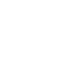

# mongodb

[← Back to main README](../../README.md)

<table><tr>
  <td></td>
  <td></td>
  <td></td>
</tr></table>

## 16 px

### black
```
https://georgegach.github.io/compatible-icons/simple-icons/compat/mongodb/16/black.png
```

### slate
```
https://georgegach.github.io/compatible-icons/simple-icons/compat/mongodb/16/slate.png
```

### white
```
https://georgegach.github.io/compatible-icons/simple-icons/compat/mongodb/16/white.png
```

## 64 px

### black
```
https://georgegach.github.io/compatible-icons/simple-icons/compat/mongodb/64/black.png
```

### slate
```
https://georgegach.github.io/compatible-icons/simple-icons/compat/mongodb/64/slate.png
```

### white
```
https://georgegach.github.io/compatible-icons/simple-icons/compat/mongodb/64/white.png
```

## 128 px

### black
```
https://georgegach.github.io/compatible-icons/simple-icons/compat/mongodb/128/black.png
```

### slate
```
https://georgegach.github.io/compatible-icons/simple-icons/compat/mongodb/128/slate.png
```

### white
```
https://georgegach.github.io/compatible-icons/simple-icons/compat/mongodb/128/white.png
```

## 512 px

### black
```
https://georgegach.github.io/compatible-icons/simple-icons/compat/mongodb/512/black.png
```

### slate
```
https://georgegach.github.io/compatible-icons/simple-icons/compat/mongodb/512/slate.png
```

### white
```
https://georgegach.github.io/compatible-icons/simple-icons/compat/mongodb/512/white.png
```

## 1024 px

### black
```
https://georgegach.github.io/compatible-icons/simple-icons/compat/mongodb/1024/black.png
```

### slate
```
https://georgegach.github.io/compatible-icons/simple-icons/compat/mongodb/1024/slate.png
```

### white
```
https://georgegach.github.io/compatible-icons/simple-icons/compat/mongodb/1024/white.png
```

## 16 px in base64

### black
```
data:image/png;base64,iVBORw0KGgoAAAANSUhEUgAAABAAAAAQCAYAAAAf8/9hAAAABmJLR0QA/wD/AP+gvaeTAAAA0ElEQVQ4jZXSMUqDQRCG4SemiGAvOUEaL+BBrLX1FLmMRQIpLSwC1raeQFAQIoqY4g9JSGKxWVzWzc/mg4EZdr53d4fhsLp4xF1LT6smaPCB62PNt/jGbh/vGNSaT/GSmGM81QJusCgAPnFZA5gWzDFGefNJAdDP6lWSX9QAeln91XJWBGySfJm9YFsDmCf5Gp2kbmoAk+zWCNjhodD/T2f+9mCOt33+ivMaAFwJK7wRtvAHw1pz1FBY5wbjY81R98IXOocaSkNM9YyZMIOifgHyWjo+UBq1kwAAAABJRU5ErkJggg==
```

### slate
```
data:image/png;base64,iVBORw0KGgoAAAANSUhEUgAAABAAAAAQCAYAAAAf8/9hAAAABmJLR0QA/wD/AP+gvaeTAAABLUlEQVQ4jZXTu0oDQRgF4HNm0USCIIiw9sHGF8gDCD6CjVjbWYmdtbWNjZU2AUsLO9/BJwibLO4mQSYXDBjNHAtzX4Zdpxv2/N9/pljAcyQFUWpfW6l99GUAwPg+xJ1+nWBNMMdRYs/+BTTbw3MBRwC2AO3R4CbuDg4KAY2GytLPFYSdxXu47yZ6KARsVIYngAkzSakap/1aLuCcOyVUzgDEroMucgES69vHixY4zAUAlJYvgj7muGFpPZwFxMlSn6/VBnK5gKDBYl7fBDm7OmGU34Dmab71b98MEImXXGBTozsB79NJQVNAiMcIbnOBMAw/AxNcEuiKqIAKQAwE3lfD7U6mse9ESf86alvbTHqjKO3VCw+uIKl9bia2JYm+jPdvBIDA8A1gm6R8mV90V3nElN/jCwAAAABJRU5ErkJggg==
```

### white
```
data:image/png;base64,iVBORw0KGgoAAAANSUhEUgAAABAAAAAQCAYAAAAf8/9hAAAABmJLR0QA/wD/AP+gvaeTAAAA0klEQVQ4jZWSMQoCMRBFJ1oo2IsHEBsv4EEEO2tPsZexUNjSwkKwtvUEgoKgIOIWCyrrs8niGLNr9leTyZ83kzAiBQLqwBqYFnlKBcRACpyBcdXiCXDloyPQCy1uAjt+tfH5a57cSEQ6nnwXGIRMsPJ0zzULmcDt/lBxPwTQcM6XkjsvIFPx3ZngFQJIVPwUEaPOaQggdrrmAERk6fF/C2ipPUiAg433QPsvwEKGdoUzu4U3IAoqVpDIrnMKzCsVK8jCPsEUeXyfqLUVkZMxhiLDG6lOygI/gZw5AAAAAElFTkSuQmCC
```

