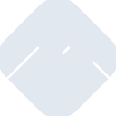
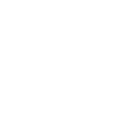

# mongoosedotws

[← Back to main README](../../README.md)





## 16 px

### black
```
https://georgegach.github.io/compatible-icons/simple-icons/mongoosedotws/16/black.png
```

### slate
```
https://georgegach.github.io/compatible-icons/simple-icons/mongoosedotws/16/slate.png
```

### white
```
https://georgegach.github.io/compatible-icons/simple-icons/mongoosedotws/16/white.png
```

## 64 px

### black
```
https://georgegach.github.io/compatible-icons/simple-icons/mongoosedotws/64/black.png
```

### slate
```
https://georgegach.github.io/compatible-icons/simple-icons/mongoosedotws/64/slate.png
```

### white
```
https://georgegach.github.io/compatible-icons/simple-icons/mongoosedotws/64/white.png
```

## 128 px

### black
```
https://georgegach.github.io/compatible-icons/simple-icons/mongoosedotws/128/black.png
```

### slate
```
https://georgegach.github.io/compatible-icons/simple-icons/mongoosedotws/128/slate.png
```

### white
```
https://georgegach.github.io/compatible-icons/simple-icons/mongoosedotws/128/white.png
```

## 512 px

### black
```
https://georgegach.github.io/compatible-icons/simple-icons/mongoosedotws/512/black.png
```

### slate
```
https://georgegach.github.io/compatible-icons/simple-icons/mongoosedotws/512/slate.png
```

### white
```
https://georgegach.github.io/compatible-icons/simple-icons/mongoosedotws/512/white.png
```

## 1024 px

### black
```
https://georgegach.github.io/compatible-icons/simple-icons/mongoosedotws/1024/black.png
```

### slate
```
https://georgegach.github.io/compatible-icons/simple-icons/mongoosedotws/1024/slate.png
```

### white
```
https://georgegach.github.io/compatible-icons/simple-icons/mongoosedotws/1024/white.png
```

## 16 px in base64

### black
```
data:image/png;base64,iVBORw0KGgoAAAANSUhEUgAAABAAAAAQCAYAAAAf8/9hAAAABmJLR0QA/wD/AP+gvaeTAAAA8klEQVQ4jZ3STUoDQRQE4M8wCxeCoB7Ao7jSrZq1xrjwZnoAz6ArbxAwom6MP2AIGDRiXMwbaNrMTPBBMXT3q+p6PcXi6uIO48AQBzW9f+oEI8wzvKDfRj6uIVd4xtl/yY0i/Tiomr4z0g9myXqEXkXuZuQvTDPCDB9xloocUr5wett97E2TxusQyZ0NO9hKRnmM5nWsBukJ2yjwGZhE/yblf57jARd4y6ynticx7iDW4wKvIXKFPWwkjorssdfie4MOVmAX59nNbRjjEjuVcs9yGUhTeZq5c7SkSGMa20QayW3jLLRdV/vKML0HbkXq8voF+j2ZpCAi13YAAAAASUVORK5CYII=
```

### slate
```
data:image/png;base64,iVBORw0KGgoAAAANSUhEUgAAABAAAAAQCAYAAAAf8/9hAAAABmJLR0QA/wD/AP+gvaeTAAABpElEQVQ4jY2Tv2tTURiGn/f0Ch0qGttUGmy1o/+Ak7ur0NlaEYTOYnFwcyoWV8HFwV2dOwnq5O4kliSS28aUmyIONbnndcgPb25S9N2+w/ccnsP5PjEjzVZ3w8F7RpcABMeKfrhaq7wt96p80EizLUu7guVSY8f2ztpK5VXxPBSLepptagYMYFhC2q23ug9mGtTTbDNIzzwDLuWHI0+u1i6+HBscpNk9ob0CnJceakF/WFVD4Gk9ze4CqNnqbli8QFSHDT1QDjEBJQASfUd6DiQy5wZ3qk2M22ocnnwDrxfe1Igml1gB5m3aIegr+AaWjOcKbgdBeKlg2jT6FMQFYB6pJ/kQuGaTmHgKOhX8HCKLSQRrDIePON6yBv+Po5Cu2x5pR8Qvmy5w3kAi6AifjGBG8MApwX8rwwI2hs/YQQoKxHzb6MM0fGYWJG4CX/K5eD+s1Rb3be9b6v8THXmZ3xLv1quV9+NB+n6U3bEnZuGsTAzSxC78xyUTMJR24crlyuto7wjaU9rQAT8uwlMGozSOsttYz4HBOkvH5PHRaq3yptz7ByH5wlIVa7/cAAAAAElFTkSuQmCC
```

### white
```
data:image/png;base64,iVBORw0KGgoAAAANSUhEUgAAABAAAAAQCAYAAAAf8/9hAAAABmJLR0QA/wD/AP+gvaeTAAABC0lEQVQ4jZ2Tzy5DQRSHv1uVWBAJNnYsvYC1FVtqTdWib+YFPAMrr0CbsNGWpDeCcOlnYSYZ7b1t45ecTGbO+X458w9KpB6rXTUP0VGPymrL4DO156QGamsWfFoBR/XV9n/hahO1FRJRX2PQSC2SeU9tpgeWwp/q+xhQqG8hl5o0MrUDbCcN3QPfwCawBPSBW2AXyICFpLZbAzaShQfgGlgNcAE8AltAHfgI8RLq1+uACXwFHABrYS0DdoDFMB8Br8AQWCG4PgF5CRzzqZbDeAPUgAx1X71Qn+e4wqhcvVT34k00ne8NRA3U8z+9qSdzmkx9jbNMquHEpGo7k21PMTn09wsPQ9ypjbLaH/BiFSfaLUGTAAAAAElFTkSuQmCC
```

