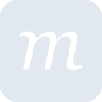
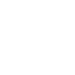

# moqups

[← Back to main README](../../README.md)





## 16 px

### black
```
https://georgegach.github.io/compatible-icons/simple-icons/moqups/16/black.png
```

### slate
```
https://georgegach.github.io/compatible-icons/simple-icons/moqups/16/slate.png
```

### white
```
https://georgegach.github.io/compatible-icons/simple-icons/moqups/16/white.png
```

## 64 px

### black
```
https://georgegach.github.io/compatible-icons/simple-icons/moqups/64/black.png
```

### slate
```
https://georgegach.github.io/compatible-icons/simple-icons/moqups/64/slate.png
```

### white
```
https://georgegach.github.io/compatible-icons/simple-icons/moqups/64/white.png
```

## 128 px

### black
```
https://georgegach.github.io/compatible-icons/simple-icons/moqups/128/black.png
```

### slate
```
https://georgegach.github.io/compatible-icons/simple-icons/moqups/128/slate.png
```

### white
```
https://georgegach.github.io/compatible-icons/simple-icons/moqups/128/white.png
```

## 512 px

### black
```
https://georgegach.github.io/compatible-icons/simple-icons/moqups/512/black.png
```

### slate
```
https://georgegach.github.io/compatible-icons/simple-icons/moqups/512/slate.png
```

### white
```
https://georgegach.github.io/compatible-icons/simple-icons/moqups/512/white.png
```

## 1024 px

### black
```
https://georgegach.github.io/compatible-icons/simple-icons/moqups/1024/black.png
```

### slate
```
https://georgegach.github.io/compatible-icons/simple-icons/moqups/1024/slate.png
```

### white
```
https://georgegach.github.io/compatible-icons/simple-icons/moqups/1024/white.png
```

## 16 px in base64

### black
```
data:image/png;base64,iVBORw0KGgoAAAANSUhEUgAAABAAAAAQCAYAAAAf8/9hAAAABmJLR0QA/wD/AP+gvaeTAAABJElEQVQ4jZ3Tu0pDURAF0JXro9BANELwUdjYW9tbiJ2d+AfWVn6Df+BHWFibWFlb+QDFLipqMBETRL2JxZ3ARcRoBobDGWbm7L1nDpRwjFt00BvgHdRRi1pVpH8o/O5p1KoPUdz3eoIpw1upgE+MROABb5jGGB4xjgruAvYCkshPoRtw7rGPWRzgECvYwhU2Q7SbHIWu3KWBD+xhXTaVcyxF0VPQvc7r0IcC5QieYhdz0XQDi2hhEhN5EfINxCsnQYNsP9YirxGUyr816MRZxAuOMB+xMyzjPdCA0YBdiHsTq5iRidqIZoL/jkz57Yj1fhpjGvyfA1FFNtJmoCrmaKQFvMrEGcbaSZ7PENZKcCkW4p/WxQXZdtVkn6pt8AdqR24VpS/4enz7+lUL1gAAAABJRU5ErkJggg==
```

### slate
```
data:image/png;base64,iVBORw0KGgoAAAANSUhEUgAAABAAAAAQCAYAAAAf8/9hAAAABmJLR0QA/wD/AP+gvaeTAAABn0lEQVQ4jZWSP0+UYRDEf7N3x4lcwnkmRLSwlMbYmBg7CwtbtLD2K0jll8DGUr+D1mLEwsbGyqgFhZKAoAfvET3l4N2xuFc5NPybbvPszOzOPlra2JhsbOupxaVAbcM4h0Dw02jTzo+7Tc9qebV4QXDDJg4j/ickkvRi3dIM9onIADaBYibA7ZOS98bwZF2oaTysYd34l+EMREP4K2gMPIW8ilViX0CKIZ9TYarxpbUkn5XRuCZpQfA8FHcF9wVLOOZ2xvIy0qe/a0DE0BhkGiLuqRzMZeox5FWcTwjeGGrAo5Bkk6NLxJ6aO0jGtbcRPABNl3YXaxa4CO7Vy3IC+fRoDPvTN9+SfC18DqAWvMTcqvq6yvp1EZ0DBWz3AdK0jLeyZCGd56vHd5nlFckDoDcq4BGNIqybks4K9azsKmgNM1ZbO/WHoHnB9h9PLX8pdquQEFo3lOBpxCZ2H2kK0zAUgi2gBXSqs5f6vFZ8x0z8+0eOBfEjsHpHdx4AuxdyfpD23fa47inrfQyavp3pV6AVQf9oHn3Qis3ioJl3fgOs8r+ujKprKgAAAABJRU5ErkJggg==
```

### white
```
data:image/png;base64,iVBORw0KGgoAAAANSUhEUgAAABAAAAAQCAYAAAAf8/9hAAAABmJLR0QA/wD/AP+gvaeTAAABPElEQVQ4jZ2TvUpDQRCFv1x/Cg0kKoSohY29dXoLsbMT38DaymfwDXwIC2uTVNZW/oBipwZNMBETRL35LDLgRRTDPc0yuzOzc87ZRS2pTfVeHfg/Buqd2lBLqHU1HaPwJ1K1XlDvgCXy4T4ByjmLAUoF9ROYiI1H4A2YA6aAJ2AaqAAPQAosA0nkp6jD4NRSD9WqeqQeqzV1R71Wt0Pw24wOQzJBR/1QD9RNR65cqKtR1FbL6k1WySTDZx4QOAP2gUWgA2wBK0APmAVmsiJkGwC0gVOgGnET2Ii8DlCLi/5sMIi1CLwAJ3xbfA6sAe8xDQCTMXYh4i6wDiwArbi1GGdlYC+c2I09f7MxDf7PMVGFkaXdmKqYoZEW1NcQJw/6SZZPDvQS4AoY5igeApfE62rEF+2P8Qv7kVtXS1/EGGo4NU9FQQAAAABJRU5ErkJggg==
```

