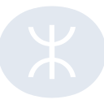

# mtr

[← Back to main README](../../README.md)

<table><tr>
  <td></td>
  <td></td>
  <td></td>
</tr></table>

## 16 px

### black
```
https://georgegach.github.io/compatible-icons/simple-icons/compat/mtr/16/black.png
```

### slate
```
https://georgegach.github.io/compatible-icons/simple-icons/compat/mtr/16/slate.png
```

### white
```
https://georgegach.github.io/compatible-icons/simple-icons/compat/mtr/16/white.png
```

## 64 px

### black
```
https://georgegach.github.io/compatible-icons/simple-icons/compat/mtr/64/black.png
```

### slate
```
https://georgegach.github.io/compatible-icons/simple-icons/compat/mtr/64/slate.png
```

### white
```
https://georgegach.github.io/compatible-icons/simple-icons/compat/mtr/64/white.png
```

## 128 px

### black
```
https://georgegach.github.io/compatible-icons/simple-icons/compat/mtr/128/black.png
```

### slate
```
https://georgegach.github.io/compatible-icons/simple-icons/compat/mtr/128/slate.png
```

### white
```
https://georgegach.github.io/compatible-icons/simple-icons/compat/mtr/128/white.png
```

## 512 px

### black
```
https://georgegach.github.io/compatible-icons/simple-icons/compat/mtr/512/black.png
```

### slate
```
https://georgegach.github.io/compatible-icons/simple-icons/compat/mtr/512/slate.png
```

### white
```
https://georgegach.github.io/compatible-icons/simple-icons/compat/mtr/512/white.png
```

## 1024 px

### black
```
https://georgegach.github.io/compatible-icons/simple-icons/compat/mtr/1024/black.png
```

### slate
```
https://georgegach.github.io/compatible-icons/simple-icons/compat/mtr/1024/slate.png
```

### white
```
https://georgegach.github.io/compatible-icons/simple-icons/compat/mtr/1024/white.png
```

## 16 px in base64

### black
```
data:image/png;base64,iVBORw0KGgoAAAANSUhEUgAAABAAAAAQCAYAAAAf8/9hAAAABmJLR0QA/wD/AP+gvaeTAAABHElEQVQ4jZ3TTyvEYRAH8M8qe8UbkkIh1rp4HUopzv7kHcjJxRtw4EB5AwpJDoiDLGqX3du2WAfzq93HbylT35pnnplnZr7PDL9Lf6CnFJLzIFYwhgEU0UYLbzjEBup5jy3hHh8RlIeP8FlMgzdRwycqaETAM15Cr+Mp9BpWs+B5VDuybOEi9D0chX6C3Q6/KmbhKinzGtORLXvgAaO4S3wvdZSVoYUzzGA4UA7nlJ9KAc1gO5VqVFDEFIZyfJp9OcZU2r7J7SlpC+/RQgkjgZJvYn+0IHrrNN5gMi73A4+YwK0cEud0f+M2zkM/CLRxih3d31jO2lgNQ94gPYfeiLtskNZTLhb8Y5TzlmkZ4/KX6RhreE2z95I/1/kLWyaM4CdnEnEAAAAASUVORK5CYII=
```

### slate
```
data:image/png;base64,iVBORw0KGgoAAAANSUhEUgAAABAAAAAQCAYAAAAf8/9hAAAABmJLR0QA/wD/AP+gvaeTAAAB3UlEQVQ4jY2TPWvTYRTFf+dJWgfRJgGbVjQV3ZycXdXFxc0PIHaoUyeltQhCa3VwsShOfgEnXUUdnISCIG4OGmppU0j+aUWkL7nH4V/T1JLi3Z6Hy7n3vFw4pBbtgUV74LAe9T6+ZVkpbWma4HJKDDk8iGSJ7QjawJudIzF/rlJZPwCw1GjfxtyyfRop9RkYQkt2LNRGy4+7APVG+1GCcUzJUsP4qMwxw5rynhPABvAbqGKyVODZqeHSTKqvNK/L3LQpG2T7lex6jq6Pkj7nu+or4u3u3uUIJpZXN66lROE+UOlyEpdMYcqmgQNswMvJvoN9sYdOpUPnQTFEuVdJmTMiZkMxTtK6dwwFKoGfYNX2S5Iqqq+0NyUG/1XL0JR57eRBha4iygckNZv91O7ak4wR0a+vCGRAtQtqOimlL3bnnmADA/JLSXO2z0OPxVJWlNwEVff++I48ZesFSZ9y1LiwI90owlObs3vzo5Wkwoyg1d0geIf1UDBCWIQFGk3heaMPPRRbRRXuCuDHWns2QhPC5d4gSVrLaXlY5qeTfmGPYDLM89rJ0nTXwfrq+iR4UodG2XmUlRZq1eN7Uf5bu8c0RXBFYgjnxwRs27QF773F3NhYKevnyr76n3P+A4Rn6kFxzZrzAAAAAElFTkSuQmCC
```

### white
```
data:image/png;base64,iVBORw0KGgoAAAANSUhEUgAAABAAAAAQCAYAAAAf8/9hAAAABmJLR0QA/wD/AP+gvaeTAAABOklEQVQ4jZ2TzyqFYRDGf686lv5t3ILcBgopbFyHUopi5U/uQFY2bsCCBeUGlMTJArEQhzo4ZyeOn4U5dbw+kqm3nmae+eabZ2bgF1NLauk3TsoSuoB5YBDoBNoBgVfgGdgDVlNKtaJqs+q12vBnawRnJk9eUx/Vd/VOrUfCvfoQuKZWAj+qS83kKbXaUmVdPQm8re4HPlS3WnhVdRz1LPvNc3UsqjU/cKMOqFcZt5zUCtDb0tEbUAYWgKZYPcAy0Ae0tXArSX0JtXOrAtsRGwW6CzgvbQXObwMC3n8KFrXQAE6BRaAevo5ooT9vAbWcCXOhjsQ4d+LdqsPqZS4i6mQ2xg31OPBuPNUjdTMb48Rnk7oUjqJFug9cj5h+LtLKV6V02n+sctExzQFDFB/TAbCcUnr6w/T+ds4fWtr1Tt2Jh0EAAAAASUVORK5CYII=
```

