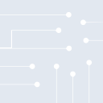
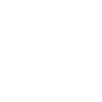

# multisim

[← Back to main README](../../README.md)





## 16 px

### black
```
https://georgegach.github.io/compatible-icons/simple-icons/multisim/16/black.png
```

### slate
```
https://georgegach.github.io/compatible-icons/simple-icons/multisim/16/slate.png
```

### white
```
https://georgegach.github.io/compatible-icons/simple-icons/multisim/16/white.png
```

## 64 px

### black
```
https://georgegach.github.io/compatible-icons/simple-icons/multisim/64/black.png
```

### slate
```
https://georgegach.github.io/compatible-icons/simple-icons/multisim/64/slate.png
```

### white
```
https://georgegach.github.io/compatible-icons/simple-icons/multisim/64/white.png
```

## 128 px

### black
```
https://georgegach.github.io/compatible-icons/simple-icons/multisim/128/black.png
```

### slate
```
https://georgegach.github.io/compatible-icons/simple-icons/multisim/128/slate.png
```

### white
```
https://georgegach.github.io/compatible-icons/simple-icons/multisim/128/white.png
```

## 512 px

### black
```
https://georgegach.github.io/compatible-icons/simple-icons/multisim/512/black.png
```

### slate
```
https://georgegach.github.io/compatible-icons/simple-icons/multisim/512/slate.png
```

### white
```
https://georgegach.github.io/compatible-icons/simple-icons/multisim/512/white.png
```

## 1024 px

### black
```
https://georgegach.github.io/compatible-icons/simple-icons/multisim/1024/black.png
```

### slate
```
https://georgegach.github.io/compatible-icons/simple-icons/multisim/1024/slate.png
```

### white
```
https://georgegach.github.io/compatible-icons/simple-icons/multisim/1024/white.png
```

## 16 px in base64

### black
```
data:image/png;base64,iVBORw0KGgoAAAANSUhEUgAAABAAAAAQCAYAAAAf8/9hAAAABmJLR0QA/wD/AP+gvaeTAAABF0lEQVQ4jZ3TzS5DcRAF8N9tqxFSYUE0FkgaW2tP4pG8gPfgBdh5AmtJLVSCBi2q+mVxp3HdtpRJJpOZ/8mZOXPnJnjHwP9sVPgD+CEaLWW8UEAfozn8FM94xEuQFpN4/HXUiAku8IF9LIwJ2pglp44WDiJvoxgSlKLYxAoWpxCsYzVXu0cF5XHXIoa+L2jsG9iSau/HBCfo4TXBJbrYC42z7BiH2M0W510iqcwKynmC/CG1Im5GvAkpaxnMGbZRm3YHV7jLgM/xFLhm1GpBismDGYSP89sgrOMo3upoYJQEayent4NlVIOgFB170k96HbuoFqRX1ct5I0bO72vCSr6WlbWdaeBZBF0//87FwA0jf5OOX0b3EwEgWPMNHV/5AAAAAElFTkSuQmCC
```

### slate
```
data:image/png;base64,iVBORw0KGgoAAAANSUhEUgAAABAAAAAQCAYAAAAf8/9hAAAABmJLR0QA/wD/AP+gvaeTAAABZklEQVQ4jZ2SXWpTURSFv+/kGkpqRfCHig8qFJ9EnzsAx+AUHJBvDqJOQN8cgc+CBCpBjemPWtOmd/lwc2tuk0pwcTbnsDiw1l57Oxwd/ob6nP+CKWt+BPgWOAcHbQmlQD0D8u9KpLwxHqIT5AdAQs/h6CBrWAgKiSHvwVOTZxavVXODx+GqdsqnJEeS3aYbn5bQiw4SqABqGBtvYDaWpXPHkpvElgD4StjC9MvcQU+tFwNaCOou8X7CBJhJjoN76BmUnw5Hkw+EqcXHSSuzag6+CrwAHnX4NUMkyVjLFqS/yFfgtLtIHs0f2/N7Xx0At9oAlLeJDyA7K/YgH2vy5ULZvEtyIMwI43mQO1APAAq4eal2iz658BOfq9drsp/Ur4G6aalZz4rwHXPSbdgTdJPkHiQg4m0KLxvRvygUT8GzTpnPJLNO2u25hIpke4mND5e4K7BiCl2IvUAl1E3O/or2C/SD0z8sk64sAoWzSgAAAABJRU5ErkJggg==
```

### white
```
data:image/png;base64,iVBORw0KGgoAAAANSUhEUgAAABAAAAAQCAYAAAAf8/9hAAAABmJLR0QA/wD/AP+gvaeTAAABIElEQVQ4jZ3SS0oDURAF0NNJDKIoAVEMDlQQp45diTtxJe7BoW5AZ67AsaCIH9TgP/H/HHQ1tk0HogVF8YrLrbr3VZZSesGn/0Vq/AF8E4MmStlo4ANphNzFPW7xFKTNLKWURlk1aoYDvGENYwXBI4bJOcYD1uP9iGZI0IpmD9MYryGYRafSu8YU2sXUJr78NqjIOSzItX/EBjt4x3OWUjrEK1ZD47DYwgaWy81RTSSXOYV2udmK6eVDeog6H/UspMyUMHtYxErdHRzhqgTex13getFbCdJaCV9RC4Mv5Sb3sY1NnIaUbpZS6mFQIRlgEl1chNQJufMdnBQEDflVvVfyPFYuR+0PtfyYVY6lOvAwguovVKMZuMKbvnz9Nl6/AX29ZPaLfK5JAAAAAElFTkSuQmCC
```

