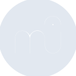
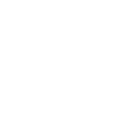

# musescore

[← Back to main README](../../README.md)





## 16 px

### black
```
https://georgegach.github.io/compatible-icons/simple-icons/musescore/16/black.png
```

### slate
```
https://georgegach.github.io/compatible-icons/simple-icons/musescore/16/slate.png
```

### white
```
https://georgegach.github.io/compatible-icons/simple-icons/musescore/16/white.png
```

## 64 px

### black
```
https://georgegach.github.io/compatible-icons/simple-icons/musescore/64/black.png
```

### slate
```
https://georgegach.github.io/compatible-icons/simple-icons/musescore/64/slate.png
```

### white
```
https://georgegach.github.io/compatible-icons/simple-icons/musescore/64/white.png
```

## 128 px

### black
```
https://georgegach.github.io/compatible-icons/simple-icons/musescore/128/black.png
```

### slate
```
https://georgegach.github.io/compatible-icons/simple-icons/musescore/128/slate.png
```

### white
```
https://georgegach.github.io/compatible-icons/simple-icons/musescore/128/white.png
```

## 512 px

### black
```
https://georgegach.github.io/compatible-icons/simple-icons/musescore/512/black.png
```

### slate
```
https://georgegach.github.io/compatible-icons/simple-icons/musescore/512/slate.png
```

### white
```
https://georgegach.github.io/compatible-icons/simple-icons/musescore/512/white.png
```

## 1024 px

### black
```
https://georgegach.github.io/compatible-icons/simple-icons/musescore/1024/black.png
```

### slate
```
https://georgegach.github.io/compatible-icons/simple-icons/musescore/1024/slate.png
```

### white
```
https://georgegach.github.io/compatible-icons/simple-icons/musescore/1024/white.png
```

## 16 px in base64

### black
```
data:image/png;base64,iVBORw0KGgoAAAANSUhEUgAAABAAAAAQCAYAAAAf8/9hAAAABmJLR0QA/wD/AP+gvaeTAAABI0lEQVQ4jY3TzU4CUQwF4I9hNCoggo/gA7h0ZUw08QndGH0VfRIBV/LjQhPBSBRwMZ04IEw4SZPbOz1tT2+HZRzjDj28Yho2whNu0bIBV+hijsUGm+EZZ6vkc/RLiKv2EgVBO7KWEQZ4CzmDuOuiWcUNLlDZpA27SEJeUphXuxLDOSkhkw00wVcUamEfnRSNQuAo/GkE7yANy6c/xE+cGwnq4XziAHtB7uAw9BblzeM7NFJUwxlHcD26OI0OjmTPlyMpnBcJ3nMnsq9D8T4tJBmnmKxJUFkhTaLDBDV/c/tI8BjBtYKcXdlMctSiQJ48f9IHobFr+y3MrSfbBXAtW89tyf3gLOEyss5KiLPo9h85RxP3su0cyt77O84d2e/cLBJ+AXudfKT/nrUdAAAAAElFTkSuQmCC
```

### slate
```
data:image/png;base64,iVBORw0KGgoAAAANSUhEUgAAABAAAAAQCAYAAAAf8/9hAAAABmJLR0QA/wD/AP+gvaeTAAAByklEQVQ4jZWRTU6TYRSFn3P7tRLgg7YOJASoxAUYE6dGE9mDE41DXYFxCRrjCtyBSyDi3Ak7IKCQICRSqIUUhHsc9CcNAYxn9Oa+ee6591wxpp2dzm0X+c6wgj2NNDP4OgJ1jNc45W2rVW8PGQ0f33cOn6rgE3B3vH5JabwdxLPFudlvowY/9juPyPwMzF0DXpJ3A71YmKuvaXv7qJnVXBdqXQ9oD/kWZhJoA3eMN89rflBQ9QehxX84NrAvgHOkCVs9Qat6pveF0WNw3ISrH2IY97AEWQMFsFIYl8PEDPuCEnwK0cNZdagACkyjH5n3Qjq3QaiMgOkBfiI8CUzY6kFuEJqR7b7raJ606Q2YskhTkcCoK2TwtIIS6z6mCqrjvGDQwxAyw0M7JA4HexqRV4YQGtWFCyAAEroF6BgMwuAEkFHiFCPXY9ldFGE8JbkEIfQ7hL+qv9cUVmVgVJN0MnbGKUmGRFigEErhNW222/XKqdaB5ZtOeVkWW5U/8TCWG41Dktfg3f/gf+qCVwsLM78CYGm+vhroOXirn83VEkrDJsnLpfn6ar82po2Dg9nqmT5CPBEuE80GriQcCLqCL2e1fHOv2TwaMn8BlyzCwy5mVmMAAAAASUVORK5CYII=
```

### white
```
data:image/png;base64,iVBORw0KGgoAAAANSUhEUgAAABAAAAAQCAYAAAAf8/9hAAAABmJLR0QA/wD/AP+gvaeTAAABMklEQVQ4jZWTTU4CQRBGH+NoVEREjuABXLpyIwln1KhH0ZOAuJK/hSYKShSei6mJDUGiL+mkq6e+r6truiFBbarXak8dq7MYI7WjXqkN1qG21Ad14e/M1Uf1bFV8rvY3CFd5Ulul+DhcNzFQn+M4g1h7UOuot1HaJmbqVJ2oL+p7aC4ragc4WduYH8ZABnwAFaAB7AHdHKgliaOIZ5G8DeQxyu4Pga+Y1zLgIIIpsA/shrgLHALGriWL+A5Qy4GtCN4i+SCqOI0KjoB5YpClPzADXsog3NeRrueJyVsOTNYYVFZEk6gwA6r89O01A+4juZocZ4eiJyXV2KA0z0Jzh3oUl+K/9NRmUbu2La7nX+mr7aUuqRfhuulWzqPaZXFiUldvLJ7uUP1QP2PetXjO9VTzDUF48zcmN3GVAAAAAElFTkSuQmCC
```

