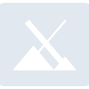

# mxlinux

[← Back to main README](../../README.md)

<table><tr>
  <td></td>
  <td></td>
  <td></td>
</tr></table>

## 16 px

### black
```
https://georgegach.github.io/compatible-icons/simple-icons/compat/mxlinux/16/black.png
```

### slate
```
https://georgegach.github.io/compatible-icons/simple-icons/compat/mxlinux/16/slate.png
```

### white
```
https://georgegach.github.io/compatible-icons/simple-icons/compat/mxlinux/16/white.png
```

## 64 px

### black
```
https://georgegach.github.io/compatible-icons/simple-icons/compat/mxlinux/64/black.png
```

### slate
```
https://georgegach.github.io/compatible-icons/simple-icons/compat/mxlinux/64/slate.png
```

### white
```
https://georgegach.github.io/compatible-icons/simple-icons/compat/mxlinux/64/white.png
```

## 128 px

### black
```
https://georgegach.github.io/compatible-icons/simple-icons/compat/mxlinux/128/black.png
```

### slate
```
https://georgegach.github.io/compatible-icons/simple-icons/compat/mxlinux/128/slate.png
```

### white
```
https://georgegach.github.io/compatible-icons/simple-icons/compat/mxlinux/128/white.png
```

## 512 px

### black
```
https://georgegach.github.io/compatible-icons/simple-icons/compat/mxlinux/512/black.png
```

### slate
```
https://georgegach.github.io/compatible-icons/simple-icons/compat/mxlinux/512/slate.png
```

### white
```
https://georgegach.github.io/compatible-icons/simple-icons/compat/mxlinux/512/white.png
```

## 1024 px

### black
```
https://georgegach.github.io/compatible-icons/simple-icons/compat/mxlinux/1024/black.png
```

### slate
```
https://georgegach.github.io/compatible-icons/simple-icons/compat/mxlinux/1024/slate.png
```

### white
```
https://georgegach.github.io/compatible-icons/simple-icons/compat/mxlinux/1024/white.png
```

## 16 px in base64

### black
```
data:image/png;base64,iVBORw0KGgoAAAANSUhEUgAAABAAAAAQCAYAAAAf8/9hAAAABmJLR0QA/wD/AP+gvaeTAAAA8UlEQVQ4ja3STyuEURgF8N+rbJSUrGykrJntIDZ2Nna2voBi5dvIauYDKF9gVmPhz25E5E+NaCjxSsm1cJVe923q5dazuKdzTs85PRk2MaPaO87wgqGKBnmGUFEMBhLYLc4Sxu+4wGM/g2vM4byAd9DFcFEQCpNjB1O4idgpdn31VeT/AkJccwtL6GEbDyXcJPiKN6xgGvclvJDq4AOHOMBy7KmJ5wQ32UEHIxjEPu4wjj089Ytwhckf5hMx+wlGsYbLMoMuFhIbzsdO1uN/NnIDwvcl9tBCoyRmHe3YD6xiEWP/csr5H/R5hg3UKhocfQJSkGWXuUo03gAAAABJRU5ErkJggg==
```

### slate
```
data:image/png;base64,iVBORw0KGgoAAAANSUhEUgAAABAAAAAQCAYAAAAf8/9hAAAABmJLR0QA/wD/AP+gvaeTAAABXklEQVQ4jaWRTUuUYRSGr/uZVyUhaERBW0iYy6BZtBEDt4qQCxGJXPgLBNf9g36FK/sPQbQQF25Sd0Lix2j0tqgZwYaYxnO30Ria10HGs7zgXM+570fneW09zHN6mCT2Vc3rv4DBXgRAI91jGWAwFcAcdAhyOxRqIY6Rau28SHDWJE2Dj9qhHQdC32Q/7C6wn/U73ilp1vgrgMSh4cThiiHrLpAeIC8EWuRKq5ifFltKmkadfama190hQb/BifCySj5y6CPScEHczgskwvau4LMS85KS4T34skiQ/Q8i+NIaiLlaudwY+V7fTpE+KGtWiL5JwUubLiXaZxZzT4eGLl5If66CJeSM6P+kplYcXsOu3ibIW6Vs5cnoo+MbMPG4fBpKr7DHoy/ejI+VN0qp9BrI/0W+LvEHeMvWZlFOSVPgHZu4PnVZ0gwwfMsv3H0S0LjHfiNL+G2YSk+vi72/XuSSaJOzbt0AAAAASUVORK5CYII=
```

### white
```
data:image/png;base64,iVBORw0KGgoAAAANSUhEUgAAABAAAAAQCAYAAAAf8/9hAAAABmJLR0QA/wD/AP+gvaeTAAABAUlEQVQ4ja2Su0oDURRF1whpBBHEKo0IqTWtUZLGzsbO1h8QtPJvxCp+gJAfsDKFmi6iKD4gosSAmBFBXDY3oOMdAqOnu5t9FndvTqLuAIsUm06iDoHJgoA0US24DMBERHsALoEs+AO4BgbjAHfAMnCV0btAD5j6ofp7UnVfraj3QbtQD9Vh1hwDqA7UXXVV7at76nPMmAd4U9/VdXVBfcrxGevgEzgFToC10NMB8BrxRjvoqtNqSW2rj2pZbakv4yLcqvPf4HMh+7k6o26qN3mAnlqP/HAldLIV3rXgVXV0iX3gCGhGc8IScBz6AdgAGsDsv5xy+of9NFG3gWpBwNkXhimBiZMISA8AAAAASUVORK5CYII=
```

