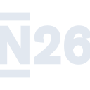

# n26

[← Back to main README](../../README.md)





## 16 px

### black
```
https://georgegach.github.io/compatible-icons/simple-icons/n26/16/black.png
```

### slate
```
https://georgegach.github.io/compatible-icons/simple-icons/n26/16/slate.png
```

### white
```
https://georgegach.github.io/compatible-icons/simple-icons/n26/16/white.png
```

## 64 px

### black
```
https://georgegach.github.io/compatible-icons/simple-icons/n26/64/black.png
```

### slate
```
https://georgegach.github.io/compatible-icons/simple-icons/n26/64/slate.png
```

### white
```
https://georgegach.github.io/compatible-icons/simple-icons/n26/64/white.png
```

## 128 px

### black
```
https://georgegach.github.io/compatible-icons/simple-icons/n26/128/black.png
```

### slate
```
https://georgegach.github.io/compatible-icons/simple-icons/n26/128/slate.png
```

### white
```
https://georgegach.github.io/compatible-icons/simple-icons/n26/128/white.png
```

## 512 px

### black
```
https://georgegach.github.io/compatible-icons/simple-icons/n26/512/black.png
```

### slate
```
https://georgegach.github.io/compatible-icons/simple-icons/n26/512/slate.png
```

### white
```
https://georgegach.github.io/compatible-icons/simple-icons/n26/512/white.png
```

## 1024 px

### black
```
https://georgegach.github.io/compatible-icons/simple-icons/n26/1024/black.png
```

### slate
```
https://georgegach.github.io/compatible-icons/simple-icons/n26/1024/slate.png
```

### white
```
https://georgegach.github.io/compatible-icons/simple-icons/n26/1024/white.png
```

## 16 px in base64

### black
```
data:image/png;base64,iVBORw0KGgoAAAANSUhEUgAAABAAAAAQCAYAAAAf8/9hAAAABmJLR0QA/wD/AP+gvaeTAAABJ0lEQVQ4jc3SPSvGYRQG8N/DXyIPZcFk8A2URY+BMlgsBiWxSJKVRRmUwQcw2azyDaykFIuQl0hK8pb3B3kZ/kc9TM/GVaf77tzn5brOuflrZLCL1wJfGYawUkyBBNe/fJ94KpZBKbKYxzSW8Y41PKALfcH0OHKqMIB27MMbTlGB7pCTwxweC2wU5VLJeTxjrwQfqMVMdPiIsxNHqMMF+qNzI6awhCSJ4DsM4rBA3hxqUI9qrKMtGM/iBTviMoIbnAe9XBRpwB6u0IRF6dA7MIl8SQQexmNVAYNWbAWD4ZCxEXPI4/I78DX0ZnEWw8nhNubxFLYfkk4iJo+tBOPYxj160IIDTEg3842zKNqMXum6FzJY9ROfGMOmIpBIV/j7K1cWk/w/8AU2f087Bs+8TAAAAABJRU5ErkJggg==
```

### slate
```
data:image/png;base64,iVBORw0KGgoAAAANSUhEUgAAABAAAAAQCAYAAAAf8/9hAAAABmJLR0QA/wD/AP+gvaeTAAAB1UlEQVQ4jc1SPWjTcRS8e/knTUua2GBsO8R0cXAVuwguSgZxERxUEHUQJ9eKUxHEwdHBSRx09GPUWQSLKCiiqEir0pDEpFKbWGo+/r93Do2FOmXTGx/v3Xvv7oB/DX6tr340srdVEJNudr40mX02DEGUsMTqdkqXGDaGvSCK5fci2UJxOvfic+1HKWE4JibrAFBpto64fNYcT4vTE08AoNlsZjY8ddJouSjgDpe/rfVBNdhb36NkpizyAeiHGOwUiHOQABIuzvXXs7fT2fYbSTMQRLJiABzOvFLZa5sawDdfQRngl3SiP0lgJUGdTo+3zkgoiZgX9dChKBosaEM6C9kSqME8b4Ke62JkSlJWhpdwHTRDH8J1wLqkPtig+woIEzH/R5ziVO5GsNQtuB4DEoHLZhyVKzbgMKCrEvYaAAhYonCf8AxBAEC10T5gce8dgCkXL3SjsELZKxpHSOvI/TtAcLmx1hNwdMz6z3+F5CeAO2ShTLdHgMYBdAb+Vvsp35/q8q1oBUkkuRhJmrMovC/sLPysNtrHY4VZR2oxyfhSkI1u+W2q787nW7Vae1+c0AnGHiJ17rLSaC1sj4YrEBdndk28HipIwUP+7yjTbGy4HP4P+A2i++ABylTNYwAAAABJRU5ErkJggg==
```

### white
```
data:image/png;base64,iVBORw0KGgoAAAANSUhEUgAAABAAAAAQCAYAAAAf8/9hAAAABmJLR0QA/wD/AP+gvaeTAAABXElEQVQ4jc2SPUvbURTGfyf8JVjUgEvrlMFvILhIuhQydJFCh3YQu5Qi4qqL4NbBD5APUMdKv4MIzWChXUIb1CCUQij1BRVtXjA/B68SMmVrDxwuPDz33uc5z4F/XaHWgU4fNgK8jYjPwzyQAacDmMD1sAoy4CNQjYg9tQi8AJoA6nNgFtiNiJ2EjQGvgQLwAbWr/lJH1Xm1o5bUinrV18tqXq2rLfWvup8DesAk8D6p6qWzDBwBj4E/wAKwCBSBDeATkGWJfAG8ARp99ipJ5hNgAvgCPAW6wCbQBn6gttUl9Uz9neSVkt8pdV89UafVbfVUfaauq61c+q0BbANjD1HoHFBLCt4lG1+BPNACju+JHbWsjqvNNJySeq721OvUB2pB/Zk4LbWWAavA94i4VF+m2A6BNWC0bybNiDhXZ4BXwA2wFWp1YDcEViLiG0NUxl2Eg6v8aJjL/0fdAgGP8qQfK4MeAAAAAElFTkSuQmCC
```

