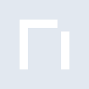
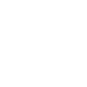

# namemc

[← Back to main README](../../README.md)

<table><tr>
  <td></td>
  <td></td>
  <td></td>
</tr></table>

## 16 px

### black
```
https://georgegach.github.io/compatible-icons/simple-icons/compat/namemc/16/black.png
```

### slate
```
https://georgegach.github.io/compatible-icons/simple-icons/compat/namemc/16/slate.png
```

### white
```
https://georgegach.github.io/compatible-icons/simple-icons/compat/namemc/16/white.png
```

## 64 px

### black
```
https://georgegach.github.io/compatible-icons/simple-icons/compat/namemc/64/black.png
```

### slate
```
https://georgegach.github.io/compatible-icons/simple-icons/compat/namemc/64/slate.png
```

### white
```
https://georgegach.github.io/compatible-icons/simple-icons/compat/namemc/64/white.png
```

## 128 px

### black
```
https://georgegach.github.io/compatible-icons/simple-icons/compat/namemc/128/black.png
```

### slate
```
https://georgegach.github.io/compatible-icons/simple-icons/compat/namemc/128/slate.png
```

### white
```
https://georgegach.github.io/compatible-icons/simple-icons/compat/namemc/128/white.png
```

## 512 px

### black
```
https://georgegach.github.io/compatible-icons/simple-icons/compat/namemc/512/black.png
```

### slate
```
https://georgegach.github.io/compatible-icons/simple-icons/compat/namemc/512/slate.png
```

### white
```
https://georgegach.github.io/compatible-icons/simple-icons/compat/namemc/512/white.png
```

## 1024 px

### black
```
https://georgegach.github.io/compatible-icons/simple-icons/compat/namemc/1024/black.png
```

### slate
```
https://georgegach.github.io/compatible-icons/simple-icons/compat/namemc/1024/slate.png
```

### white
```
https://georgegach.github.io/compatible-icons/simple-icons/compat/namemc/1024/white.png
```

## 16 px in base64

### black
```
data:image/png;base64,iVBORw0KGgoAAAANSUhEUgAAABAAAAAQCAYAAAAf8/9hAAAABmJLR0QA/wD/AP+gvaeTAAAAcUlEQVQ4jWNkYGD4z0ABYKJEM1UMYEHj32FgYDiKQ60XAwODKDaJ/0h4AR7LjqGp/c/AwPAf3QUw8IGBgeEzmpgAAwPDcQYGBhV0l2BzwWMstj2Gyi1AFh/4WBiGBlgzQEKZFYtaVqicNbIgI8OQz0wATXAfKh5DJV0AAAAASUVORK5CYII=
```

### slate
```
data:image/png;base64,iVBORw0KGgoAAAANSUhEUgAAABAAAAAQCAYAAAAf8/9hAAAABmJLR0QA/wD/AP+gvaeTAAAApklEQVQ4je2TPQrCQBSEv1ns1UKCoFaeQi8gnsJTihdQL2GjNkm3kj5joUUiG3/Q0oFX7DDv4+3yVqc8mi8Uvmn+CaDzcD5gb5NJaQkMngPs7WTYX6X6z8VlZ/sF4K5jHmMQZZPtnqS97Wl9kuQbBFHajOolEcdZd4a9bmRTgE/0B4Ae/sJtkUJYYGfNpAqqaoM0B6ZtAAAM6A0PWq6QCqa8VsAnugJ3eD5+XzDV+wAAAABJRU5ErkJggg==
```

### white
```
data:image/png;base64,iVBORw0KGgoAAAANSUhEUgAAABAAAAAQCAYAAAAf8/9hAAAABmJLR0QA/wD/AP+gvaeTAAAAeElEQVQ4jWP8////fwYKABMlmqliAAsa/w4DA8NRHGq9GBgYRDFE/6OCBbhs+v///7H/WAC6C2CKPzAwMHxGExZgYGA4zsDAoILsElxh8JmBgUEGDX9gZGS0YmBg2IascOBjYRgaYA1NC6xY1LJC5ayRBRmHfmYCALqnQknaTET8AAAAAElFTkSuQmCC
```

