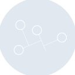
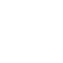

# namuwiki

[← Back to main README](../../README.md)





## 16 px

### black
```
https://georgegach.github.io/compatible-icons/simple-icons/namuwiki/16/black.png
```

### slate
```
https://georgegach.github.io/compatible-icons/simple-icons/namuwiki/16/slate.png
```

### white
```
https://georgegach.github.io/compatible-icons/simple-icons/namuwiki/16/white.png
```

## 64 px

### black
```
https://georgegach.github.io/compatible-icons/simple-icons/namuwiki/64/black.png
```

### slate
```
https://georgegach.github.io/compatible-icons/simple-icons/namuwiki/64/slate.png
```

### white
```
https://georgegach.github.io/compatible-icons/simple-icons/namuwiki/64/white.png
```

## 128 px

### black
```
https://georgegach.github.io/compatible-icons/simple-icons/namuwiki/128/black.png
```

### slate
```
https://georgegach.github.io/compatible-icons/simple-icons/namuwiki/128/slate.png
```

### white
```
https://georgegach.github.io/compatible-icons/simple-icons/namuwiki/128/white.png
```

## 512 px

### black
```
https://georgegach.github.io/compatible-icons/simple-icons/namuwiki/512/black.png
```

### slate
```
https://georgegach.github.io/compatible-icons/simple-icons/namuwiki/512/slate.png
```

### white
```
https://georgegach.github.io/compatible-icons/simple-icons/namuwiki/512/white.png
```

## 1024 px

### black
```
https://georgegach.github.io/compatible-icons/simple-icons/namuwiki/1024/black.png
```

### slate
```
https://georgegach.github.io/compatible-icons/simple-icons/namuwiki/1024/slate.png
```

### white
```
https://georgegach.github.io/compatible-icons/simple-icons/namuwiki/1024/white.png
```

## 16 px in base64

### black
```
data:image/png;base64,iVBORw0KGgoAAAANSUhEUgAAABAAAAAQCAYAAAAf8/9hAAAABmJLR0QA/wD/AP+gvaeTAAABJElEQVQ4jZXTW0oDQRAF0BMdNYhvGBDRHxeiJLhFP0RxKeIyFBSiiMb4wCcaNRM/UiOTMZF4oZie7rq3bhfV9GMJ+zhFC+8Rrdjbw6Ih2MIZOugOiQ4aqA8iN/8glqOJWtH2WanKKCINLIxjGxuoxOYV2pgbdtfAHNJKNGcdGY6whptIuMUkVuNbxukYZuMnXx9jGndYwCfuC6RbXETB2aQgIKpX447LIZIhjfNXnGMCH1hJBthK8RCW5/GCxzhr4w0/vIrekKSheBl7M/iKnERvmKqRMxkiK7hL8BwCzaiQhcWlIMETpiKKeBrDYd6QaFhXr4nVQuJX0XYgwwG92W4EMYsYeZBytbr/j/JmyZGa0R/TL3KOReziBNf6n/MJdoq24RvpTIZtQoVnLgAAAABJRU5ErkJggg==
```

### slate
```
data:image/png;base64,iVBORw0KGgoAAAANSUhEUgAAABAAAAAQCAYAAAAf8/9hAAAABmJLR0QA/wD/AP+gvaeTAAABz0lEQVQ4jYWTz04TURjFf2eY0glhoEPSqKS1dOeSNyAkvINhZcI7GN9BeQV3voZFn4C1O4eKsZE/Q6s0peUeF502FUHO5t58ued853z3XrGAbvdqw5VwCNrBpMAaAKIPGkA48kivW63a5Yyj2ea0V+zd2u9F1DCOuB/BuOuJDrYatc5c4LRX7E3MB8GTB4h30Qv2/taz7Eil7WPQ81kX4CEHcxjnocp27Eo4LG0DfMW6hrCG1PifgFAzHvEuBu2UmQPWtRWaQj+BM8GZYdnQECzf0YiMdiMgnRUkpyL6AlpRpHNDzWIMXCwQz2R/AwVBGmPS2V0YmtiJJIfgp0LnMgFcn9rmt82JRUX4xmYzvidcPciF7GXMusQv4MqA5RGKhpg5L0YMgARzg/guEGbVRH3JGFYRQ0wynbNfYA8tbQLnMTAA6hI/kEa2A6gi2AASAJs+piqpOnWpclE/An8CguXU9hhs8Ao4WQg2kfRXXEMAd5TnRUbCsUxrWi8n8Qhs5yFhO2q1apcec2DolcRHyUAvxPGrdpYVEcBWo9axvY99wvQp3991+pny26Wll+16+vkfq3leZFGVt6BdIA32enmoj9QX/jip+k07y4oZ5w+gz9uRYPZCawAAAABJRU5ErkJggg==
```

### white
```
data:image/png;base64,iVBORw0KGgoAAAANSUhEUgAAABAAAAAQCAYAAAAf8/9hAAAABmJLR0QA/wD/AP+gvaeTAAABNElEQVQ4jZWT60pCURBGl2El0UWDIKT+9CKR9JJh9CjRSwQFSVoRZhllhWZ6Vj8a5SinOC0YzmXvb+bbw2xIoW6qJ2pD7aiDiE78O1YrZKEeqi117O+M1aZayxK3/xDO01YP0rZbc1Xy0FTL+HPmiehaPVdvcyQYq/WC2gD2gAS4AHaBR2AdeAKWgJ14ztNYANbiY/J+CawAXaAMfAHPKdETcBcF14qpBET1EiCwHUkSYCvWP4AbYBEYAtVihq0t4CUsbwDvwGusfQJ9YKorqJ0QDYF7oACsAqPYUwQG4WwYiftAFegWgbdI0I4KSVjcDBFAD1iOSNNbAM4mDYmGyU8TS6mNo7TtIAFOUSsxFKpJRP5BAlBr/n+U92f8qAfmv0z7ZBHHqatX6oOz1/lKPZraDr4BBHj+B7Nyd3EAAAAASUVORK5CYII=
```

