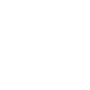

# nano

[← Back to main README](../../README.md)




## 16 px

### black
```
https://georgegach.github.io/compatible-icons/simple-icons/nano/16/black.png
```

### slate
```
https://georgegach.github.io/compatible-icons/simple-icons/nano/16/slate.png
```

### white
```
https://georgegach.github.io/compatible-icons/simple-icons/nano/16/white.png
```

## 64 px

### black
```
https://georgegach.github.io/compatible-icons/simple-icons/nano/64/black.png
```

### slate
```
https://georgegach.github.io/compatible-icons/simple-icons/nano/64/slate.png
```

### white
```
https://georgegach.github.io/compatible-icons/simple-icons/nano/64/white.png
```

## 128 px

### black
```
https://georgegach.github.io/compatible-icons/simple-icons/nano/128/black.png
```

### slate
```
https://georgegach.github.io/compatible-icons/simple-icons/nano/128/slate.png
```

### white
```
https://georgegach.github.io/compatible-icons/simple-icons/nano/128/white.png
```

## 512 px

### black
```
https://georgegach.github.io/compatible-icons/simple-icons/nano/512/black.png
```

### slate
```
https://georgegach.github.io/compatible-icons/simple-icons/nano/512/slate.png
```

### white
```
https://georgegach.github.io/compatible-icons/simple-icons/nano/512/white.png
```

## 1024 px

### black
```
https://georgegach.github.io/compatible-icons/simple-icons/nano/1024/black.png
```

### slate
```
https://georgegach.github.io/compatible-icons/simple-icons/nano/1024/slate.png
```

### white
```
https://georgegach.github.io/compatible-icons/simple-icons/nano/1024/white.png
```

## 16 px in base64

### black
```
data:image/png;base64,iVBORw0KGgoAAAANSUhEUgAAABAAAAAQCAYAAAAf8/9hAAAABmJLR0QA/wD/AP+gvaeTAAAA00lEQVQ4je3Qv0qCYRQG8J8a1GJTkGJDRESzY23egBfgHdTaNTjpBUSLYFPQUGs4Rg1NXYAIDoUNGZ+Dg/i5nOBD/O7AZzvn+fM+52WL0oZdHY84xSDHd4QnNDaR70jxjZOcgIfQzLLLc3TxgynmeEELhdBU0cYX/jD6NxcwjNQxLqN+iiRC4CN2EzRRLmIftSBE9Vf0MhX3cIHDmBM8I9nBJ3ZxG7V7IbrHMsw3qGCBDu4yD5rF0M/5sOO4OcXbOlnCGX5xHdXWMcUBiriKE7fIYAX80jNBUfY80QAAAABJRU5ErkJggg==
```

### slate
```
data:image/png;base64,iVBORw0KGgoAAAANSUhEUgAAABAAAAAQCAYAAAAf8/9hAAAABmJLR0QA/wD/AP+gvaeTAAABWklEQVQ4je2Qv0+TYRSFn3t5gYahKSa1NIKVjVkHCbN/gAsrCQMDg5uDrs6MLsalCepgmCBx1Bjjj9mVBJuPj/YrTe1ngcTY9j0uhqH2P4AznnPuc5IL17Jxo9nJ745GPI/Ej7WFG08nHaVpd1FTvhvdk/8ASZZ/A+4DbRlrtUrpaLxz3Oq9ldk66OIS0Gz2V4amLYwNoWmTFTB9MrP64s3iGzNTo3NR9cHgEc4mMCepFwAkWZLl78xsGSMFfyhGzwx7gLSanvYBXvtwcIBzD+iANubC8L0fdrvFk5Oft8xMAIisVil+JlI3OBcCqdBo99fMqfwbPFuqlPbL5fJZmPnj32OwWZm9QPodPdQBbldLr9LTfjRRAB47cUFiGBV3QggvLweTrHeeZLmOs1+7kz7+o9W7k7TzVpLlSrL863juuO9JfCAMnkwCLFfnG1Ksm9kXd21P6lx1/QVAd6DeOYwfXwAAAABJRU5ErkJggg==
```

### white
```
data:image/png;base64,iVBORw0KGgoAAAANSUhEUgAAABAAAAAQCAYAAAAf8/9hAAAABmJLR0QA/wD/AP+gvaeTAAAA4ElEQVQ4je2QMS5EARCGvxHJbkPLZhWiUoqSQzjAXmPPYBsOIJoVKqVWUC0KlQPIJlvsCw15W2whPoV5icR7LsDfzcw3f/4Z+NcPqdvqrTr4hVlTb9STuuG9XyrUjQaD82Rm35ub6qH6or6qc/VS7amRTEfdV6fqmzqulkN9SteJuqteZV2qveQesves7qlLC+oy0AXMMEVEjIAhUEVsqzvAStYlcBER5SLwCLSAI2CeiwBnwAfQBvrAKvAOHADHEWEVf5axThsetp43q97VAUP1Wu3WGSQzUEfqVhPzl/UJap/V9czM4QMAAAAASUVORK5CYII=
```

