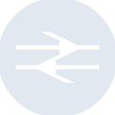
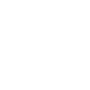

# nationalrail

[← Back to main README](../../README.md)





## 16 px

### black
```
https://georgegach.github.io/compatible-icons/simple-icons/nationalrail/16/black.png
```

### slate
```
https://georgegach.github.io/compatible-icons/simple-icons/nationalrail/16/slate.png
```

### white
```
https://georgegach.github.io/compatible-icons/simple-icons/nationalrail/16/white.png
```

## 64 px

### black
```
https://georgegach.github.io/compatible-icons/simple-icons/nationalrail/64/black.png
```

### slate
```
https://georgegach.github.io/compatible-icons/simple-icons/nationalrail/64/slate.png
```

### white
```
https://georgegach.github.io/compatible-icons/simple-icons/nationalrail/64/white.png
```

## 128 px

### black
```
https://georgegach.github.io/compatible-icons/simple-icons/nationalrail/128/black.png
```

### slate
```
https://georgegach.github.io/compatible-icons/simple-icons/nationalrail/128/slate.png
```

### white
```
https://georgegach.github.io/compatible-icons/simple-icons/nationalrail/128/white.png
```

## 512 px

### black
```
https://georgegach.github.io/compatible-icons/simple-icons/nationalrail/512/black.png
```

### slate
```
https://georgegach.github.io/compatible-icons/simple-icons/nationalrail/512/slate.png
```

### white
```
https://georgegach.github.io/compatible-icons/simple-icons/nationalrail/512/white.png
```

## 1024 px

### black
```
https://georgegach.github.io/compatible-icons/simple-icons/nationalrail/1024/black.png
```

### slate
```
https://georgegach.github.io/compatible-icons/simple-icons/nationalrail/1024/slate.png
```

### white
```
https://georgegach.github.io/compatible-icons/simple-icons/nationalrail/1024/white.png
```

## 16 px in base64

### black
```
data:image/png;base64,iVBORw0KGgoAAAANSUhEUgAAABAAAAAQCAYAAAAf8/9hAAAABmJLR0QA/wD/AP+gvaeTAAABKklEQVQ4jZXTu0qDQRAF4C8kakDQeAERLXwDfQJFUSzFwsbOF7LTQrAS7OwsFBTxEbSwipCIeAmoiHgJ+CcW2cBv3EgycGCZmTNndnaW3zaMXVyjgq+ASvDtYkgbW0QZCeptkKCEhRj54R9iKx4wn2673AW5iRKGstjCLDKh4CuyOMQz8uiPXHkAo8JwYgpVXGAVJ7iP5BQzGhPuwT5uIkp7uMMMloNvAutIMvgMLT9FWvzGCpYCIZ+KjyDJpRxJ6lzFNo5wGgReWnLqkMMb+kLybQie4wyT2IxcaxxrocPoEF9wiQ0c4x21SF4xi+mATEohjzGN563jClP4QG/IqeGAxm6XItU7WaTBpuKC7ld5rnUw86FqJ5/pD7lpBeygiEe/v3MxxAppwg+4/pRFVtqMOgAAAABJRU5ErkJggg==
```

### slate
```
data:image/png;base64,iVBORw0KGgoAAAANSUhEUgAAABAAAAAQCAYAAAAf8/9hAAAABmJLR0QA/wD/AP+gvaeTAAAB40lEQVQ4jZWRPWvTYRTFf+f5J0bBtEmklGBsWp1F3QVfqIiTk2i7CF38AuKHqG+bm5u4iluXvoEITv0ERdK02Cgl/7SitEme41CbJqWCPdOFe88599wr+lCvt0pk/dxwE5MHhgAQ26AdiEve1dNqtdA84Oig2Gikk93ot1KoGAeOR7Sou83MeKWw0BPYaKSTHfNOMPoP4lE0oj01Xi4uql5vlZyNK6Cx/yQDYKixy7XgbHwhQqXXES1DG/zR+DPmx3ECggshx2wA3RjIbIYFWQj3JM4q+InteYvNIxrB6FYGyCNS4L0jawNLWpBpf6mOjnxY/9682o26u2/v8yJMC/Ja+5b+JiHB2hoMGYeAjsx9W3cITCOdPuz7HKab2a9Bjt3DgNqN5k0gzBE8j0nATezejJEFZBA72DnQnK11gMRxeaxcXFzf+lXp7rVf9c7WM3AZ8wDoaG0zXQUuDr7IqVCdEF7j+Aj7OtIZ3K8CwGoALwFx8EUqAJdxfIkpgz4JupJ/9p04CuZVq6VFcl4RqnICGNc6p3wlVKuFpjuaMTROwG/EJPP4UqnUCgDjlcKC7SlD7WicQVei7Vo3SR5OjOSX9+P24WuzWcjsaRbrNpCP9vDfoW2kbeGFTs7PJorF9IDzB/2y3zNKczyJAAAAAElFTkSuQmCC
```

### white
```
data:image/png;base64,iVBORw0KGgoAAAANSUhEUgAAABAAAAAQCAYAAAAf8/9hAAAABmJLR0QA/wD/AP+gvaeTAAABOUlEQVQ4jZWTTytEYRTGf5cRK2ZYia+gfAPNRJaysLHzgVha0Ngoa0vKhOIDsB41IzGmNAoxmjs/i3nVndsdmafeejvnPOfP0zmQgDqtltU7tal+hdcMtrJaIAvqslpXYwcjVmtqKYvc+IOYRkMtJtuuD0H+RU0toB6k2n5Vv9Vj9dre/FmI1X3siZOFtnqjrqtn6lNGTDVSm8AYcATcZ+h7GEXRo7oIrAbbHLAJxJH6CYwCLyniJNAB1oCVQJhI+GeAOJcwxIl/G9gFToBKKNBKxQiQA96A8RD8EJyXURSdq/PATsZYs8AG0BkkYku9VbfUU/VD7WaJOAJcAN1UhTywAGyHaleh/fdETBeooBbCUgyLmjrVU0NLDr/KS309q8WQ9T/H1E9OJMmre2pVfbb/nKvBl09yfgDlJ3MgK5QPXgAAAABJRU5ErkJggg==
```

