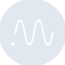

# neptune

[← Back to main README](../../README.md)





## 16 px

### black
```
https://georgegach.github.io/compatible-icons/simple-icons/neptune/16/black.png
```

### slate
```
https://georgegach.github.io/compatible-icons/simple-icons/neptune/16/slate.png
```

### white
```
https://georgegach.github.io/compatible-icons/simple-icons/neptune/16/white.png
```

## 64 px

### black
```
https://georgegach.github.io/compatible-icons/simple-icons/neptune/64/black.png
```

### slate
```
https://georgegach.github.io/compatible-icons/simple-icons/neptune/64/slate.png
```

### white
```
https://georgegach.github.io/compatible-icons/simple-icons/neptune/64/white.png
```

## 128 px

### black
```
https://georgegach.github.io/compatible-icons/simple-icons/neptune/128/black.png
```

### slate
```
https://georgegach.github.io/compatible-icons/simple-icons/neptune/128/slate.png
```

### white
```
https://georgegach.github.io/compatible-icons/simple-icons/neptune/128/white.png
```

## 512 px

### black
```
https://georgegach.github.io/compatible-icons/simple-icons/neptune/512/black.png
```

### slate
```
https://georgegach.github.io/compatible-icons/simple-icons/neptune/512/slate.png
```

### white
```
https://georgegach.github.io/compatible-icons/simple-icons/neptune/512/white.png
```

## 1024 px

### black
```
https://georgegach.github.io/compatible-icons/simple-icons/neptune/1024/black.png
```

### slate
```
https://georgegach.github.io/compatible-icons/simple-icons/neptune/1024/slate.png
```

### white
```
https://georgegach.github.io/compatible-icons/simple-icons/neptune/1024/white.png
```

## 16 px in base64

### black
```
data:image/png;base64,iVBORw0KGgoAAAANSUhEUgAAABAAAAAQCAYAAAAf8/9hAAAABmJLR0QA/wD/AP+gvaeTAAABKUlEQVQ4jZXTS0oDQRAG4M9JfCAkRo0bEQQP4iOeyxu4FFHxAt7AK3gFjSSK4gs3Juomgy6mBmfGF/mhoPvvqr+ruqopYx7H6OIBb2GPwR2h5Rd00EeKj18sDZ/NavA27v8IrNp9UWQBV2ME59ZHq4Y9rGMiBG8xRCP27+E8helC1k20k0glCXKIE5xiFNw19nFTKTtBJyncBE+RzZqsC7nALi58R6P+g8ACZvAia+tdnL0G94ZJLKKZKGM5BOZCbBiONbRjf45BsY5BQWClIPCMOlYL4nkLZ4MbJJEWWSvPYt2MW3dCUGSwHyUsBfdCNrqp7JW7ysNyqdz7nq+BS3EoHqpv/EHqRalgy3ijfCdrdwlb/v9Mo/DZqAbnaEVd1e/8ENxBMW34BPojimkzHIxtAAAAAElFTkSuQmCC
```

### slate
```
data:image/png;base64,iVBORw0KGgoAAAANSUhEUgAAABAAAAAQCAYAAAAf8/9hAAAABmJLR0QA/wD/AP+gvaeTAAAB2klEQVQ4jY2Rv05UURjEf3P2AtHkAntdJRBwXWgt6OwMgZfASi18Ba18AMWa0s7CN7DwD7GzoodCLosKIYRld8WoyxmLvcuuG4lMdc6Xmck384kB5HmjrDGvibAEpOAUwKaN1JT8vjPqx7VyudHTqPfY2WssK+GlYA4I/BvRuB6dPKhNpxvnBvleY0UJr4CpC4R/wXAQXVqtTacbqtdPMo/ETdDNy4j7Js7jGIuBEa+BZgcyfUH+OsD9IdiOuDVoIDSX/NLzYFiin7lt+zXmjUQHQNJuB68naG9oiWBrOQDpQLZDo7tC8zYHALZ3S+hFxNvDMQRpwH2DIA4Fk9Gu2DTBp7a+CSDqO9A07AuOCvPx4XPNIDLBhIIPhdpBXDOUCFQktSVvGc77CKj/sZkFMoImMEc2iXG1WHjG2Lb2BVcLSSuAmt08zoU+FWWMQyiVgp4aZwW5guO65FPD9aKEZgJxA1QzJMgV3CvUd87MbaGZYjJl6xHWFQkZYoB3yvNGmTFvClWHW/4Pdn6PxsVQrU4e2zw03bNdCtJ+J5TuL2TZSQC4NV3+YPuecW6IFyt9Zjs/C2F1/kb6sVvDAD4fH08mP/XMsCKUmph2SWoZWoa3ndH4ZCHLTnqaP5yl1GoIC2JLAAAAAElFTkSuQmCC
```

### white
```
data:image/png;base64,iVBORw0KGgoAAAANSUhEUgAAABAAAAAQCAYAAAAf8/9hAAAABmJLR0QA/wD/AP+gvaeTAAABNUlEQVQ4jZ2TUUpCURRFFy+DCDS1+okgaCBWNq5m0Lek1ACaQVNoClaoUahFP1p+9Vh9dLTnywrb8ODefc/Z75xz94UM1Ip6rt6qQ3US31NwLbXMIqh1taum/ow0Yg7zycfq4JfEPAYzEbWq9pZInqKrllEvcmU/qI+Z/URtq6OcQKq2EuAQSKKbV+ASuALeg7sHGsBDbmwJUE+AYoZ8BmrAPjDMCJwCNwtmXywsEKgCa8AIqAD9OHsLbgKsAptAKWEeOyGwEWKvEbgCbMW+DYyzfYwzArsZgRegAOxlxAUGwHpw4yTKAugB17EuxV9PQpCooBEtbAc3wk/rpnF9tzmz3OWuruOX4VK1OfV/9x9G6qgbAKhHLmflvlqbG3+I/PWY3iPmgEVQy2rT7895GNzZrOzAB1U/KuJkE44zAAAAAElFTkSuQmCC
```

