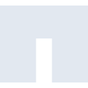
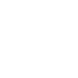

# netapp

[← Back to main README](../../README.md)





## 16 px

### black
```
https://georgegach.github.io/compatible-icons/simple-icons/netapp/16/black.png
```

### slate
```
https://georgegach.github.io/compatible-icons/simple-icons/netapp/16/slate.png
```

### white
```
https://georgegach.github.io/compatible-icons/simple-icons/netapp/16/white.png
```

## 64 px

### black
```
https://georgegach.github.io/compatible-icons/simple-icons/netapp/64/black.png
```

### slate
```
https://georgegach.github.io/compatible-icons/simple-icons/netapp/64/slate.png
```

### white
```
https://georgegach.github.io/compatible-icons/simple-icons/netapp/64/white.png
```

## 128 px

### black
```
https://georgegach.github.io/compatible-icons/simple-icons/netapp/128/black.png
```

### slate
```
https://georgegach.github.io/compatible-icons/simple-icons/netapp/128/slate.png
```

### white
```
https://georgegach.github.io/compatible-icons/simple-icons/netapp/128/white.png
```

## 512 px

### black
```
https://georgegach.github.io/compatible-icons/simple-icons/netapp/512/black.png
```

### slate
```
https://georgegach.github.io/compatible-icons/simple-icons/netapp/512/slate.png
```

### white
```
https://georgegach.github.io/compatible-icons/simple-icons/netapp/512/white.png
```

## 1024 px

### black
```
https://georgegach.github.io/compatible-icons/simple-icons/netapp/1024/black.png
```

### slate
```
https://georgegach.github.io/compatible-icons/simple-icons/netapp/1024/slate.png
```

### white
```
https://georgegach.github.io/compatible-icons/simple-icons/netapp/1024/white.png
```

## 16 px in base64

### black
```
data:image/png;base64,iVBORw0KGgoAAAANSUhEUgAAABAAAAAQCAYAAAAf8/9hAAAABmJLR0QA/wD/AP+gvaeTAAAAY0lEQVQ4je3TOwqAQAwE0OcHwQt4/8qrCaK1IogWWoiyFm6hhYFAQmaGISRERoIOw0N+mWCJcZDGkL8hkN/MWkx7XaAKAZdA1gdMHcK9v4NfYLuD3vWZMoyHfkSD+YQrYw1YAam7GAzw83+xAAAAAElFTkSuQmCC
```

### slate
```
data:image/png;base64,iVBORw0KGgoAAAANSUhEUgAAABAAAAAQCAYAAAAf8/9hAAAABmJLR0QA/wD/AP+gvaeTAAAAeElEQVQ4je2TsQrCQBBE32gIpDsQvOr+/yvuZ9IoIYKdRyCMRRoNpPBSaOGWuzPDY9mFnaX+eh8lHjVmm64BTnY9waHe+isBzdZAMCAmAExrOH9EYJRTDCnFkIzylu77O/gHLHdwWz+T7SOmvDQK8kXS/K6j2wvAE6dEH9YF/Pp7AAAAAElFTkSuQmCC
```

### white
```
data:image/png;base64,iVBORw0KGgoAAAANSUhEUgAAABAAAAAQCAYAAAAf8/9hAAAABmJLR0QA/wD/AP+gvaeTAAAAZ0lEQVQ4je2TMQqAUAxDX1QEL+D273+Kfx5BdPYjSB10EEVBO+hgp5YmIYQWnCUz64DhIb+SmZnHQeYhf0OguNi1wLj2JVDfdRAlBUkBiGeg9zP4BZY76Dk+Uw6kzZyABph2uMprgBnVtxKC882HlQAAAABJRU5ErkJggg==
```

