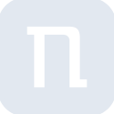
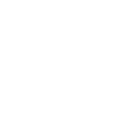

# netcup

[← Back to main README](../../README.md)

<table><tr>
  <td></td>
  <td></td>
  <td></td>
</tr></table>

## 16 px

### black
```
https://georgegach.github.io/compatible-icons/simple-icons/compat/netcup/16/black.png
```

### slate
```
https://georgegach.github.io/compatible-icons/simple-icons/compat/netcup/16/slate.png
```

### white
```
https://georgegach.github.io/compatible-icons/simple-icons/compat/netcup/16/white.png
```

## 64 px

### black
```
https://georgegach.github.io/compatible-icons/simple-icons/compat/netcup/64/black.png
```

### slate
```
https://georgegach.github.io/compatible-icons/simple-icons/compat/netcup/64/slate.png
```

### white
```
https://georgegach.github.io/compatible-icons/simple-icons/compat/netcup/64/white.png
```

## 128 px

### black
```
https://georgegach.github.io/compatible-icons/simple-icons/compat/netcup/128/black.png
```

### slate
```
https://georgegach.github.io/compatible-icons/simple-icons/compat/netcup/128/slate.png
```

### white
```
https://georgegach.github.io/compatible-icons/simple-icons/compat/netcup/128/white.png
```

## 512 px

### black
```
https://georgegach.github.io/compatible-icons/simple-icons/compat/netcup/512/black.png
```

### slate
```
https://georgegach.github.io/compatible-icons/simple-icons/compat/netcup/512/slate.png
```

### white
```
https://georgegach.github.io/compatible-icons/simple-icons/compat/netcup/512/white.png
```

## 1024 px

### black
```
https://georgegach.github.io/compatible-icons/simple-icons/compat/netcup/1024/black.png
```

### slate
```
https://georgegach.github.io/compatible-icons/simple-icons/compat/netcup/1024/slate.png
```

### white
```
https://georgegach.github.io/compatible-icons/simple-icons/compat/netcup/1024/white.png
```

## 16 px in base64

### black
```
data:image/png;base64,iVBORw0KGgoAAAANSUhEUgAAABAAAAAQCAYAAAAf8/9hAAAABmJLR0QA/wD/AP+gvaeTAAAAvElEQVQ4jdXTu4oCURCE4c9bYGTgBrIGXp7GFzZ2fAERlmUxEDSQMVDQWMUNbHAcZlkvkQUFfXqmf/pAHWgiwRoHnP/xIf5NYlZyx9BfHgvas4C0FCtVXbTBUrEa6KCW6R3liN9ox8dP9NFDBXXMC7a4OezwFYAJ0vAwetM8oFyw5inqM1oZFyoPeFjvB6hg/wpggFW2kQ8S1zB1RdaxxSLqDj6iPvJilMv4efAaWc3EmiOXxN37nNOYaf4Cyhhv8KZvvhoAAAAASUVORK5CYII=
```

### slate
```
data:image/png;base64,iVBORw0KGgoAAAANSUhEUgAAABAAAAAQCAYAAAAf8/9hAAAABmJLR0QA/wD/AP+gvaeTAAABHklEQVQ4jdWTPy9DYRjFf+e9t2KRDm3ShjQVg/RbWG0GvqZFDMZGwieQYNO64tIKZTB4e4+hQt1oRTdnPMn58zx5HmXZc61IxvtGnRCo2aTMgUQsCh6EL8I42VX/9rGLtDVPNAu2j4OlziLiSZuwmQZRsz+pIXLv5zhVkduYypeB62lp5nslcadVr9/0B4NVF5VlG7cb1X6WZUuurJwBG18jkIZSzJpjegTgmB4KnQQ47eWjg1ar9SrxUi5WMqAqMQZQkLGbQDMEmrP2UDb4M/6ZgU0CjBY2UBq3QTffuOu7p7fpWxAaWu5h1oHaB/2AuJrUUBtch8lfqJ+PcnDjL02m8vMAPl9MDFBchhDDHtAF5RLx10wRQTl2N8Rk9x0wkHE6U3mAdgAAAABJRU5ErkJggg==
```

### white
```
data:image/png;base64,iVBORw0KGgoAAAANSUhEUgAAABAAAAAQCAYAAAAf8/9hAAAABmJLR0QA/wD/AP+gvaeTAAAAxElEQVQ4jdWTv2oCcRCEP/+ksEpxAUULkzyNL2yd8wWCIBIsBC2CVyQQ6zv5LFzw+GFIPCsHFoZhd9iFWdRMzdVCLf0bZfTmakaQppi11ALo0wxFSy2BbghfwPaX5kdgDDzUtIpkpaU6AlCH6qv6onbUnrpOb0gNftRFGLyru6hpaPPUoH1hzUNwgUGtLiI1uBr3Z9AB9rcYTIDPupAGCc5hegay0L6BTfAx8BS8ujnKbeCj4TDACk/v/BaJ++8772ImOwKRtkZajj9/DQAAAABJRU5ErkJggg==
```

