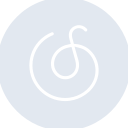
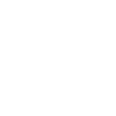

# neteasecloudmusic

[← Back to main README](../../README.md)





## 16 px

### black
```
https://georgegach.github.io/compatible-icons/simple-icons/neteasecloudmusic/16/black.png
```

### slate
```
https://georgegach.github.io/compatible-icons/simple-icons/neteasecloudmusic/16/slate.png
```

### white
```
https://georgegach.github.io/compatible-icons/simple-icons/neteasecloudmusic/16/white.png
```

## 64 px

### black
```
https://georgegach.github.io/compatible-icons/simple-icons/neteasecloudmusic/64/black.png
```

### slate
```
https://georgegach.github.io/compatible-icons/simple-icons/neteasecloudmusic/64/slate.png
```

### white
```
https://georgegach.github.io/compatible-icons/simple-icons/neteasecloudmusic/64/white.png
```

## 128 px

### black
```
https://georgegach.github.io/compatible-icons/simple-icons/neteasecloudmusic/128/black.png
```

### slate
```
https://georgegach.github.io/compatible-icons/simple-icons/neteasecloudmusic/128/slate.png
```

### white
```
https://georgegach.github.io/compatible-icons/simple-icons/neteasecloudmusic/128/white.png
```

## 512 px

### black
```
https://georgegach.github.io/compatible-icons/simple-icons/neteasecloudmusic/512/black.png
```

### slate
```
https://georgegach.github.io/compatible-icons/simple-icons/neteasecloudmusic/512/slate.png
```

### white
```
https://georgegach.github.io/compatible-icons/simple-icons/neteasecloudmusic/512/white.png
```

## 1024 px

### black
```
https://georgegach.github.io/compatible-icons/simple-icons/neteasecloudmusic/1024/black.png
```

### slate
```
https://georgegach.github.io/compatible-icons/simple-icons/neteasecloudmusic/1024/slate.png
```

### white
```
https://georgegach.github.io/compatible-icons/simple-icons/neteasecloudmusic/1024/white.png
```

## 16 px in base64

### black
```
data:image/png;base64,iVBORw0KGgoAAAANSUhEUgAAABAAAAAQCAYAAAAf8/9hAAAABmJLR0QA/wD/AP+gvaeTAAABWElEQVQ4jY3TTUuUYRQG4GvGSSVQHDe5kKQwVAhqrQs12tVv6Af5B1QMV7oNV2JtghZu28coM2LjZFqpEIWfi+e88jh+4A2H9z2H83mf83AV/VjEBnbxL2Q3bO9RdQteo4FTnN8ip6jj1U3BrTsCD/A301uYzttu3FDpR/zXMYsl/M586ugTM+dt/8EaPuMsvk3s4aStyEIpyHka3ZzgI4Ywiu9YCfsbPMbDbPSNMnoyQ1NifQxb+IR30eo+vuA48+9pT/ALz9GBdbxFLyp4GW1vZ/69ZVdxHMHQiXIEneE/nkWRS1RwhO7QqxL7wxjHMh5gQtpWMxIXOCKRWDB7iBmJvEIv1nmAOexk/rUOvAgpoQtPpNU+iuoV/MQqpqRNiLE+lKLtr9LqCuxhE98i8QBGMJj5NCRikW77rlNulxYmtWHa/R/TteACVSygFuTlz7mGeXH/BS4A1UGKR53XMIQAAAAASUVORK5CYII=
```

### slate
```
data:image/png;base64,iVBORw0KGgoAAAANSUhEUgAAABAAAAAQCAYAAAAf8/9hAAAABmJLR0QA/wD/AP+gvaeTAAACBklEQVQ4jX2TT2tTURDFf+cmaeri1aRQWzHaFhQRXBSXKpRqdwouSxFcCH4E8Ttov4Ku1KVbQbBV0eKuuNSF+tI/EKw1TTYNTe5xkbz2KdWzujPcc+ecmbkih/X13VGX4hJoFpMAIwCIFqgNccUd3Z+crPzKOMoOm43mfM9+LELNOHA0ovG6u7o7VassHzyw2WjOd81Twfg/iC1ByXBsEDeivTh1srqigew10Jl8JcF2hBMBUouXthMRboArAMZpLDNTdCkuDWRnpnYd+ShRxh6z+Ia5JTQEMclcC50udngUQLOZZ6Guot5LPoW4ilQ3fArSc8MPrE5OZTCaC0CSZey4Bd4DXbCpI17JuhNNRdJPAu/A+7kJJGEwrn4iaCfCRaBgvCp8EzGCVMSesdUDbRwW9Mgf47LZV6DQDzRkK2D1gh2BjuxziJ08p4hoA8MDDVUcG6CzClwm+pmlUhRXMKOILcxQjt8OQPtAgTxuaVXSlk1N6B54AXMJaEH4gDR2YFlqBfAbIALIJAHdlniC+GzYkyli6sgvIF63PdHfAyJ4WWnarDLMmsxkrrvbNl8V9CUa4TgR0HmLWq6BaRxmRgDfN5rXVOT5f1b5bzR6hcLC9FjyNgBM1SrLthex65mdo+D+Z0oz8kDtIdK0WQ1lHoLmgCTaxweXWkgt4dfdsh9MV6vNjPMbLOb1qUGjazgAAAAASUVORK5CYII=
```

### white
```
data:image/png;base64,iVBORw0KGgoAAAANSUhEUgAAABAAAAAQCAYAAAAf8/9hAAAABmJLR0QA/wD/AP+gvaeTAAABdUlEQVQ4jY3Ty2qUQRQE4C+/Y3STMBMQBBU3igguXKsQJroUfADBB1L3KkpW6tIHcCEiIu7EpRJ1RrxM4o0xIJE4KRd2pGcYLwUN/2mqTlfXf5oKSRaSLCd5kWQtyUZZa2XvRpKOaUhyJkk/ySh/xihJL8nSNPHgL8Jhkm9VPUjSrW33p5y0Wr57Sa4kuZnkS8XpJWm3cBn7K0NDPMYu7MErnMMs5ireAVxqsIimbP7AQ+zDKbzGU9zGB3yvGjToNhNd32EDR4v4Li6gjU94gM2KPzfZ4DOOYQce4Szm0cJxjPCm4s83xrFZxMqdmyLaKvYPl0N+o4V17C51B6s4hBO4hZ04iYVyxdlKv65M2Da+JrmY5G1Vb//OYZKrSd5X/JUG94tFJY/zWMazEmirBHoHp7G3cLdwbya/ZvsJDlbWPuIlnmOmiI4Yn5d+CZYkS/8Y5UkMkiyOxZ+km/9/TOPiqkknyfUkKyW8+jmvJLmWpF1rfgLCpr2wM2YPcQAAAABJRU5ErkJggg==
```

