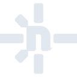

# netlify

[← Back to main README](../../README.md)

<table><tr>
  <td></td>
  <td></td>
  <td></td>
</tr></table>

## 16 px

### black
```
https://georgegach.github.io/compatible-icons/simple-icons/compat/netlify/16/black.png
```

### slate
```
https://georgegach.github.io/compatible-icons/simple-icons/compat/netlify/16/slate.png
```

### white
```
https://georgegach.github.io/compatible-icons/simple-icons/compat/netlify/16/white.png
```

## 64 px

### black
```
https://georgegach.github.io/compatible-icons/simple-icons/compat/netlify/64/black.png
```

### slate
```
https://georgegach.github.io/compatible-icons/simple-icons/compat/netlify/64/slate.png
```

### white
```
https://georgegach.github.io/compatible-icons/simple-icons/compat/netlify/64/white.png
```

## 128 px

### black
```
https://georgegach.github.io/compatible-icons/simple-icons/compat/netlify/128/black.png
```

### slate
```
https://georgegach.github.io/compatible-icons/simple-icons/compat/netlify/128/slate.png
```

### white
```
https://georgegach.github.io/compatible-icons/simple-icons/compat/netlify/128/white.png
```

## 512 px

### black
```
https://georgegach.github.io/compatible-icons/simple-icons/compat/netlify/512/black.png
```

### slate
```
https://georgegach.github.io/compatible-icons/simple-icons/compat/netlify/512/slate.png
```

### white
```
https://georgegach.github.io/compatible-icons/simple-icons/compat/netlify/512/white.png
```

## 1024 px

### black
```
https://georgegach.github.io/compatible-icons/simple-icons/compat/netlify/1024/black.png
```

### slate
```
https://georgegach.github.io/compatible-icons/simple-icons/compat/netlify/1024/slate.png
```

### white
```
https://georgegach.github.io/compatible-icons/simple-icons/compat/netlify/1024/white.png
```

## 16 px in base64

### black
```
data:image/png;base64,iVBORw0KGgoAAAANSUhEUgAAABAAAAAQCAYAAAAf8/9hAAAABmJLR0QA/wD/AP+gvaeTAAAA3ElEQVQ4jZXSvUpDQRQE4E+TwmsRG5sgiI1FSGXjK4iVkCqVT2ThM9gIImKTxjZgEXyHJJX/YiEqWGiRFcKSu0cHFnZ258zOYQ9l7GE/0BRxj8eSoBkYvGO5JMgvjzDBZmBca7CLDVwkfou7kkEj46foYA0H+MAzXjD+ayo4xncqfsMDdhYJm3hKL/3iE4O0P0cLffRwhpU5bRX9wmtaUNUlWK9pIccSthcZzKPCCbbM2rhK511cBmnBEF+4Sfwao1JBnmBkNkS9xNuCSYwwxvQ/CXKsRgkig8PI4AedwyRYUhJPoQAAAABJRU5ErkJggg==
```

### slate
```
data:image/png;base64,iVBORw0KGgoAAAANSUhEUgAAABAAAAAQCAYAAAAf8/9hAAAABmJLR0QA/wD/AP+gvaeTAAABQklEQVQ4jZ2TvU4CQRSFv7tsFEj8IVEjwYCNlb2vQGyprHwFX8TC0prSGGNDY2JlYkFMfARk17CDMbDbgMmGuRbgD4iD8XSTe+6Xc+/MgENBN6mGUXLo8viuolrqYD1g818AER0I4rk8U8Ugik/bpv/U6fTKrqZfAaAHgpRS8a4ABIkUMc6U3w+tlma9fFIXZVeQl7HDDm0q55Wd9duFgA+FJjlT9ESQnqpdFmTgZbRa2io8znr9dtR/FY/h1xTyBjQALHopGVlVy5FCLTDxBaLZT6sl57wFhFiVWAA7kty8vH6lWNiYN8IcmpS31/Z+AKYawzDH0kpdx0tsaKo3AOLLvuro2pkW4Lmb3AUmToNu8jBJch+YftPVM5XAQhPVsm9tDUDR4qKX6FRg4lZo4vafE8xKVfKTz/Q/gHgci/WcgHctjoX/Q97OJwAAAABJRU5ErkJggg==
```

### white
```
data:image/png;base64,iVBORw0KGgoAAAANSUhEUgAAABAAAAAQCAYAAAAf8/9hAAAABmJLR0QA/wD/AP+gvaeTAAAA8ElEQVQ4jZWSPUtDMRiFn1c69Do4uUihuDg5ufgXxLWTk7+og2PnjiLi0kVwEhyK/0Gd1Gqhg2ihw+NgRL29JPVAIG9ycvLkAzJSD9TDnCcr9Vl9yXlahYx3YC1n+DOp9tV7tbsa43L6PtABzlP9CDzlAqJG0AaGwDYwScMfwCAirlalQj3xS1P1TZ2oe03elvqadvnWHBil/hmwARwBPfUUaP/yVqVXmKUGUDUSRMRm0xEavBERO0sBtYUVP5c4Ai7T1C5wUaAF9VpdqLepvlHHuTX1OxgDXaCX6i0KP7FEdKc+/IegrvUSQSnguBTwCU1JbjXAitSYAAAAAElFTkSuQmCC
```

