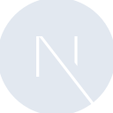
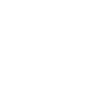

# nextdotjs

[← Back to main README](../../README.md)





## 16 px

### black
```
https://georgegach.github.io/compatible-icons/simple-icons/nextdotjs/16/black.png
```

### slate
```
https://georgegach.github.io/compatible-icons/simple-icons/nextdotjs/16/slate.png
```

### white
```
https://georgegach.github.io/compatible-icons/simple-icons/nextdotjs/16/white.png
```

## 64 px

### black
```
https://georgegach.github.io/compatible-icons/simple-icons/nextdotjs/64/black.png
```

### slate
```
https://georgegach.github.io/compatible-icons/simple-icons/nextdotjs/64/slate.png
```

### white
```
https://georgegach.github.io/compatible-icons/simple-icons/nextdotjs/64/white.png
```

## 128 px

### black
```
https://georgegach.github.io/compatible-icons/simple-icons/nextdotjs/128/black.png
```

### slate
```
https://georgegach.github.io/compatible-icons/simple-icons/nextdotjs/128/slate.png
```

### white
```
https://georgegach.github.io/compatible-icons/simple-icons/nextdotjs/128/white.png
```

## 512 px

### black
```
https://georgegach.github.io/compatible-icons/simple-icons/nextdotjs/512/black.png
```

### slate
```
https://georgegach.github.io/compatible-icons/simple-icons/nextdotjs/512/slate.png
```

### white
```
https://georgegach.github.io/compatible-icons/simple-icons/nextdotjs/512/white.png
```

## 1024 px

### black
```
https://georgegach.github.io/compatible-icons/simple-icons/nextdotjs/1024/black.png
```

### slate
```
https://georgegach.github.io/compatible-icons/simple-icons/nextdotjs/1024/slate.png
```

### white
```
https://georgegach.github.io/compatible-icons/simple-icons/nextdotjs/1024/white.png
```

## 16 px in base64

### black
```
data:image/png;base64,iVBORw0KGgoAAAANSUhEUgAAABAAAAAQCAYAAAAf8/9hAAAABmJLR0QA/wD/AP+gvaeTAAABH0lEQVQ4jY3TOy/DURgG8J9TJjTaGCRmdoNJIorBB/CxbEyC2SoSiYnZILG71NSqW6IkOlQNPX85/untSZ6cc97zPu/lXPiPMg5xhwa+IxvRdoCSPtjAI9ro9GEbVVR6iesDhHnW0yDlmHlUccYqZgrYwyrGYsAWXjAemeE1jhNxLGI2YA0hcXzHLm5ipgzXeEvWAesB0/kDwWLs8yGxffXwmw6xlDwK2MQpaj32MxRDrswUk9jGCT79bzNDJ6A5IMO87hldYavHfrNfgKlkvhCrbGAu5/cRcImfxFjCSrIuYBlneE7sbVxkgqrhD6eGnRiko3tDfxdQMdpTvsdxDLKa77sSKxn2mc6xlBdnmME+bvGk+5VbMeM9jqLPH34B8Ip0jcWcQAkAAAAASUVORK5CYII=
```

### slate
```
data:image/png;base64,iVBORw0KGgoAAAANSUhEUgAAABAAAAAQCAYAAAAf8/9hAAAABmJLR0QA/wD/AP+gvaeTAAABqUlEQVQ4jY2RvW5TQRSEv1k7cgEOvgSJGEKuKUILDRWNFRCiRjSporwCEi8RSnq6PABCokOOKCmIeILkykg4/NnYgHAk71DYjq/tOOJUu2fOzJnZFblqNn9e9lJ8DqGOXQaWARBdUA9iw309S9NKe8zR+JB96txX0S9FWDMOnF3R0LS9U6smjVOBIZk94OoC4lQZjm1v1apJQyPbB6D1/yFPRJzFEnfCMLPWJpD6SC3Q3zxB8B3zZ3LXjeKJdgOoDkwyy23sF+CPIOdsfyDwI6cZbG0GoDzvz7fALeTDnIPfs2OCcrBHX5UHRAF4IPs11ueF72AvB4HPhnXB6AnwCvPLaO5rJRwQvUUbgOuW6wq8xzyaBSP0AswLGF083QIbGAt/waxOOUDdAN4fio3ZSgT3cnMFw10U3oC/5voDM2goyzoJJQ4E6TlRQGoR4x4K2+ArwFF/aXA7pGmlbXvHcHyugL1q6TH2W+AbsbC9sbLSDQC1atKwvWWcTcWZNQEpikkMfrh+rfxu1JvUYbtdKZ5oF2sTKEf7EkKyu0g98P6gxNObSdIZc/4BMF+0OkQ/ohEAAAAASUVORK5CYII=
```

### white
```
data:image/png;base64,iVBORw0KGgoAAAANSUhEUgAAABAAAAAQCAYAAAAf8/9hAAAABmJLR0QA/wD/AP+gvaeTAAABLklEQVQ4jZWTPUtDQRBFDy+lJiRWgrX2FlaCGLXwB/iz7OxErW1FEKy0thDsNR9VYiIKxmAsnsfibWTzeEn0wsLOnb2zM7OzEEFdUk/VJ7WnjsLqBe5ErVEEdVdtq6nTkaottV4k7s4Q5tH9DRLSbv9DPEZLrWJWc5z2SO2onznBizqM7FQ9ToBtIIkqegOOgAfAiL8HXiM7AXYSoFzQ0zWgCzQjblhwrpwAlQJHCdgDLoFOgX+MSpJLM8YCcABcAB9MljmGCTCYccMKWY/ugP0C/2BagMVovxqy7AHLuXPvCXALfEdkDdiM7BKwAVwB/YhPgRvUWhiKeeioh2o/2E01ewC17t9GuaGehyBbE8WEIC3nf6Zrdb2gb6BW1WP1UX02G+uvcGNDPVOrseYHvprmPrdGNwIAAAAASUVORK5CYII=
```

