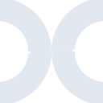

# nextflow

[← Back to main README](../../README.md)

<table><tr>
  <td></td>
  <td></td>
  <td></td>
</tr></table>

## 16 px

### black
```
https://georgegach.github.io/compatible-icons/simple-icons/compat/nextflow/16/black.png
```

### slate
```
https://georgegach.github.io/compatible-icons/simple-icons/compat/nextflow/16/slate.png
```

### white
```
https://georgegach.github.io/compatible-icons/simple-icons/compat/nextflow/16/white.png
```

## 64 px

### black
```
https://georgegach.github.io/compatible-icons/simple-icons/compat/nextflow/64/black.png
```

### slate
```
https://georgegach.github.io/compatible-icons/simple-icons/compat/nextflow/64/slate.png
```

### white
```
https://georgegach.github.io/compatible-icons/simple-icons/compat/nextflow/64/white.png
```

## 128 px

### black
```
https://georgegach.github.io/compatible-icons/simple-icons/compat/nextflow/128/black.png
```

### slate
```
https://georgegach.github.io/compatible-icons/simple-icons/compat/nextflow/128/slate.png
```

### white
```
https://georgegach.github.io/compatible-icons/simple-icons/compat/nextflow/128/white.png
```

## 512 px

### black
```
https://georgegach.github.io/compatible-icons/simple-icons/compat/nextflow/512/black.png
```

### slate
```
https://georgegach.github.io/compatible-icons/simple-icons/compat/nextflow/512/slate.png
```

### white
```
https://georgegach.github.io/compatible-icons/simple-icons/compat/nextflow/512/white.png
```

## 1024 px

### black
```
https://georgegach.github.io/compatible-icons/simple-icons/compat/nextflow/1024/black.png
```

### slate
```
https://georgegach.github.io/compatible-icons/simple-icons/compat/nextflow/1024/slate.png
```

### white
```
https://georgegach.github.io/compatible-icons/simple-icons/compat/nextflow/1024/white.png
```

## 16 px in base64

### black
```
data:image/png;base64,iVBORw0KGgoAAAANSUhEUgAAABAAAAAQCAYAAAAf8/9hAAAABmJLR0QA/wD/AP+gvaeTAAABF0lEQVQ4jY3TsUpDQRAF0GOwsQkIIVr4G6KNhZX4C3ZqQGLjh1laJI2gViLYJSGmNQkYLZQIpjGxePtk2eRpFhb2ztw7O7szAxMM0cY5SopXCRfoBM0EppiFPcYDKgvEVTziM+JP0wC5sYNyJF5HN+H9BjjFDUaR4xuNKMB1ctFLsNXiFA8wiEgjbGMPb5G9j/2iT6rhIyJf4irC7zgqEsMKepGgFf4jx91UsJrgGZ6xFnBVVrp+wPdpgEU17yf+aYS3/kqf+Se0Zc/IcS9wCjM4xkaEn8LO1yZOim5Py/iKXeyEc24f4DAW1nFnvpGaEacRbHGP3AqNtEwrl4NtEXfpYaoE3zgN8CUbzRbO/D/OdVl1hpj8APuFfnTnpi+FAAAAAElFTkSuQmCC
```

### slate
```
data:image/png;base64,iVBORw0KGgoAAAANSUhEUgAAABAAAAAQCAYAAAAf8/9hAAAABmJLR0QA/wD/AP+gvaeTAAACDklEQVQ4jX2Tz0vUURTFP+fNTBqJpuOPHMrcmEa7aFEblxX9+ANatCgsKepPaRVBELQJgkBoE7gIily5cFsmBuWM6ZiOzphgYfNOi5mvzph0V+8ezrn33HffU75Y+YXiOg4bsVp9cjLX+VRS5ICwHfLL5YcKYRw4CnQpXyxHQAASW47Mph2u5HLta43iL8WfvRlXJyWGgSNJzdDcgTYC53ZCnJovldoTfGGh3JlRdUribIMYgBDhDvYHzGqtCgpiuOVP+tUuq4UJmVO7jfAPmXcxclcJ+HWpcimV4jl2jto8q0SuklIrMb4GsnXq92jfHOzvfE8yexKFYnnM4hGmHcBiIlitxtdqnalkUrqf6+l4mWiaCthWYWVzDjxURz5CCODTALLmTvR3jDRq0o2JJBeK5YLlwwBE9SIH5MWaI02zL8J+QNLiXkLA7L4J2cf385sc1EaoXADVifqkgG3O1Ktv25YkH+igsFK+BfTtOfCciXNJGmM8trhSud3kODn8s0a0FuC6wcZvgO76iEvVyNhgf8ckgPLL6/dAN0AjiJ4aiWj0dqCv4zJAfqUyKXzRrjs2q+BZpfWi6S/UPRnz+Xemen4om90EmC+V2g/tpKYlRnDj6u19W/AWkZl0DKOJGGAom93MxDBKZEZiq/EGlC9Wtk3cEGHdqfB4oLvt2f++87fixnhKqQcmdoK6/gJFBu9rUH/H5wAAAABJRU5ErkJggg==
```

### white
```
data:image/png;base64,iVBORw0KGgoAAAANSUhEUgAAABAAAAAQCAYAAAAf8/9hAAAABmJLR0QA/wD/AP+gvaeTAAABLklEQVQ4jZXTMWtUURAF4LmLjc1CYIkp/AfWIaawsBL/gl2SBdk0/rCUKWITSKxEsFuXmNZNwNXCsIHdxv1S5C4Ob99qPPDgnZlz5g5z7wTmuMYXHKITa4AO3mFUPfPAwh9M8Qm9FvMmPuM26RfNAiofoZvMG7iwikXgAGeYpMRvnKQCp42DvtdYP7f4CldJNME2XuBnio/xct2Q+rhJ4iMcJ/4Lb9YNOVBwmQzDOo8lLpqeR5mUUuBbRDyuoc2I6ETEuPKPzQJtdz5u5BeJP/1rBygRsZuEo4gQEc8qn6GUUqzrYC8iniT+tX5LbEXEfkvXrdf4A8+xU/+XuMLrbBzgQ8tDep80JzWW38g5+g99yt0aW9H+zzL1am7aLDBzv5pDvPXvdR64X/1rzO8A3W4v2EezP1AAAAAASUVORK5CYII=
```

