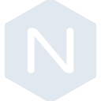

# nginx

[← Back to main README](../../README.md)





## 16 px

### black
```
https://georgegach.github.io/compatible-icons/simple-icons/nginx/16/black.png
```

### slate
```
https://georgegach.github.io/compatible-icons/simple-icons/nginx/16/slate.png
```

### white
```
https://georgegach.github.io/compatible-icons/simple-icons/nginx/16/white.png
```

## 64 px

### black
```
https://georgegach.github.io/compatible-icons/simple-icons/nginx/64/black.png
```

### slate
```
https://georgegach.github.io/compatible-icons/simple-icons/nginx/64/slate.png
```

### white
```
https://georgegach.github.io/compatible-icons/simple-icons/nginx/64/white.png
```

## 128 px

### black
```
https://georgegach.github.io/compatible-icons/simple-icons/nginx/128/black.png
```

### slate
```
https://georgegach.github.io/compatible-icons/simple-icons/nginx/128/slate.png
```

### white
```
https://georgegach.github.io/compatible-icons/simple-icons/nginx/128/white.png
```

## 512 px

### black
```
https://georgegach.github.io/compatible-icons/simple-icons/nginx/512/black.png
```

### slate
```
https://georgegach.github.io/compatible-icons/simple-icons/nginx/512/slate.png
```

### white
```
https://georgegach.github.io/compatible-icons/simple-icons/nginx/512/white.png
```

## 1024 px

### black
```
https://georgegach.github.io/compatible-icons/simple-icons/nginx/1024/black.png
```

### slate
```
https://georgegach.github.io/compatible-icons/simple-icons/nginx/1024/slate.png
```

### white
```
https://georgegach.github.io/compatible-icons/simple-icons/nginx/1024/white.png
```

## 16 px in base64

### black
```
data:image/png;base64,iVBORw0KGgoAAAANSUhEUgAAABAAAAAQCAYAAAAf8/9hAAAABmJLR0QA/wD/AP+gvaeTAAAA8klEQVQ4ja3TL0sEURQF8N+Ktklu0yJ26zZB2GL1E6zBpsls9AMIBnftBuMGwWoSFlQQTIKI+AcEQcQtGsYwM3AZZlZdPXDDve+d8+69nEc1EuzhHk/Yz2vfooFV3OADaR6fuMMmJurILVzgLRDL8Y4rLEbiNI7wPIJYjhcc51xtDMPhGQ4qBK9xGvIh2sU8aehoB2vo4TXUB9gNeWrEQrZwiBPZMmtRJzAnm3EDl6UOfyQAM+hjBY/jCDSwIDPUMm5/KwBTWJKZa7vqwmR4rcA6miFP0MEs5ksd4h+MVKCFc2NYOeJPnykiQRcPeXTVfOcvmCFhZAmcEGkAAAAASUVORK5CYII=
```

### slate
```
data:image/png;base64,iVBORw0KGgoAAAANSUhEUgAAABAAAAAQCAYAAAAf8/9hAAAABmJLR0QA/wD/AP+gvaeTAAABeUlEQVQ4jaWTMUxTURiFv3PbBwwFDYQ3IBiDrg4MupF0ZGFwZcHBwQQnwkic2HBo4qDMJiaOhsXVsBBIGJgZME3EPBJDjSZQ23sY2tJaHiTgv917z//l/PeeK3Iqy7LSaXNgHXneqBBgczDUl9M0/d2vVe/Ctg5/nCwWpNeISUzSFjWMjxCVqfRuRVK8BKge1Z4S4kY0D4WG85yB/xi+KRRe3k9HtgBUrdZGSfhg+wli3P22cjn8JGhXdRZCTDxjYhkxDiCzJ/QROO5rOwBtt32P4jgbE8+E1obcUYWgCn9/vQBvIE66s2pH8LZ7e62ekOtw8M4q+BPWV0P9umlyAYp+APoSGo1Xgn3AeborAW3MREyKn0Oj+Qz8/RYAhP24WSy+A8856PCmAIAkyGUUnuustpYnKAJgq/P6NkvGYx2BTQl70cnIPfA03QOBLgfpOjsXIesJUl+UeR8dH90oyv8c/89n6q0sy0qnceCN8XxLpM2hUF/J+87nBoKmySvU/vgAAAAASUVORK5CYII=
```

### white
```
data:image/png;base64,iVBORw0KGgoAAAANSUhEUgAAABAAAAAQCAYAAAAf8/9hAAAABmJLR0QA/wD/AP+gvaeTAAABBUlEQVQ4ja2TIUtEURCFvxVtL61Ni9itNkHYYvUXuMGmybzRHyAYdtduMBqErSZBUEEwCSKiLgiCiFvW8Bn04XC5b3HVAzfMvXPOnRnOQAZqobbVe7Wv7qlFLjcl1tSmeqMO/ca7eqduqRNV5EX1Qn21Gm/qlboUiXX1SH0aQUzxrPbUOmpDHYTHM3U/I3itnoR4oDbKfgzd7ADrQBd4CfenwG7sGiA/EGgBB8AxMBw1+CqBOaAHbAKXSYU/EgCYAQ6BVeDxNwI1YAFoAyvA7bgCAFPAMtAEtnMJk+G3EhvAdIgLYA2YBeaTCv/BSCX8tPK541o5wr8sUyJUqB314et0rFjnDx6qmDuHjnHiAAAAAElFTkSuQmCC
```

