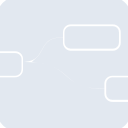
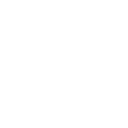

# nodered

[← Back to main README](../../README.md)

<table><tr>
  <td></td>
  <td></td>
  <td></td>
</tr></table>

## 16 px

### black
```
https://georgegach.github.io/compatible-icons/simple-icons/compat/nodered/16/black.png
```

### slate
```
https://georgegach.github.io/compatible-icons/simple-icons/compat/nodered/16/slate.png
```

### white
```
https://georgegach.github.io/compatible-icons/simple-icons/compat/nodered/16/white.png
```

## 64 px

### black
```
https://georgegach.github.io/compatible-icons/simple-icons/compat/nodered/64/black.png
```

### slate
```
https://georgegach.github.io/compatible-icons/simple-icons/compat/nodered/64/slate.png
```

### white
```
https://georgegach.github.io/compatible-icons/simple-icons/compat/nodered/64/white.png
```

## 128 px

### black
```
https://georgegach.github.io/compatible-icons/simple-icons/compat/nodered/128/black.png
```

### slate
```
https://georgegach.github.io/compatible-icons/simple-icons/compat/nodered/128/slate.png
```

### white
```
https://georgegach.github.io/compatible-icons/simple-icons/compat/nodered/128/white.png
```

## 512 px

### black
```
https://georgegach.github.io/compatible-icons/simple-icons/compat/nodered/512/black.png
```

### slate
```
https://georgegach.github.io/compatible-icons/simple-icons/compat/nodered/512/slate.png
```

### white
```
https://georgegach.github.io/compatible-icons/simple-icons/compat/nodered/512/white.png
```

## 1024 px

### black
```
https://georgegach.github.io/compatible-icons/simple-icons/compat/nodered/1024/black.png
```

### slate
```
https://georgegach.github.io/compatible-icons/simple-icons/compat/nodered/1024/slate.png
```

### white
```
https://georgegach.github.io/compatible-icons/simple-icons/compat/nodered/1024/white.png
```

## 16 px in base64

### black
```
data:image/png;base64,iVBORw0KGgoAAAANSUhEUgAAABAAAAAQCAYAAAAf8/9hAAAABmJLR0QA/wD/AP+gvaeTAAAA6UlEQVQ4jZ3SzUoDQRAE4G9/EkUjHkQQvAnefQifW59A8eBBTyLBi6KuGI0xRj1sr4QlmzVb0EzTM11dXQycosDPilHgRMfmKp6TSJbhHtMF9T5285bmIa6xv+DuBsdNBBM8xeSDiDoSTJsIZvGgjxfcLXjzhl6OS3yjh0M8IMUexhiFmjoGSOdNvMImMqzH9EGDwj+ktXwDecjLYvJsGUG1QkUwwNrc/avSyHdsRW2CW3xSGtX2Dx6xrfSjCJVDHFUK2rAT51cMpFzPfxXUMcJFRdaFQPSMkaXKj7IqEqUXHynOO5IUOPsFNu5P+/xzlDgAAAAASUVORK5CYII=
```

### slate
```
data:image/png;base64,iVBORw0KGgoAAAANSUhEUgAAABAAAAAQCAYAAAAf8/9hAAAABmJLR0QA/wD/AP+gvaeTAAABKklEQVQ4jZ2RTUuCQRhFz338KMwQiSJoJ7RrUf+h/92qZa5a1CoyIimyV/zKzLktNIk0Tc9umLlnnjujxtPbBdIZUGE92oK6Gs0s2yA8QWT5VWHDs/BoQbqI2c8vv4AH4BbiaMHeXcLnfwg0hNSyNMLUwLVFhwKPFgqEx4mQkovIbeBxrpqih1XIg6+BZFQQHINfTITwIWIgq2u5NSdILkcQajQzTzvd2OwQyil520ERU172RgAxM5pAKjk5b9EjOYdpAeNlgu8KoAhEWbA1WQtBJ5lRiL5hF8AwlH2P+JgKdDKdAfyrJxxIvCIqsju2MomSRV/odCpYyZ4NSJ/YwkIi96PCPzFVpCq4i2kjXQLMfmEtbCMGELkA2msLJIFKxu8hqG8mIQOuvgCfBITq7vswVAAAAABJRU5ErkJggg==
```

### white
```
data:image/png;base64,iVBORw0KGgoAAAANSUhEUgAAABAAAAAQCAYAAAAf8/9hAAAABmJLR0QA/wD/AP+gvaeTAAAA8UlEQVQ4jZ3Sy0oDQRAF0DOPRNERFyII7gT3+g/+t19gcOFCVxKCG0UZMRpjjO2ieyQMiXlcaLqpx61b1ZWFEC5xjn3r4RW9LIRQb5DcoM5CCGFJ0CMmc+xdHJZLkge4w/Ec3z0uFhGM8ZIqn6TTRobJIoJpCuiKw3qYE/OOTokb/KCDUzwhxxFGGCY1bVTIZ4d4i10U2E7VqwUK/5C33jsok7wiVZ7+R9C00BBU2Jrxv4mD/MBeso3RxxessgfP4qKNUCeVA5w1CpbhIN3f4s8Q27OqgjaGuG7INiGAILZU5OKirItMnMVnjt6GJDWufgFj7kpz1BQN9wAAAABJRU5ErkJggg==
```

