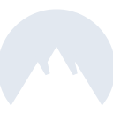
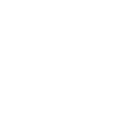

# nordvpn

[← Back to main README](../../README.md)

<table><tr>
  <td></td>
  <td></td>
  <td></td>
</tr></table>

## 16 px

### black
```
https://georgegach.github.io/compatible-icons/simple-icons/compat/nordvpn/16/black.png
```

### slate
```
https://georgegach.github.io/compatible-icons/simple-icons/compat/nordvpn/16/slate.png
```

### white
```
https://georgegach.github.io/compatible-icons/simple-icons/compat/nordvpn/16/white.png
```

## 64 px

### black
```
https://georgegach.github.io/compatible-icons/simple-icons/compat/nordvpn/64/black.png
```

### slate
```
https://georgegach.github.io/compatible-icons/simple-icons/compat/nordvpn/64/slate.png
```

### white
```
https://georgegach.github.io/compatible-icons/simple-icons/compat/nordvpn/64/white.png
```

## 128 px

### black
```
https://georgegach.github.io/compatible-icons/simple-icons/compat/nordvpn/128/black.png
```

### slate
```
https://georgegach.github.io/compatible-icons/simple-icons/compat/nordvpn/128/slate.png
```

### white
```
https://georgegach.github.io/compatible-icons/simple-icons/compat/nordvpn/128/white.png
```

## 512 px

### black
```
https://georgegach.github.io/compatible-icons/simple-icons/compat/nordvpn/512/black.png
```

### slate
```
https://georgegach.github.io/compatible-icons/simple-icons/compat/nordvpn/512/slate.png
```

### white
```
https://georgegach.github.io/compatible-icons/simple-icons/compat/nordvpn/512/white.png
```

## 1024 px

### black
```
https://georgegach.github.io/compatible-icons/simple-icons/compat/nordvpn/1024/black.png
```

### slate
```
https://georgegach.github.io/compatible-icons/simple-icons/compat/nordvpn/1024/slate.png
```

### white
```
https://georgegach.github.io/compatible-icons/simple-icons/compat/nordvpn/1024/white.png
```

## 16 px in base64

### black
```
data:image/png;base64,iVBORw0KGgoAAAANSUhEUgAAABAAAAAQCAYAAAAf8/9hAAAABmJLR0QA/wD/AP+gvaeTAAAA/klEQVQ4jaXTPUoDURQF4M8kqJUrCGYPFvbqArTUysINCO7ALSjoBozY2ktA3EK6EQV/QMGocWySQot5Q57DZJjggQuP8845vLn3Dv/EXAk3j3VsoxO4e5yjh3FV4B5u8YWfQg2RYLfM2MAZBiXGYn0E7Z/XnyCtYc4rxVFuXsXrDOa8XrACNxWiBzxW3F83sDyloSN0cRHOZejAeyF1hE/cYQGLsu6n4S7WDpSQCTZCX3LsyMabFLRj+I6IN2wF0z6aUcgBNoMmnobniOhN+dYYV5H+CfomHW/XCGibTKbfDIc1HOOyRsAQS7L9OSRbyVO0aphztGTbW/YzzoZfO7B6p5xQjK4AAAAASUVORK5CYII=
```

### slate
```
data:image/png;base64,iVBORw0KGgoAAAANSUhEUgAAABAAAAAQCAYAAAAf8/9hAAAABmJLR0QA/wD/AP+gvaeTAAABmUlEQVQ4jaWTPWvTURyFn/NLLEg1aS2NKYaEDgU/gLg42a1TwclBcfAj6CQ4CX6A4tuggwgWdx2Lgn4EuzcvtkmG5B8LrW1MjkOjtjExiGe8nOfw3AsX/jMaPtjc9FRm/uty31yX+6VBawu03sxl31+SumMHturJ7TD3EDngzFBx19B0xINSLvPyxIDtqDU6ryytYM9OcO7Ielc4n7khyQFQrXceI1YnwgAma/VXq41kDUDVnc5ly2+B+YnwcRHR7AUrKtfbn4SujNGtYQt0YczKx5BVHGlqHRpe43gDOhzJ2yVVGkkbM/MLFF3BfpjW/m72YjqNUqc7nzF5B1Myp44ZtgM0fXKVSphrfTO9tKSDxUV9g/59goZMZah7NmR3fw+qlVbcLeRnNkJ6aDsFUMyfWw/iCb24I9Q6Znugcr29LbQwuPiH4sLs1ZEPNki5nmwIlgcK2yGifQRTi17/5t9ggNT33i3wlyMmkkB+hL3n8ItCYa42aaBQmKtZPMfshbyGbVXqyTPb6Unwz9hOV3aSp7b/+Iz/nB8sFbI49bXrpgAAAABJRU5ErkJggg==
```

### white
```
data:image/png;base64,iVBORw0KGgoAAAANSUhEUgAAABAAAAAQCAYAAAAf8/9hAAAABmJLR0QA/wD/AP+gvaeTAAABFElEQVQ4jaWTP0pDQRyEv40xtaVFMK21hQfQA2iplYUXELyJClpoqeIhJCAewXQRBKNgwET0qZAUn0X2wfLyH6daZmeG3d/swj8RioRaATaAHaAW6SfgGqiHEPpj09R99VH9chifalPdG2UsqZdqZ4SxiI+oDWnAqZrNYM6Rqce5eV1tz2HO8aauod5PED2rrQn7dyVgZcxMe8AVcBPXo1ALahdYSsg+8At0gFUGVT8Ay0AFWEy0XdRe4VhNdVNtJ0PedVBvs6Dto34nxLu6HU0H6kIScqhuRU2ODPU1Iepj7ppWfpvoX1AbycSrMwRUk2YaJeAE+AEuQgitaQFRcx49R6hBPVPL08zJKcoOXu/QZ5wbfwuk3p35jwSaAAAAAElFTkSuQmCC
```

