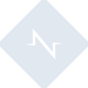
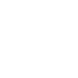

# normalizedotcss

[← Back to main README](../../README.md)





## 16 px

### black
```
https://georgegach.github.io/compatible-icons/simple-icons/normalizedotcss/16/black.png
```

### slate
```
https://georgegach.github.io/compatible-icons/simple-icons/normalizedotcss/16/slate.png
```

### white
```
https://georgegach.github.io/compatible-icons/simple-icons/normalizedotcss/16/white.png
```

## 64 px

### black
```
https://georgegach.github.io/compatible-icons/simple-icons/normalizedotcss/64/black.png
```

### slate
```
https://georgegach.github.io/compatible-icons/simple-icons/normalizedotcss/64/slate.png
```

### white
```
https://georgegach.github.io/compatible-icons/simple-icons/normalizedotcss/64/white.png
```

## 128 px

### black
```
https://georgegach.github.io/compatible-icons/simple-icons/normalizedotcss/128/black.png
```

### slate
```
https://georgegach.github.io/compatible-icons/simple-icons/normalizedotcss/128/slate.png
```

### white
```
https://georgegach.github.io/compatible-icons/simple-icons/normalizedotcss/128/white.png
```

## 512 px

### black
```
https://georgegach.github.io/compatible-icons/simple-icons/normalizedotcss/512/black.png
```

### slate
```
https://georgegach.github.io/compatible-icons/simple-icons/normalizedotcss/512/slate.png
```

### white
```
https://georgegach.github.io/compatible-icons/simple-icons/normalizedotcss/512/white.png
```

## 1024 px

### black
```
https://georgegach.github.io/compatible-icons/simple-icons/normalizedotcss/1024/black.png
```

### slate
```
https://georgegach.github.io/compatible-icons/simple-icons/normalizedotcss/1024/slate.png
```

### white
```
https://georgegach.github.io/compatible-icons/simple-icons/normalizedotcss/1024/white.png
```

## 16 px in base64

### black
```
data:image/png;base64,iVBORw0KGgoAAAANSUhEUgAAABAAAAAQCAYAAAAf8/9hAAAABmJLR0QA/wD/AP+gvaeTAAAAxklEQVQ4jZ3TTWoCQRCG4Ud0J2RtYBYuXGUbcgWXXsr75Bwh4AHUqDdI/FsMITEuLGEYnB47BQVNd39fvdVF0xwFlljFOiuKEP5FbjD8rzjL5IpdF18z2U5V/IWywWR5y6ReeYM3/N5Dcgt7jScs2trpYoZRbO7xiR4GeMUzfvCBbxzi7iMmnag+wg7HONwGWYkpXjAO4j4e0AlTBeYJ1EW0s049ZsrkhPd42KxJVLN0GW2j+B6SVnEbyUrmf6iaZInrJknsMwgpfZdQxVzoAAAAAElFTkSuQmCC
```

### slate
```
data:image/png;base64,iVBORw0KGgoAAAANSUhEUgAAABAAAAAQCAYAAAAf8/9hAAAABmJLR0QA/wD/AP+gvaeTAAABSUlEQVQ4jY2TsUoDQRRFz51NISgaCRbCFkaif2AtIoqFhT9k5Q9ZWAki1lrYG2KQLWyEIIoImbkWJrIuE+MtZ+acefOYJ2akql7K1CqugRDGcbcsO1XunP6Ab4DNydIw2nvd9dXhXEEGniYrCTPKbsIAG4V0VVUvZVZQg3sSI9BnRrKZWsV1XRKaMEAyI/A9kDKSXmoVN1OJmvAkj3ZxLMVzw1a20zAI47irp+fRA9BD2OZV0jsGlC5J4Rb5FLHg5ErQRshoSbAC9FtTnc2r8BvJNowknSAfYZ2htCOFQwS2FyWW8Tf3/YRQXBHYbtZoQPBgFydSvAC6te1+GMc9/TRxhgQw5s5iTbBRh8uyU/30Z0YzJ9Gn5A+bdh2Gxk+cU8mvm6cLv35iWXaqkOI+0M/Ag2gfNIfqr2GqP2cQ7f1/DVNGQrPser4Ay//BXko2B+YAAAAASUVORK5CYII=
```

### white
```
data:image/png;base64,iVBORw0KGgoAAAANSUhEUgAAABAAAAAQCAYAAAAf8/9hAAAABmJLR0QA/wD/AP+gvaeTAAAAyUlEQVQ4jZ2TO7IBQRhGj0wVdVnABALRze8W7EpkV1agWAFjSOQeRdUkHIFWppiemeuP+5z+vn5AZNRETdVMTWLrquDM12zVwbdwc0khdmzidd7gvZpHJOmHpGTnrTpTr7VJIrE36q+6qqvTUlNgCAicgEsINgUWwBhoAzugD7SALtAD1kXBETgH0QFIgByYAH/AKIg7wE8QrZ8VlhVRV6HOJnqYNZKbOvdxsJ9wwzeQ+7jacvhNUlUnDjdIkvnP/5B+BZdIKmPfAU1yI+yCfve3AAAAAElFTkSuQmCC
```

