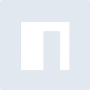

# npm

[← Back to main README](../../README.md)





## 16 px

### black
```
https://georgegach.github.io/compatible-icons/simple-icons/npm/16/black.png
```

### slate
```
https://georgegach.github.io/compatible-icons/simple-icons/npm/16/slate.png
```

### white
```
https://georgegach.github.io/compatible-icons/simple-icons/npm/16/white.png
```

## 64 px

### black
```
https://georgegach.github.io/compatible-icons/simple-icons/npm/64/black.png
```

### slate
```
https://georgegach.github.io/compatible-icons/simple-icons/npm/64/slate.png
```

### white
```
https://georgegach.github.io/compatible-icons/simple-icons/npm/64/white.png
```

## 128 px

### black
```
https://georgegach.github.io/compatible-icons/simple-icons/npm/128/black.png
```

### slate
```
https://georgegach.github.io/compatible-icons/simple-icons/npm/128/slate.png
```

### white
```
https://georgegach.github.io/compatible-icons/simple-icons/npm/128/white.png
```

## 512 px

### black
```
https://georgegach.github.io/compatible-icons/simple-icons/npm/512/black.png
```

### slate
```
https://georgegach.github.io/compatible-icons/simple-icons/npm/512/slate.png
```

### white
```
https://georgegach.github.io/compatible-icons/simple-icons/npm/512/white.png
```

## 1024 px

### black
```
https://georgegach.github.io/compatible-icons/simple-icons/npm/1024/black.png
```

### slate
```
https://georgegach.github.io/compatible-icons/simple-icons/npm/1024/slate.png
```

### white
```
https://georgegach.github.io/compatible-icons/simple-icons/npm/1024/white.png
```

## 16 px in base64

### black
```
data:image/png;base64,iVBORw0KGgoAAAANSUhEUgAAABAAAAAQCAYAAAAf8/9hAAAABmJLR0QA/wD/AP+gvaeTAAAAkklEQVQ4ja2SQQrCQAxF3wwewZ24EOpxPEbv5bYXETd6jCqUnqDQcRNoCENTZ/ohkJD5Px/+APRAKqw+ADMQKEMKolSMg5kHYHQ4R6nFhqrXhqNPzbEOLBqglf4NdLlHaw5uwCS7R85BdBy46XgCLqzAWqTZ3e4O/oaN8QTc1XxW/VV2F02o/sqxUiBF4Fsh8PkBuKUxjUiKlP8AAAAASUVORK5CYII=
```

### slate
```
data:image/png;base64,iVBORw0KGgoAAAANSUhEUgAAABAAAAAQCAYAAAAf8/9hAAAABmJLR0QA/wD/AP+gvaeTAAAA10lEQVQ4jaWRMU4DMRBF3x/2AEhEsBShoqGmT89BuAC3ygWQOAFUHCKRiEWElPRZf4oogrU2YWV+9z0z749tLdL2A3xNlbQKcFs3DOA2ANUDUFP4teDrj9SJYXJwfYC8nF6d358aX6bNG0cBZfPn9nbX+TEC5O79pr2Yu+jpA3K/mHN318TZk+1Gal6BuYDfkDi1gZDwvj27zB4BGKMo3HAMENK+pv6vj94gOw+e//sKWqTNz9oikf1ysEbTCM1sN+A15tnSg+ByGFChgOMPN0IO41Q/r9U3nrhLNQ4Xd9kAAAAASUVORK5CYII=
```

### white
```
data:image/png;base64,iVBORw0KGgoAAAANSUhEUgAAABAAAAAQCAYAAAAf8/9hAAAABmJLR0QA/wD/AP+gvaeTAAAAnUlEQVQ4ja2RQQoCMRAEe8I+wYuIhwV9js/wX179yOJFn+EK4gsEy0sOcYgZ3LUhkElPdzoTA66SlpqG0YCXJJtoQJohliTr3MFd0iMQLfLKGT5xjq4ETqXAJ/DNG0n7XF7M7Fhr+poA2AHPzA21BClIHA44MgjhDWj0Vrm/J/gZ/htXwKGo18V+m7m+FBjQeneIpPbgIpAk3WYYjG8zI3BvuJcPDgAAAABJRU5ErkJggg==
```

