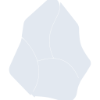
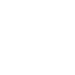

# obsidian

[← Back to main README](../../README.md)





## 16 px

### black
```
https://georgegach.github.io/compatible-icons/simple-icons/obsidian/16/black.png
```

### slate
```
https://georgegach.github.io/compatible-icons/simple-icons/obsidian/16/slate.png
```

### white
```
https://georgegach.github.io/compatible-icons/simple-icons/obsidian/16/white.png
```

## 64 px

### black
```
https://georgegach.github.io/compatible-icons/simple-icons/obsidian/64/black.png
```

### slate
```
https://georgegach.github.io/compatible-icons/simple-icons/obsidian/64/slate.png
```

### white
```
https://georgegach.github.io/compatible-icons/simple-icons/obsidian/64/white.png
```

## 128 px

### black
```
https://georgegach.github.io/compatible-icons/simple-icons/obsidian/128/black.png
```

### slate
```
https://georgegach.github.io/compatible-icons/simple-icons/obsidian/128/slate.png
```

### white
```
https://georgegach.github.io/compatible-icons/simple-icons/obsidian/128/white.png
```

## 512 px

### black
```
https://georgegach.github.io/compatible-icons/simple-icons/obsidian/512/black.png
```

### slate
```
https://georgegach.github.io/compatible-icons/simple-icons/obsidian/512/slate.png
```

### white
```
https://georgegach.github.io/compatible-icons/simple-icons/obsidian/512/white.png
```

## 1024 px

### black
```
https://georgegach.github.io/compatible-icons/simple-icons/obsidian/1024/black.png
```

### slate
```
https://georgegach.github.io/compatible-icons/simple-icons/obsidian/1024/slate.png
```

### white
```
https://georgegach.github.io/compatible-icons/simple-icons/obsidian/1024/white.png
```

## 16 px in base64

### black
```
data:image/png;base64,iVBORw0KGgoAAAANSUhEUgAAABAAAAAQCAYAAAAf8/9hAAAABmJLR0QA/wD/AP+gvaeTAAABHklEQVQ4jY3STytEURzG8c+gyZ9oJFNjQymyUmpeBZZsvQB774O3YWHpNVhYKmWBEBIzxlBiXIt7bo47d4Zf/Tqde37f557n6dC75nGGNvZQ7jPbVXVcIgndxv5/4TXcRPAtHtDA9l9wFVcRnKCFZiS23E9gAx8R3IzgrA9iYCAnsIKhaN/Cc25mpp9AVeo3q07BzHgvgWmsoiT1mp0nOYEKZhXUbvhjO1z7C6+6M0hwmIeHcR4N3PgJs4E33EffHrEeW9hCLSeahVfBSLjdS1hHscBP4lMYjOAyPnOCNWk273gKln9ZOApQgmtcFHjvhFzq+QxgDMdh6C50XiDBSRGc1QROg9ciuIOdGCj1ENnEEuawKA1yUvrI6qLH9g13C2SS0crCxwAAAABJRU5ErkJggg==
```

### slate
```
data:image/png;base64,iVBORw0KGgoAAAANSUhEUgAAABAAAAAQCAYAAAAf8/9hAAAABmJLR0QA/wD/AP+gvaeTAAAByklEQVQ4jXWSvWuTURjFf+dtGtPGtKnaJK+UaFEU6SbUVRQHwY/RVXF1dXTwLxDcnASH7o5O/gOi0LlitaCJhsSmqSQ1ee9xaEzz1We5PPee++Oc515xTO383L2AeSccB3i9X88/XVvT33FdNPVypbku895w0Sgr8/jkqd2NadoJwLdq4y7iraEsAFEFtSXd2qk0nozrNdx8rrYKJ5R8tFkBMABuCQVg0VCdkW+vFJc2pzrIRMl1oDS01fx/ud+Xgnl+bISkx1Wb1JE97wk1R+3q7LEARS4AtWGm5RGNrdxUQKXSWja6gxG4MjgP/VEMXIT8lx+/z00AejPhmfAyYg4pa2zgjCMWGCEoTkmvRgDb2844hPugCMgK7QsS0DzGQNvol6AHYHzte23v3pGD+eZDO4oHOQ+XZn9weWBOhMR2C5NANN8NXAIOJz7r6HRQmBmaVBqpN5Y+RqogDuTQKBfyLwcOuu3cC8wnIOlbPLDpMFEuOngBR48k9QaA1VV10urcxGwCQSglyEwCiCR9LceLHyZeoVQq/TlIJzdktoAsUJw0QJD1ZiTYuGarXl+Y7fIgUuoKIZyH6DIKeaGlgGtpp9bjODf4bP8ANt22ik5kTqUAAAAASUVORK5CYII=
```

### white
```
data:image/png;base64,iVBORw0KGgoAAAANSUhEUgAAABAAAAAQCAYAAAAf8/9hAAAABmJLR0QA/wD/AP+gvaeTAAABLUlEQVQ4jY2Szy4DURyFv0Eaf0IqokltSCTESiLpU2DJ1gPYe496DQtLz2BhKZFYIDQlDf2jJKL1WbjVa0zLSSaTe+d8J/d35sIAqcvqpdpWD9XcIG8WXFJv7KutHv0X3lIrEVxVa2pd3f8LLqi3/lRLbURh68MCdtT3CG5EcE/HMTOSytgAxqJ1C2imPAvDAgpALVp3MzzTmQHqPLAJJEA1+m4qIK8ukpZaVrvhlzXVD/UlowPVkzQ8rl5FhkpUZl19VR+ivUd1Ox5hDyimDtUrLw9MhD6ew3sSWIF+43PAaATngE4qsBi6eQOegHJ6hFO1E454p15nzN4NvZSySpxSz4LpPjxZOv8FRyEz6oX6PADuqgcxk2SFALvAGrAErIYiZ/m6ZKUkSb4v2ycK+pVyIdq8+wAAAABJRU5ErkJggg==
```

