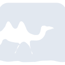

# ocaml

[← Back to main README](../../README.md)

<table><tr>
  <td></td>
  <td></td>
  <td></td>
</tr></table>

## 16 px

### black
```
https://georgegach.github.io/compatible-icons/simple-icons/compat/ocaml/16/black.png
```

### slate
```
https://georgegach.github.io/compatible-icons/simple-icons/compat/ocaml/16/slate.png
```

### white
```
https://georgegach.github.io/compatible-icons/simple-icons/compat/ocaml/16/white.png
```

## 64 px

### black
```
https://georgegach.github.io/compatible-icons/simple-icons/compat/ocaml/64/black.png
```

### slate
```
https://georgegach.github.io/compatible-icons/simple-icons/compat/ocaml/64/slate.png
```

### white
```
https://georgegach.github.io/compatible-icons/simple-icons/compat/ocaml/64/white.png
```

## 128 px

### black
```
https://georgegach.github.io/compatible-icons/simple-icons/compat/ocaml/128/black.png
```

### slate
```
https://georgegach.github.io/compatible-icons/simple-icons/compat/ocaml/128/slate.png
```

### white
```
https://georgegach.github.io/compatible-icons/simple-icons/compat/ocaml/128/white.png
```

## 512 px

### black
```
https://georgegach.github.io/compatible-icons/simple-icons/compat/ocaml/512/black.png
```

### slate
```
https://georgegach.github.io/compatible-icons/simple-icons/compat/ocaml/512/slate.png
```

### white
```
https://georgegach.github.io/compatible-icons/simple-icons/compat/ocaml/512/white.png
```

## 1024 px

### black
```
https://georgegach.github.io/compatible-icons/simple-icons/compat/ocaml/1024/black.png
```

### slate
```
https://georgegach.github.io/compatible-icons/simple-icons/compat/ocaml/1024/slate.png
```

### white
```
https://georgegach.github.io/compatible-icons/simple-icons/compat/ocaml/1024/white.png
```

## 16 px in base64

### black
```
data:image/png;base64,iVBORw0KGgoAAAANSUhEUgAAABAAAAAQCAYAAAAf8/9hAAAABmJLR0QA/wD/AP+gvaeTAAABF0lEQVQ4jZ3SPy9DYRQG8N+lFU01YiCxspqsnUwMdqvFIL4Cg48isfgCxCLxBYiQMBARIf6VSAShxXCP5raaRvskJzn3fc/73Oc55yRIMIkxneEMe7CNCr47jAdswlMXj3/jMYmka/Rk8q9MXuuU4ABbQXKKVam1f+EdZZRwicU435fximWsSBt3nbmz1EIRzOI+ii6QxzwO40d1gnYoYx0LKODc30kYxFQbkpJ0yXbx0UyQYAMzIesEa5jDTiiYRi9GmizWcZdhfJdO4S38H7WQ3BA5DGfIbtGfiQ88h82WyDV9j2rsbA0v7QgSXIXHHIakMx5AX3jO4wbVIKyGuiKKSRSNS7ewgk9MSLsPrzjWuJl9UVP4AfFEboHVY8SZAAAAAElFTkSuQmCC
```

### slate
```
data:image/png;base64,iVBORw0KGgoAAAANSUhEUgAAABAAAAAQCAYAAAAf8/9hAAAABmJLR0QA/wD/AP+gvaeTAAABsklEQVQ4jZ2Sv2rTURzFP+f+kpgQYxKx1VoxRUc7FRfpA+gTKOITiKNzBXFy8RWK4OITFBfFwaWD4FB1sIPpv7ShTdKWYtrkHoeQkIqGxu90L99zPt9zL1/ZVnWrNYe4wRhlszpztfRZ1VrzHXAbuDgOQGjX9rKqtWYDKI1jHqI0wn+bAUw5DN3i0Ll7VkboJfEXEZYMEfwDheeYxlkB7aDkSTY5fhjEJtKr65eLLyR+DlSiAV7Aeoa0ZLzVb6UIejo9eeETgO2KpAgQCQvCi+BLRA52rpReTtaaj7Duy+qiPntEbWzvz3fsx0R/DN2DN04VviJmhjVa3dsrnmtr7tpU+cPfIPV6vXAU0xPCiyLcsZ0+BajWmm8t7slak/w9Or4OJA+M3kOcR9zFSiRP2oQ/B2it1twxTPT+QG0FrztqWuLQxG2hW6OemeqbASRvY2clskBWcGzcEir+C3A6kpiywwCI6QbpcGQC0CaQgFO91fSmxXnsDNIEJo3YkOkYupgOIovJA3nZDuv1/Zu2Yzfj3Vy7fXJCbjbKhV6IcKRf8VulUhps5sqKM/lya1ZJyP0GTrfBnRVYkK8AAAAASUVORK5CYII=
```

### white
```
data:image/png;base64,iVBORw0KGgoAAAANSUhEUgAAABAAAAAQCAYAAAAf8/9hAAAABmJLR0QA/wD/AP+gvaeTAAABOElEQVQ4jZ2SOy8DUBiGn0M1GpoiIREbI5PYOpkY7FaLQfwFBj9FYvEHiEViNRAxMBARNC6pRiLi0noMPTgkSr3JSb5z+Z7vdoIagFFgkOZ0HELYCeoGMAb0NAkoA9tBrQBdTTq/qxJU/+kMQEtivyZ2rVnAHrAeIUfAElD5E0F9VItqXj1T5+L5rp+6VRfURXVNLb1foM4nsJbEnlJv4rtTtU2dUfdjIH/tX8xsRZ1Vc+qJ34RaUMcbQPLqoLqlPn8HBHUVmATOgENgGZgGNoEiMAG0An18nRoAQb0GeuP+CTgHBoB74AoYblRmJnEmOrQn6xm4AwqNAKn6gbSztZjJj4CgXlCvMQN0AyWgE8hSr7kNuASqEViN2XUAHSHOfoj6LywDL8AIkI9BHoCDEMLHz1Sz8U3uDYrU7hOXSMmsAAAAAElFTkSuQmCC
```

