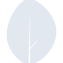
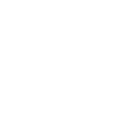

# octobercms

[← Back to main README](../../README.md)





## 16 px

### black
```
https://georgegach.github.io/compatible-icons/simple-icons/octobercms/16/black.png
```

### slate
```
https://georgegach.github.io/compatible-icons/simple-icons/octobercms/16/slate.png
```

### white
```
https://georgegach.github.io/compatible-icons/simple-icons/octobercms/16/white.png
```

## 64 px

### black
```
https://georgegach.github.io/compatible-icons/simple-icons/octobercms/64/black.png
```

### slate
```
https://georgegach.github.io/compatible-icons/simple-icons/octobercms/64/slate.png
```

### white
```
https://georgegach.github.io/compatible-icons/simple-icons/octobercms/64/white.png
```

## 128 px

### black
```
https://georgegach.github.io/compatible-icons/simple-icons/octobercms/128/black.png
```

### slate
```
https://georgegach.github.io/compatible-icons/simple-icons/octobercms/128/slate.png
```

### white
```
https://georgegach.github.io/compatible-icons/simple-icons/octobercms/128/white.png
```

## 512 px

### black
```
https://georgegach.github.io/compatible-icons/simple-icons/octobercms/512/black.png
```

### slate
```
https://georgegach.github.io/compatible-icons/simple-icons/octobercms/512/slate.png
```

### white
```
https://georgegach.github.io/compatible-icons/simple-icons/octobercms/512/white.png
```

## 1024 px

### black
```
https://georgegach.github.io/compatible-icons/simple-icons/octobercms/1024/black.png
```

### slate
```
https://georgegach.github.io/compatible-icons/simple-icons/octobercms/1024/slate.png
```

### white
```
https://georgegach.github.io/compatible-icons/simple-icons/octobercms/1024/white.png
```

## 16 px in base64

### black
```
data:image/png;base64,iVBORw0KGgoAAAANSUhEUgAAABAAAAAQCAYAAAAf8/9hAAAABmJLR0QA/wD/AP+gvaeTAAABFklEQVQ4jYXSvS5EQRjG8d9u4SOEREJDqFQKjdoNuAB34BK4GI1EpRONjkKhFYlQibUiEh+LxVphV7FzYjLm8DTvnPc8/+fMvGfIaxV1vOES6xgo8f7SGh7QRSvUDxxj4j94ATcB6uIlWndxitEyuBK+EgOd5PkLe2UBS3hKgBaaaES9BpZzAQcJ3MW93iDT/lEBVUPtw1Qm9DkcI9W4MNAiYBZDGWO1pD+CuThgEsMZYztaN5J3nTigjc9MwEeot3rHKdTERRxwrvfPU73jNfhmkoBaHFDPbLEwXmMw2dVGxmvF75u3ibukd4b+XEAFh35u3xd2E/gK8zm40BhOAtzGdgTXsPgXXGgUO3jElt5s9jGdM38DE6Zl1MWq6iIAAAAASUVORK5CYII=
```

### slate
```
data:image/png;base64,iVBORw0KGgoAAAANSUhEUgAAABAAAAAQCAYAAAAf8/9hAAAABmJLR0QA/wD/AP+gvaeTAAABu0lEQVQ4jXWSzU4UQRSFv1NtEJXfGQXDn0EdN65MXBgTd670AUh8B7aiL2Hi2sT4Bm504c74BsYQWRiVUQkiwsgwwgxNHRfMdDfTWKuqc+/96tStK05Yqz8bDwWLMlXDpuBNuje6OD+v/f5clYo3GksceknSOGgfPGhxIFjpOLl79eLwxn8B9bXGTQe9Ep7sBluGc724zUp6Ot66Uqn86WkhD1oEP+8VAxjOFi8IgWunOuHlMS2zvrlzz3Cp74VtxC5So+sgSNyor/9eKAGUxkdCI8fq7b+YBHss1xiD5PExwPKyBxQ0Q9+y2AFivw668Gm9OZEBhipbNZw3K0s7ip+ge2TQ6fUMoJBMg4fKF6ldeM52vgV3nR0BottGaQng2OnufknaKYCbB+ZrBggxfgbvnuBgH2iBQvGHJDcvT42vZoDp6eo3EbZL9aYJrIHPFOSOHF70DvkgyU+NW0VARN+BCoWBsvmy1xx+UgLMTYw+k/UB5F69fHgeqBaYP5LghVotb24+SJKV6r6JHyUikNp5oqBOTB7MTI6/L7oMxcPs7OhWOuDbjn5tvIfcRjSAt0mMd+amht/19+kfQtG0IYZz8kYAAAAASUVORK5CYII=
```

### white
```
data:image/png;base64,iVBORw0KGgoAAAANSUhEUgAAABAAAAAQCAYAAAAf8/9hAAAABmJLR0QA/wD/AP+gvaeTAAABJ0lEQVQ4jYWSvUoDQRSFz2wRFYMBQRtFKysLG2tfwAfwDXwEfRgbwSqdpEmnhYWtCKKVGCMi+LNqonGD2c8is3Gc3MXTzOydc765O1zJELADtIFP4BbYAyYtrxXeBV4YqufXPnAOzP8XXgce+FWXv7oEamVh528JlUffA+CoDLAJvEWBHtAB0qCWAlsW4IRxPfuHjHVW5BIfrkhaNBp7l5Qb9bniQRNfWJE0bRiTkvqMpNUQsCCpahizYJ9GZ3kIyCR9G4C+Xx81/J1CHUk3IeBaUtcAfEn68L7lEOCca40Azrm20WJx072kqair/TEnsG1M3gHwFNWugAkL4IDTYPoGQDMK3wFrRqcjyCxw4cMZcBiEW8BGaTiA1IAG8ArU/egeA0uW/wdqfZC9FEy74wAAAABJRU5ErkJggg==
```

