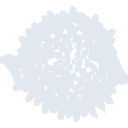
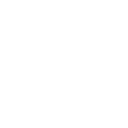

# openbsd

[← Back to main README](../../README.md)

<table><tr>
  <td></td>
  <td></td>
  <td></td>
</tr></table>

## 16 px

### black
```
https://georgegach.github.io/compatible-icons/simple-icons/compat/openbsd/16/black.png
```

### slate
```
https://georgegach.github.io/compatible-icons/simple-icons/compat/openbsd/16/slate.png
```

### white
```
https://georgegach.github.io/compatible-icons/simple-icons/compat/openbsd/16/white.png
```

## 64 px

### black
```
https://georgegach.github.io/compatible-icons/simple-icons/compat/openbsd/64/black.png
```

### slate
```
https://georgegach.github.io/compatible-icons/simple-icons/compat/openbsd/64/slate.png
```

### white
```
https://georgegach.github.io/compatible-icons/simple-icons/compat/openbsd/64/white.png
```

## 128 px

### black
```
https://georgegach.github.io/compatible-icons/simple-icons/compat/openbsd/128/black.png
```

### slate
```
https://georgegach.github.io/compatible-icons/simple-icons/compat/openbsd/128/slate.png
```

### white
```
https://georgegach.github.io/compatible-icons/simple-icons/compat/openbsd/128/white.png
```

## 512 px

### black
```
https://georgegach.github.io/compatible-icons/simple-icons/compat/openbsd/512/black.png
```

### slate
```
https://georgegach.github.io/compatible-icons/simple-icons/compat/openbsd/512/slate.png
```

### white
```
https://georgegach.github.io/compatible-icons/simple-icons/compat/openbsd/512/white.png
```

## 1024 px

### black
```
https://georgegach.github.io/compatible-icons/simple-icons/compat/openbsd/1024/black.png
```

### slate
```
https://georgegach.github.io/compatible-icons/simple-icons/compat/openbsd/1024/slate.png
```

### white
```
https://georgegach.github.io/compatible-icons/simple-icons/compat/openbsd/1024/white.png
```

## 16 px in base64

### black
```
data:image/png;base64,iVBORw0KGgoAAAANSUhEUgAAABAAAAAQCAYAAAAf8/9hAAAABmJLR0QA/wD/AP+gvaeTAAABZ0lEQVQ4jY3Tv0tWcRQG8E9eMymDkJSXGhoqghY3R42aGoQaasiptbG5ob2pPyHXJreiNgchwUUlbfJXWA1Rmm9m+l6H+7zwIl71C4cL55znOc/z/d7DyacXF+qKZ2ry1zCGVsAP8QKfkmseN3EA0ygT//ET+/iB8ePAT7DbAf6DVcxjB5uJB7hxGHwPnwPcxxSWsYgFfA1JKz33obuDYBi30jCN66mXWAq4B5eT+wIFGomXGIzsK2n6oLroj1F1G+eSu4jJrjAtYSiEXfH5HGdj6w6+xc6/KL6Logj7U3xHH36HdDSxgV8h68uAflzCXNv/RC6sle+e6q3bU19H5XysbMXiZhGCXTyLt97IPJ9L64+qm6l1q36uWbxrK2hgRPV0JdZCOptYxEqslBnwyBHnFWawndfYyfQm/ga8lwG1+9EIyVaay45o4q1qVwrql+lqZE6qFugx3qh+6/dYV+3Iqc9AXeEAaStxegIIF6YAAAAASUVORK5CYII=
```

### slate
```
data:image/png;base64,iVBORw0KGgoAAAANSUhEUgAAABAAAAAQCAYAAAAf8/9hAAAABmJLR0QA/wD/AP+gvaeTAAACKUlEQVQ4jYWTzW9MYRTGf897p5ORTtIG1SraoOJjw0LECmFjI2HBQsLeDrHD3p+BxMJKEJImNpImpAkbhCIanTJXM6220452eu/7WEybWEzjLM/J83tOzgf8J8bHXUrTtHO9utolv/38Pdghn8kjMSmETqxzwreKoTmaZVns7+9vrAuoVus9mfInhqMAEpmhTnQX0rSkazt6ux60BVTSmYtWuIvpWE0tCmaM5oEhyc1oI3FZCu93bOn6GtbE39PZU5DcXhVHpBGbWjSNVaNpm6JQGesRsAegsAZIAkdi9F4gGr8C7RYuIFnymGGJ6CLSZsC2PwOE8amFvsrU3JBzn285Uxc6JLsYpRdIk9G8BL2zVAAMCPsmQAgx++zoMUsHgUQmGM8H6XoiOmx/FJwQTgWfQMut4emk7STIOoXIDdVW+2pI+pJHX7U5i9UL1KLZJGgY/6DVxuBEOndOAJXq3P2Ij0kMGCYE2203pTBvMxvEsB1Po7AC3t8CUTauF1Z3+VDiEi10r0QDqQxOJDYi9oA2ARmwbChj3gqNBoCVJHlD9HGkEYkSYg6RSXyw/R60C3sRXAI2GDVDwp2Brd1XCgA7t5RTIK38mn9tXHL0AUTThAMSy46xAwWBS4IceaoQl563PeXxqYW+QsyeAvtabiT/nO0fFJ6t5PmNnVu7JyXlbZ+pUqttS5rF5Tz4sWEUuAC+F8REZoZrvV2Th6WVdtq2Ua3We9ar/QXZ/BWlPomDlQAAAABJRU5ErkJggg==
```

### white
```
data:image/png;base64,iVBORw0KGgoAAAANSUhEUgAAABAAAAAQCAYAAAAf8/9hAAAABmJLR0QA/wD/AP+gvaeTAAABjElEQVQ4jYWTsWqUQRSFv9lVEZJKDRGUbGFErLSyDGIaLYSkiIXiO4iteQOfQjuxsgzYiEXAQBqVbLTRmKCISJLVdZPN7mfhEX9C/nhhYJhzz5lz79yB/4R6XB2pw0sNqQXcBIbACDALzAOvgGEppXvYjWPqov+ir35XB+pX9c5h5NvqboX8Q11T36g9dTtrRp3cT55WV0IcqC/VD2pbfatuRGSYnBsARyoaV4ALqXsROBdcYBXoAceAUzl7B9BQT8fOXMgd4HKSnwPrwAvgdUWwAA8AGlFaBS4BzZxtA/eBo8AKcBX4ArSBnTi+pjYbwDQwAD7HQRd4D9wDZoBx4BtwMthGBFrAbEkDHwNTwASwBpwFduNkE1gArgN94GKERoHO3yY+Ae5mP15JaAIngPNxsJcSRoFl/gwWpJFTeTrVT5mH5ay2+lHdDL6jzrE/1IfqkvozQ9RTt9Su+ivkvVxw8P+ImyW1k+RqdNWnakttQv1nOpNan6XOW8CjNHgBWC+l9A90UCM4Vof9Bo3sYDpX3WcpAAAAAElFTkSuQmCC
```

