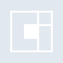
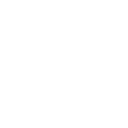

# opencontainersinitiative

[← Back to main README](../../README.md)





## 16 px

### black
```
https://georgegach.github.io/compatible-icons/simple-icons/opencontainersinitiative/16/black.png
```

### slate
```
https://georgegach.github.io/compatible-icons/simple-icons/opencontainersinitiative/16/slate.png
```

### white
```
https://georgegach.github.io/compatible-icons/simple-icons/opencontainersinitiative/16/white.png
```

## 64 px

### black
```
https://georgegach.github.io/compatible-icons/simple-icons/opencontainersinitiative/64/black.png
```

### slate
```
https://georgegach.github.io/compatible-icons/simple-icons/opencontainersinitiative/64/slate.png
```

### white
```
https://georgegach.github.io/compatible-icons/simple-icons/opencontainersinitiative/64/white.png
```

## 128 px

### black
```
https://georgegach.github.io/compatible-icons/simple-icons/opencontainersinitiative/128/black.png
```

### slate
```
https://georgegach.github.io/compatible-icons/simple-icons/opencontainersinitiative/128/slate.png
```

### white
```
https://georgegach.github.io/compatible-icons/simple-icons/opencontainersinitiative/128/white.png
```

## 512 px

### black
```
https://georgegach.github.io/compatible-icons/simple-icons/opencontainersinitiative/512/black.png
```

### slate
```
https://georgegach.github.io/compatible-icons/simple-icons/opencontainersinitiative/512/slate.png
```

### white
```
https://georgegach.github.io/compatible-icons/simple-icons/opencontainersinitiative/512/white.png
```

## 1024 px

### black
```
https://georgegach.github.io/compatible-icons/simple-icons/opencontainersinitiative/1024/black.png
```

### slate
```
https://georgegach.github.io/compatible-icons/simple-icons/opencontainersinitiative/1024/slate.png
```

### white
```
https://georgegach.github.io/compatible-icons/simple-icons/opencontainersinitiative/1024/white.png
```

## 16 px in base64

### black
```
data:image/png;base64,iVBORw0KGgoAAAANSUhEUgAAABAAAAAQCAYAAAAf8/9hAAAABmJLR0QA/wD/AP+gvaeTAAAA1ElEQVQ4jaXTz0pCURAG8J+WKLWQEtq0EbJncd1L+GCueoDeo70kGLQSSi1IhSIXd+wetFvX7gfDmXPOzDd/zpkavlRAvYozHCf6DOOSflc4283gHms0d+QUtziJ/TJs9zKAC1z/ELGLNi4xwlMRwRYrvIbewGdEn8b6jSKCZ9wkJG94l5X8gv5fBPAgayycY4AOHiXNPuQZV7Gu08PfMujJS/goMioi6OAu9AaGhxK0QrY4Kkswldea2kywkL3APL2syYdpJut8GfTEV04J/oXK07gBHGkmPwf1nFIAAAAASUVORK5CYII=
```

### slate
```
data:image/png;base64,iVBORw0KGgoAAAANSUhEUgAAABAAAAAQCAYAAAAf8/9hAAAABmJLR0QA/wD/AP+gvaeTAAABGklEQVQ4jaWT3UpCQRSFvzXH05G6EBO68aIge5aue4kerKseoPfoPhQqE0LIv6A0dFYXnuQox5LcMLDZzPpmzZ7Zen4dmT0i7CMGqKwyeYjV2Ukln2PV1xwoJvegmURWXKAjFG5BhxIZ1udy76YDAHxic7FRQ45noJpNU8EPRL1sAeQSM0VMcn2qJCwwme2+o7Ni40oBQbzZukqiJgCLyuydmH5gQggaELn8FQDgL7ebp7UhQLc7Pnbqa4kG5glYNXvnZxRM82RWrG91oAO1er1JfoU415bvVgqIpoF8N08MJg3SDS4nlAIkqkD1xzsxJsvkT4D6kqfFiq2KFR6xx5IHjhoVUVoNkxjKtEuP2QiLFqa+Dvhn7D2N3zq5djo3dM2+AAAAAElFTkSuQmCC
```

### white
```
data:image/png;base64,iVBORw0KGgoAAAANSUhEUgAAABAAAAAQCAYAAAAf8/9hAAAABmJLR0QA/wD/AP+gvaeTAAAA2ElEQVQ4jcXTT0pDQQwG8N+oRdGFaMGNG8F6FtdewoO58gDew71UsOCqoM8/oC0ocdF5OjwdbenCD0IyM8mXZGaSIiIsgZVlgmGtsBtczxl3iJ1uBZeYYr0jWzjHZl6/Zt9vFcAejn7IeIBt7OMKtzWCFhM8ZbuH95x9nPUnagR3OClInvFi1vI9jv8igGFKqYGI2MUp+hgpLnuRZ5xkPS03f6tgEBFtC281pxpBHxfZ7uFsUYKNLC1W5yUY++q19LnBo9kLPJSHqRimBsNapg4G8ldO/z6NH1ouNTN9xd7+AAAAAElFTkSuQmCC
```

