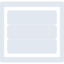
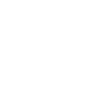

# openmediavault

[← Back to main README](../../README.md)





## 16 px

### black
```
https://georgegach.github.io/compatible-icons/simple-icons/openmediavault/16/black.png
```

### slate
```
https://georgegach.github.io/compatible-icons/simple-icons/openmediavault/16/slate.png
```

### white
```
https://georgegach.github.io/compatible-icons/simple-icons/openmediavault/16/white.png
```

## 64 px

### black
```
https://georgegach.github.io/compatible-icons/simple-icons/openmediavault/64/black.png
```

### slate
```
https://georgegach.github.io/compatible-icons/simple-icons/openmediavault/64/slate.png
```

### white
```
https://georgegach.github.io/compatible-icons/simple-icons/openmediavault/64/white.png
```

## 128 px

### black
```
https://georgegach.github.io/compatible-icons/simple-icons/openmediavault/128/black.png
```

### slate
```
https://georgegach.github.io/compatible-icons/simple-icons/openmediavault/128/slate.png
```

### white
```
https://georgegach.github.io/compatible-icons/simple-icons/openmediavault/128/white.png
```

## 512 px

### black
```
https://georgegach.github.io/compatible-icons/simple-icons/openmediavault/512/black.png
```

### slate
```
https://georgegach.github.io/compatible-icons/simple-icons/openmediavault/512/slate.png
```

### white
```
https://georgegach.github.io/compatible-icons/simple-icons/openmediavault/512/white.png
```

## 1024 px

### black
```
https://georgegach.github.io/compatible-icons/simple-icons/openmediavault/1024/black.png
```

### slate
```
https://georgegach.github.io/compatible-icons/simple-icons/openmediavault/1024/slate.png
```

### white
```
https://georgegach.github.io/compatible-icons/simple-icons/openmediavault/1024/white.png
```

## 16 px in base64

### black
```
data:image/png;base64,iVBORw0KGgoAAAANSUhEUgAAABAAAAAQCAYAAAAf8/9hAAAABmJLR0QA/wD/AP+gvaeTAAAA1ElEQVQ4ja3TwUrDQBRG4a9pRSiKFWzduXPrK/gS+o6Cb+PWnVvFxpQGlNS6yO2YjcxUvTCECTn/nNyZGeEOF35XTyN0eMDnnnCFq13ACW4xK4Rr3ONNBFxjjY94bjOjCaarInEcStAWGGyCMRkotTjCIV4LAmqDVZ+x0jeyKzBog0kGl5jjQP9/i0xAFUwy4LtBe9XO4BEvOA+LXA9WwSSDOY5jPvkBGtY0mPTxLF5WeMdZJqAOJhls9DuwjaBcjYMxPMo3OC2AYak/ys2/XKY/XecvebU6rDZfso0AAAAASUVORK5CYII=
```

### slate
```
data:image/png;base64,iVBORw0KGgoAAAANSUhEUgAAABAAAAAQCAYAAAAf8/9hAAAABmJLR0QA/wD/AP+gvaeTAAABQklEQVQ4jZ2TsU4bURREz9y3q0UWSI6EQ0dHS5WWz+An+J/8Q6TwJ0mV1kUkoLAEImssGcz6vUmxFkSRshu4/cw9M7pXN4vlF4tj3jEyV7peLLfF/qGgvEXsQoQ4rYxp9HT2XJpzK6b/t7m0jTZfn9lbVgCdm0+SPgM1lA40GTSQVp2bnwgCIEsJKxBArEfxRc5SAqgAKLSW1zb7QCNzPxIiU9wSO4La+VZiJatIbMcIhNe18+0LQZfSSeAZcm3Hg+SPIxGi1+wIetewJI9t/3sqgDrneUnpzkVHCteU4Q4EqzrneU6pJ+iUZjYHlsPeFTsUAU06pdkLAcFU1gQ5XNggDgcd5JZg2kuBZGfkgmXJg0fU60nJzq8daPN94+YC6cMfvf47gsuv2o/ftpqg60W7Leadz6TTSugy4u3vrACZy990YZR2NlxamgAAAABJRU5ErkJggg==
```

### white
```
data:image/png;base64,iVBORw0KGgoAAAANSUhEUgAAABAAAAAQCAYAAAAf8/9hAAAABmJLR0QA/wD/AP+gvaeTAAAA2UlEQVQ4ja3TwUoDMRRG4a9jRSiKFazu3Ll15aPoo/UdCr6NWxeCW4uOLRTETuNi7oTZyKTqhUAScn4Oyc0opbTAld/VyyiltMUjdnvCFW66gFPcY1oI13jAxzg2bjHHIb4wGQhY47nTgIPefFNg0ASjM6gDPMYR3goC6r7Ba2jtsC0w2ASTDa4x097BChcDAVUw2QBSjL2qM3jCEpdhMXQH62CywQwnsR7/APVrEkw+PI3NCp84Hwiog8kGjfYFkuEmou2BBvqtfIezAhjeta28+pfP9Kfv/A1ldEH/9gzOJgAAAABJRU5ErkJggg==
```

