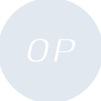
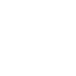

# optimism

[← Back to main README](../../README.md)





## 16 px

### black
```
https://georgegach.github.io/compatible-icons/simple-icons/optimism/16/black.png
```

### slate
```
https://georgegach.github.io/compatible-icons/simple-icons/optimism/16/slate.png
```

### white
```
https://georgegach.github.io/compatible-icons/simple-icons/optimism/16/white.png
```

## 64 px

### black
```
https://georgegach.github.io/compatible-icons/simple-icons/optimism/64/black.png
```

### slate
```
https://georgegach.github.io/compatible-icons/simple-icons/optimism/64/slate.png
```

### white
```
https://georgegach.github.io/compatible-icons/simple-icons/optimism/64/white.png
```

## 128 px

### black
```
https://georgegach.github.io/compatible-icons/simple-icons/optimism/128/black.png
```

### slate
```
https://georgegach.github.io/compatible-icons/simple-icons/optimism/128/slate.png
```

### white
```
https://georgegach.github.io/compatible-icons/simple-icons/optimism/128/white.png
```

## 512 px

### black
```
https://georgegach.github.io/compatible-icons/simple-icons/optimism/512/black.png
```

### slate
```
https://georgegach.github.io/compatible-icons/simple-icons/optimism/512/slate.png
```

### white
```
https://georgegach.github.io/compatible-icons/simple-icons/optimism/512/white.png
```

## 1024 px

### black
```
https://georgegach.github.io/compatible-icons/simple-icons/optimism/1024/black.png
```

### slate
```
https://georgegach.github.io/compatible-icons/simple-icons/optimism/1024/slate.png
```

### white
```
https://georgegach.github.io/compatible-icons/simple-icons/optimism/1024/white.png
```

## 16 px in base64

### black
```
data:image/png;base64,iVBORw0KGgoAAAANSUhEUgAAABAAAAAQCAYAAAAf8/9hAAAABmJLR0QA/wD/AP+gvaeTAAABDklEQVQ4jZXTvUpDQRAF4C9RQZSIMaTWyiewVUnwEXw1C1FSWtrYi2BnZyMWV0isYuIPBPEHTbS4G7hZ71UzMLA7zJyZM3uWSVtBCzfo4S14L8QOUVVgO+hgiK8CH6KNZl5x95fC2LtoZMfuTFE89jaWZ7CHLZSKuBXYEuqky4nRX9DHZ7g/4kG60GxeUkYlQu7iBLc4D2DHAeAIT5ncSh7ANTawikvMYQE1DGIa5RxuV1jEM9bDRNVAaVekg5JUJPVM7ALvuMem9IVqWMtp1id/iQN8hPOrYnElZZxhFCFXMBvO88ijOsKpwKld0OFPIY3RmqaX8nY8UsP/P9OP4rFVcYAEdya/c4L97NjwDX5ijrzR2MJ6AAAAAElFTkSuQmCC
```

### slate
```
data:image/png;base64,iVBORw0KGgoAAAANSUhEUgAAABAAAAAQCAYAAAAf8/9hAAAABmJLR0QA/wD/AP+gvaeTAAABr0lEQVQ4jZWSz2pTURjEf3N6Y+Kf1FyliBBNshGXXRR3Ugp9BEG6EvoO4jtoX8GduHTj2lTxAYobke5uQ6HBamIiSjA54yKJ3lxTsLM6i2/OzHzziRw6nW/XXIp7oE1MFVgFQAxAQ4j7Hulxo1HrzTmaP467/e2J/VyEunFgOaJxx2PtNuu19p8Pjrv97bF5IbhxBrGIbrR3mjfTfc1sH4Bu/ycZAOMsllkPLsU9EernIU+t61Yy0rMA2ixmFvwEToGJp3I9zFfQKDcWjLYCUF20xomDXtscCd7L/oF4ReBLwC8x+QaqYVZXXv0T0RsSDdAHpJLQJazrDhosiNmri3UZCPpouGzzHXEHOLGdSnx29ANEmqckiCFQmcsT2ZB9iDi1uY/IgLu2m0t2OUyAIbCWs3FP0hBx0SZx5IrkC7mb+xtXGgTwWyAWklRtkukQFdA/l2mI4LayrJ9S4UCmscTimbCdxQrrodGo9fyLXUP3HPxuTJJHrTTtB4Bmvda2vYN9VIxTtG2cTVZWHrbWqu+gsJks66ehzFPQFlCN9tXZ0ABpIPxmXPaTVpr255zfAoi80t6F6sAAAAAASUVORK5CYII=
```

### white
```
data:image/png;base64,iVBORw0KGgoAAAANSUhEUgAAABAAAAAQCAYAAAAf8/9hAAAABmJLR0QA/wD/AP+gvaeTAAABJklEQVQ4jZ2Tu0pDQRRFV2J8G/Eq1oqFXyB2EhL8BH9OIpaWNvYi2NnZiEUCiVVMFCG+i2RZOAk3l0kwLhgYzsw+s8/MGUihrqunal1tq19htEPsRE2IoR6qTbXneHpqQ63ExK0JwiwttZy23ZxCPKChruFvzZNsj6OnVnNqHdjJXMkn8A4kwAzwAggsA/OpffU8UMyIW8AF8ABcAx/AOfAMnIVkA4qxBPfAHrAF3AKzwBKwAXQze1fzkRe9C1bfgN3gKAE6wFGYD8mpbWAzFbsBvoEn4ABohtO3I4d1CsBrJsF+iC0CBWAFmIuIAbp54AroZxaKQQywAMRK7QOXqEloiv81EoBacfpWLo34Ucv+/TOVIiUxKKeq1tRHR79zTT0e2g78AMNo87xKeBS8AAAAAElFTkSuQmCC
```

