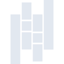
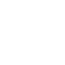

# pandas

[← Back to main README](../../README.md)

<table><tr>
  <td></td>
  <td></td>
  <td></td>
</tr></table>

## 16 px

### black
```
https://georgegach.github.io/compatible-icons/simple-icons/compat/pandas/16/black.png
```

### slate
```
https://georgegach.github.io/compatible-icons/simple-icons/compat/pandas/16/slate.png
```

### white
```
https://georgegach.github.io/compatible-icons/simple-icons/compat/pandas/16/white.png
```

## 64 px

### black
```
https://georgegach.github.io/compatible-icons/simple-icons/compat/pandas/64/black.png
```

### slate
```
https://georgegach.github.io/compatible-icons/simple-icons/compat/pandas/64/slate.png
```

### white
```
https://georgegach.github.io/compatible-icons/simple-icons/compat/pandas/64/white.png
```

## 128 px

### black
```
https://georgegach.github.io/compatible-icons/simple-icons/compat/pandas/128/black.png
```

### slate
```
https://georgegach.github.io/compatible-icons/simple-icons/compat/pandas/128/slate.png
```

### white
```
https://georgegach.github.io/compatible-icons/simple-icons/compat/pandas/128/white.png
```

## 512 px

### black
```
https://georgegach.github.io/compatible-icons/simple-icons/compat/pandas/512/black.png
```

### slate
```
https://georgegach.github.io/compatible-icons/simple-icons/compat/pandas/512/slate.png
```

### white
```
https://georgegach.github.io/compatible-icons/simple-icons/compat/pandas/512/white.png
```

## 1024 px

### black
```
https://georgegach.github.io/compatible-icons/simple-icons/compat/pandas/1024/black.png
```

### slate
```
https://georgegach.github.io/compatible-icons/simple-icons/compat/pandas/1024/slate.png
```

### white
```
https://georgegach.github.io/compatible-icons/simple-icons/compat/pandas/1024/white.png
```

## 16 px in base64

### black
```
data:image/png;base64,iVBORw0KGgoAAAANSUhEUgAAABAAAAAQCAYAAAAf8/9hAAAABmJLR0QA/wD/AP+gvaeTAAAA9klEQVQ4jZXTu0rEQBjF8R+iiIVbCIrYKMJaiJdOfAlbC8utba238Ams7X0CG0t3G7WSbVTES7GFICoIgjfQIrMSwsRJDgzk+2bOPzmTGeJaxza2cr1xPOEHrRLfnw7CwpsCoF8EDCVAn6k3Deeem9jAd6G/iRncpmCt8HmP2A+Gc1yEfkfFCB+4C6BrfFWNkNdaGI0UoGwTT3CKHl5lf+OhDmAB01iUxXnGfWxhWYQJzOISq1jGex1AXmd4wzHm6wJGsYJJLIW6EmAPh3hBG3OyjdwNnm7MNDhIfdm5H6gX+kcxU+ouwMh/k7EIY4V6B1O4igF+AdLYNIFItL55AAAAAElFTkSuQmCC
```

### slate
```
data:image/png;base64,iVBORw0KGgoAAAANSUhEUgAAABAAAAAQCAYAAAAf8/9hAAAABmJLR0QA/wD/AP+gvaeTAAABYUlEQVQ4jZWQMUtbYRiFn/PdhNBBBSESRDQUWkRsXYp08Se4Cs7u3TqLdO7Q/oCOzg7upbho6dSpUpJoFQzeokmhpNZ7v9NBCA3ehPiO73nfh3OOKJjzdvdl5vwFTq7qs1O7AGmaTvSy8gliOhK26rXJDwClIkCEV0FhE7kJ7PYFuQcauA1FgP49/B2lDzg4u+w+seO6FLJol+S7/elFZwNptperCflwQB61FtBb2z8D7Bm1TLwJaMd4EXGA7zsoiOAbQwucyvpucTtWhMHRKngVMQmjAYUlCh8KjiLxK+iXTcPR7QcAeArURFgSsSVxReBk7AgRTYMXBN+MVoBnQn8oaHFIB//D+JzAbzt+Ah6PFaH/bFcCPI+mhrQMqozlIDi+yxT3k5Bc22xL1GUaBL2xYymRD0YCKqXsy1y1+hHgR7uzDWDI52em3j8oAoCgPEq/78B6NAgIr3OYKYvjIsA/2ASHTUItZAoAAAAASUVORK5CYII=
```

### white
```
data:image/png;base64,iVBORw0KGgoAAAANSUhEUgAAABAAAAAQCAYAAAAf8/9hAAAABmJLR0QA/wD/AP+gvaeTAAAA/UlEQVQ4jZXTvyvFYRTH8VciGa5BkSykSPJjk8WfYDUY72w1S2aDf8JssBhlwXgn0sVwB+VXKeWijuE+w7ev5/469Qzn1/v0OZ2HjEXEekTsRMR2IVaJiNdoWTXXVwQcp8J6CdAoAwY6kvjukjdYmDCHTfyW4luYwn1HADZwiBec4AFN7GMBFzlATkIzNT/jDj89SSjZWnqj3QDtlniJK9TwgTqe+gHMYxKLWnLe8JgrbCdhDNO4wSqW8dUPoGjX+MQ5ZvsFDGMF41hKfk+AI5ziHXuY0VrkQer5fxMRUU133oiISiFeS/Gz3KRufwGGOiVzEkZK/i4mcJsD/AFxLXV4P9vQGwAAAABJRU5ErkJggg==
```

