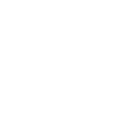

# paperswithcode

[← Back to main README](../../README.md)

<table><tr>
  <td></td>
  <td></td>
  <td></td>
</tr></table>

## 16 px

### black
```
https://georgegach.github.io/compatible-icons/simple-icons/compat/paperswithcode/16/black.png
```

### slate
```
https://georgegach.github.io/compatible-icons/simple-icons/compat/paperswithcode/16/slate.png
```

### white
```
https://georgegach.github.io/compatible-icons/simple-icons/compat/paperswithcode/16/white.png
```

## 64 px

### black
```
https://georgegach.github.io/compatible-icons/simple-icons/compat/paperswithcode/64/black.png
```

### slate
```
https://georgegach.github.io/compatible-icons/simple-icons/compat/paperswithcode/64/slate.png
```

### white
```
https://georgegach.github.io/compatible-icons/simple-icons/compat/paperswithcode/64/white.png
```

## 128 px

### black
```
https://georgegach.github.io/compatible-icons/simple-icons/compat/paperswithcode/128/black.png
```

### slate
```
https://georgegach.github.io/compatible-icons/simple-icons/compat/paperswithcode/128/slate.png
```

### white
```
https://georgegach.github.io/compatible-icons/simple-icons/compat/paperswithcode/128/white.png
```

## 512 px

### black
```
https://georgegach.github.io/compatible-icons/simple-icons/compat/paperswithcode/512/black.png
```

### slate
```
https://georgegach.github.io/compatible-icons/simple-icons/compat/paperswithcode/512/slate.png
```

### white
```
https://georgegach.github.io/compatible-icons/simple-icons/compat/paperswithcode/512/white.png
```

## 1024 px

### black
```
https://georgegach.github.io/compatible-icons/simple-icons/compat/paperswithcode/1024/black.png
```

### slate
```
https://georgegach.github.io/compatible-icons/simple-icons/compat/paperswithcode/1024/slate.png
```

### white
```
https://georgegach.github.io/compatible-icons/simple-icons/compat/paperswithcode/1024/white.png
```

## 16 px in base64

### black
```
data:image/png;base64,iVBORw0KGgoAAAANSUhEUgAAABAAAAAQCAYAAAAf8/9hAAAABmJLR0QA/wD/AP+gvaeTAAAAwUlEQVQ4je3TMUpDQRgE4C/LQ7ESsbASgp1nCKTKJXJKz6CFd0ijQipBQUihecpbmxHWYPEilg4MPzvMzL8sLH+AJ6wzFyP8izbT4RQfeNtj6SGO0UHFPVa4xgwnmOIqnEabxbNKpk5ScIcS4xoH6LMJto12jgcMuCjNtYbMgrOcazhEKztebcGv8F/wvaB94cecJ2GJNuzmSjN73GCJS8xxG86jLePp25KKd2yM/wubZGqHZ7ziaET4C1u87Jn5GZ8GwDQn8hLRPAAAAABJRU5ErkJggg==
```

### slate
```
data:image/png;base64,iVBORw0KGgoAAAANSUhEUgAAABAAAAAQCAYAAAAf8/9hAAAABmJLR0QA/wD/AP+gvaeTAAABFklEQVQ4je2TO06CARCEv1kJjwoTCyojscNDUHkBOzmGB/AMXsPOC1hReARLI2gMJJr82gB/cMeCRyQxRrR1qil2vs1uduGP0nBUPEtMbBoWpwet3evvAoNxcSxzucpUgD3MHJhu0biGaQKVCkCaR6Ey5PPB+G3CNG+z6uaOuAB4N2dR6pV6HAV5buspcVWireGoMOLOSUi0gQdDNXAJUVs0zFmiqqAE9m3uFSTmMNbLCHLhHIIWUhrb2EgpaIFjsxbWgN/qH/AJ4Fx5pWGMHUISEnYYxqDcrF0CnIRQKdG3oseMztx0Td6YvJmbLjM6VvQk+kLlCqLhqLBgbphanPzwF64EdS9P+QUxwTS2GH2GKLbMfK0PV0iHPNQj4x4AAAAASUVORK5CYII=
```

### white
```
data:image/png;base64,iVBORw0KGgoAAAANSUhEUgAAABAAAAAQCAYAAAAf8/9hAAAABmJLR0QA/wD/AP+gvaeTAAAAzklEQVQ4je3TsUoDQRgE4C/HoViJWFgJwc5nCKTKS+QpfQYtfIc0KqQSFIQUmlNuLPyRM1h42jow/Oww8/+7yy5/RZKHJOuqix/4F8NMi2O84WXE3H0copUP3CZZJblMMktylGSa5KI4LW1WnlVlMkkS3KDBFGvsoatJsB1op7hDj7NmsK2+aoOTWqfYl9bseA0b/Ar/Db42GN7wfa0nxaa0fjfXDGqHKyxxjjmui/PSluXpPrP1El+TbEb8hU1l0uIRzzgYcfQtnkZmvsc7SvqWxGeIB8YAAAAASUVORK5CYII=
```

