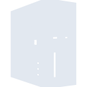
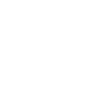

# pcgamingwiki

[← Back to main README](../../README.md)

<table><tr>
  <td></td>
  <td></td>
  <td></td>
</tr></table>

## 16 px

### black
```
https://georgegach.github.io/compatible-icons/simple-icons/compat/pcgamingwiki/16/black.png
```

### slate
```
https://georgegach.github.io/compatible-icons/simple-icons/compat/pcgamingwiki/16/slate.png
```

### white
```
https://georgegach.github.io/compatible-icons/simple-icons/compat/pcgamingwiki/16/white.png
```

## 64 px

### black
```
https://georgegach.github.io/compatible-icons/simple-icons/compat/pcgamingwiki/64/black.png
```

### slate
```
https://georgegach.github.io/compatible-icons/simple-icons/compat/pcgamingwiki/64/slate.png
```

### white
```
https://georgegach.github.io/compatible-icons/simple-icons/compat/pcgamingwiki/64/white.png
```

## 128 px

### black
```
https://georgegach.github.io/compatible-icons/simple-icons/compat/pcgamingwiki/128/black.png
```

### slate
```
https://georgegach.github.io/compatible-icons/simple-icons/compat/pcgamingwiki/128/slate.png
```

### white
```
https://georgegach.github.io/compatible-icons/simple-icons/compat/pcgamingwiki/128/white.png
```

## 512 px

### black
```
https://georgegach.github.io/compatible-icons/simple-icons/compat/pcgamingwiki/512/black.png
```

### slate
```
https://georgegach.github.io/compatible-icons/simple-icons/compat/pcgamingwiki/512/slate.png
```

### white
```
https://georgegach.github.io/compatible-icons/simple-icons/compat/pcgamingwiki/512/white.png
```

## 1024 px

### black
```
https://georgegach.github.io/compatible-icons/simple-icons/compat/pcgamingwiki/1024/black.png
```

### slate
```
https://georgegach.github.io/compatible-icons/simple-icons/compat/pcgamingwiki/1024/slate.png
```

### white
```
https://georgegach.github.io/compatible-icons/simple-icons/compat/pcgamingwiki/1024/white.png
```

## 16 px in base64

### black
```
data:image/png;base64,iVBORw0KGgoAAAANSUhEUgAAABAAAAAQCAYAAAAf8/9hAAAABmJLR0QA/wD/AP+gvaeTAAABEUlEQVQ4jYXTTU4CQRCG4WcAQSNuXBjdeRNPomfyCC49gXtXegFPYAzG3yiRAM6Ai6mJTTOESjrdqe7v7arqLtatwBluMMUvljG+8IBrdHPhKS7xGocrjAMyxgveMIn9QSoeYBEb8+TGRQA+E98KoJeEXcRNHewk/mZ+jr299OaeVduPQ4sQVQmgn+fcBiiSVD4izH74DsM/TQWdDNDkWGIY6zSF+TZAJ4QDXOEoAXRjzjVg13+VlxHBCDNbXiGnlTHmOMZ7+A/UNVmzHNBTV74p7knMEzy2AfJXoP4DVUSx1doKUrSsi5ZzGwFl+DeKNoEucG+1F5qPU+FH/Re+tTRTakOc407dymk7z/CEW9EvfwWnWJINl80FAAAAAElFTkSuQmCC
```

### slate
```
data:image/png;base64,iVBORw0KGgoAAAANSUhEUgAAABAAAAAQCAYAAAAf8/9hAAAABmJLR0QA/wD/AP+gvaeTAAABiElEQVQ4jY2Ru25TURBF1zq+TkhiFIEIhAIpTf4gNQXiA6BOQU9Fx+/wO9SUQVAQiWBBeESyE9v3bArfvIwDTHV0RnvN3jOyUEk8PPrxOKW8puaJ0gs0XfsX5BDy7tGDO/tq67nw4+fvO02vvKJmP3BPqJBRUvpYp+CYUDDr4NrZyeat3V3PGoCDg6z2/PkhNaJTEgIF3AAm6IywhSCOc8VxA9A0CBg4saYg/a4/dxhEj4RSkzUXAeelbDCfXKEKpZ3r0ZqVXCKXAwgCVZPE41BXpawoFbiLpITTqxHK4hFIRqnMCIOeZXQJ9og4iTnlL4CCDpBVCm/a5P5FBNIDJNc1DcurJT4zmSIoNWGr22Z7YwRhhsyACWQb862LcJtwvGzSNUCgIbbRzpkP5+CMLHxaBvgjgqRPbMEJZJnmZgedCzHdO178/S8AnAkFL8T/drCzwyTJC8JbhIQeoS/257FcJ+yiX7olX45bJA6Hw8F41n9u8SWwh0C6XYUJ+pXk/XB78+meTn8DOheuKilcHUAAAAAASUVORK5CYII=
```

### white
```
data:image/png;base64,iVBORw0KGgoAAAANSUhEUgAAABAAAAAQCAYAAAAf8/9hAAAABmJLR0QA/wD/AP+gvaeTAAABLElEQVQ4jYWTSUpDQRCGv87gMxpBBEV3bjyHV/AC4pU8gktP4N6VeABPIIIzSCDDy/C5SIV0nu9hQdPdVf1/XdUDVExN6rl6p47VqWv7UZ/UW7VdFZ6q1+pHLJ6rg4AM1Hf1Ux1GvABIIS6AUcynQHfFBcqI7YdvBPSA7ZTSpBPOFG0AtDJAyvrXiPXyzDts2m4sWoRongG2qudVB0ghFvgGihAugIPwj3NBqwIQGAIzoB/jvITyP0ArhAVwAxxlgHb0G5pqCSubAxcsb4Qo4TCLNWYwi1YCx8BX+PdYnskfqwI6scMqs5Poh8BzHaCuhG5AyjrBfxnA+vHk41SzrhEwC3+jqA5QAlfAY8zbLEtZPekd4Ax4iw2aTe2rl+pDfOX8O0/UF/Ve7QL8AnarsUXxusr6AAAAAElFTkSuQmCC
```

