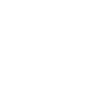

# pexels

[← Back to main README](../../README.md)




## 16 px

### black
```
https://georgegach.github.io/compatible-icons/simple-icons/pexels/16/black.png
```

### slate
```
https://georgegach.github.io/compatible-icons/simple-icons/pexels/16/slate.png
```

### white
```
https://georgegach.github.io/compatible-icons/simple-icons/pexels/16/white.png
```

## 64 px

### black
```
https://georgegach.github.io/compatible-icons/simple-icons/pexels/64/black.png
```

### slate
```
https://georgegach.github.io/compatible-icons/simple-icons/pexels/64/slate.png
```

### white
```
https://georgegach.github.io/compatible-icons/simple-icons/pexels/64/white.png
```

## 128 px

### black
```
https://georgegach.github.io/compatible-icons/simple-icons/pexels/128/black.png
```

### slate
```
https://georgegach.github.io/compatible-icons/simple-icons/pexels/128/slate.png
```

### white
```
https://georgegach.github.io/compatible-icons/simple-icons/pexels/128/white.png
```

## 512 px

### black
```
https://georgegach.github.io/compatible-icons/simple-icons/pexels/512/black.png
```

### slate
```
https://georgegach.github.io/compatible-icons/simple-icons/pexels/512/slate.png
```

### white
```
https://georgegach.github.io/compatible-icons/simple-icons/pexels/512/white.png
```

## 1024 px

### black
```
https://georgegach.github.io/compatible-icons/simple-icons/pexels/1024/black.png
```

### slate
```
https://georgegach.github.io/compatible-icons/simple-icons/pexels/1024/slate.png
```

### white
```
https://georgegach.github.io/compatible-icons/simple-icons/pexels/1024/white.png
```

## 16 px in base64

### black
```
data:image/png;base64,iVBORw0KGgoAAAANSUhEUgAAABAAAAAQCAYAAAAf8/9hAAAABmJLR0QA/wD/AP+gvaeTAAAAmUlEQVQ4jd3SMQrCQBAF0GfQSrSIhSJ4Ao/ikT2DYGctSJBsJ9goosWuEEKUGK38MLAzu/Pnz8xCwL2jlb106Izsm+SfEPRfxEsUFX+EGYZtFQQccUkWsMaprQJYYFnxt4l03EZBEwa41YNtCAJ22GBav3zXwhMHcQ4r5J8QFLhiL85i0vToFUGOc6o8F9fYiD/4ypm4pq4ID1ogKTpuTxELAAAAAElFTkSuQmCC
```

### slate
```
data:image/png;base64,iVBORw0KGgoAAAANSUhEUgAAABAAAAAQCAYAAAAf8/9hAAAABmJLR0QA/wD/AP+gvaeTAAAAuUlEQVQ4jbWPOQoCURBEXw0aiQYuuIAnmKN4ZM8gmBkrouIPBMFkxF9Gosh8HB2srJd6Xa3N/hSQ+vymkNUwAwyyGmYAagMaZU2hI/LuUdu0wSNQq1ICEwNRB0cKRwogAHPgXCkBgBWnoPwJ1VLmgOh8TFBOdNPoVumFNwXQSrCQPHwfJl94SGKLKSzNgO4XgGwn+WqzBudAr2wrAci62BebApgg2qkzCYDHiHE63cupKkt/B4Qa/nAHf946c4M9fX0AAAAASUVORK5CYII=
```

### white
```
data:image/png;base64,iVBORw0KGgoAAAANSUhEUgAAABAAAAAQCAYAAAAf8/9hAAAABmJLR0QA/wD/AP+gvaeTAAAAnklEQVQ4jd3SMQrCQBCF4S9BK9EiCorgCTyKR/YMgp21IEHcTrBRZC0SIYQoMVr5YIuZ3fn37cwmMcaAiW4KSYwxdiwG6TfFPwH0XuRPyCvxEDMM2joIOOJaroA1zm0dwALLSrwtoaM2DprUx72ebAMI2GGDaX3z3ROeOij6sEL2CSDHDXtFL8ZNh14BMlzKm+eKMTbqD75yqhhTV4UHYGkkVflg8ZIAAAAASUVORK5CYII=
```

