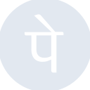

# phonepe

[← Back to main README](../../README.md)





## 16 px

### black
```
https://georgegach.github.io/compatible-icons/simple-icons/phonepe/16/black.png
```

### slate
```
https://georgegach.github.io/compatible-icons/simple-icons/phonepe/16/slate.png
```

### white
```
https://georgegach.github.io/compatible-icons/simple-icons/phonepe/16/white.png
```

## 64 px

### black
```
https://georgegach.github.io/compatible-icons/simple-icons/phonepe/64/black.png
```

### slate
```
https://georgegach.github.io/compatible-icons/simple-icons/phonepe/64/slate.png
```

### white
```
https://georgegach.github.io/compatible-icons/simple-icons/phonepe/64/white.png
```

## 128 px

### black
```
https://georgegach.github.io/compatible-icons/simple-icons/phonepe/128/black.png
```

### slate
```
https://georgegach.github.io/compatible-icons/simple-icons/phonepe/128/slate.png
```

### white
```
https://georgegach.github.io/compatible-icons/simple-icons/phonepe/128/white.png
```

## 512 px

### black
```
https://georgegach.github.io/compatible-icons/simple-icons/phonepe/512/black.png
```

### slate
```
https://georgegach.github.io/compatible-icons/simple-icons/phonepe/512/slate.png
```

### white
```
https://georgegach.github.io/compatible-icons/simple-icons/phonepe/512/white.png
```

## 1024 px

### black
```
https://georgegach.github.io/compatible-icons/simple-icons/phonepe/1024/black.png
```

### slate
```
https://georgegach.github.io/compatible-icons/simple-icons/phonepe/1024/slate.png
```

### white
```
https://georgegach.github.io/compatible-icons/simple-icons/phonepe/1024/white.png
```

## 16 px in base64

### black
```
data:image/png;base64,iVBORw0KGgoAAAANSUhEUgAAABAAAAAQCAYAAAAf8/9hAAAABmJLR0QA/wD/AP+gvaeTAAABJklEQVQ4jY3TzS5DQRwF8F+vJjY+mtYGERaeAIm1+ngA8Vq2JISNtbU3YGljJUVDoi0iaSqioWFxp8nt6BUnmdzMzP9/7pkzZxhEBYe4xTM+0EULNRyhJAdbqKOH75zRCzXVuHkDzUzhEy6CkmFEzdBDkFSPCr5wiRXc55DcoQzHObJ7uMI2Gjn7+yPYDeb1cR0UNVHAaDBvOjROhroCygkmIj8SnOIkHGUZZ/gMBFmMFzOMfSxiCZ3wfQwq5jAf1Y4lQ1j78oatx0iS8KcYszjHK4p/kLWLgWAq2ljAO3Ywg3YOQQcODL/GNh7wEkjiUPWksVfxO0hx6lalwcmu12UuYNNglOPRwFs0X4vPU/X/x7Se44mSNHU16RPuSs1s4QZ7BlPrB8QXiC6/XOTVAAAAAElFTkSuQmCC
```

### slate
```
data:image/png;base64,iVBORw0KGgoAAAANSUhEUgAAABAAAAAQCAYAAAAf8/9hAAAABmJLR0QA/wD/AP+gvaeTAAAB6klEQVQ4jW2Tu2uTYRTGf8+bLy0WE9OqROyXXtDZof0DBBX/AkcXLV2cBF0cHAUXncVBBF0VNxGqRRBdBTdRW5paWqQmaUSM+fI+Dr2Y25lezjnP5RzOK7pifX3nqJN413BeUIimICFDXagp/DYb9Y3Z8fH6Pkb7j7WN+kUFP4RQMQ4MCxMtV53p6kxaenNA8H2rfiEzTwXlvdYfoK+SyzazgzxsJeLyZLm0pJVarRRa+iiY7urpGH9S1KKCnxtVhthZVTvMh1xL92X6G3JCZwh+jLhu2OyHizDlxHe0ttn4Aj51UJA+GzcBZOctfVBO7+hwjRgnLU110XwL4GKPMTvYPJP1JFoZ9rz+6KWj20juG6OQgI5AT/50EHOOsSlpDsJGHG2NEvMVu2dPCA4H232se7UBtcGwCUF78/ZWmIzwHvgpSCJjQ8kkNRJLTcGxXjwz+Zx+O4uXHHRypN1oZLmxITo0kwBLoIW+6zvR6fgBQTvYh7J8fpk4gI8iLgdl4VYkVoc4LGJSUKbOSAX/P/tddVf/jvhmSNPiNh0tGraGzQkuR/kF9vGu5KbNlVMTE40D1tX1+jklfqTdsx3+maRoxyqZFqbT0mug19ZKrVbKtbgH4axxAVMKogNqGv9CvArtcDtNi9v7mH+S8uEx0+0EaQAAAABJRU5ErkJggg==
```

### white
```
data:image/png;base64,iVBORw0KGgoAAAANSUhEUgAAABAAAAAQCAYAAAAf8/9hAAAABmJLR0QA/wD/AP+gvaeTAAABPUlEQVQ4jY2Tyy5DURSGPycVE5cGI41LwhOUxBjlAcRTeCASDRNjYy8gOjQxEkpIaBFJU2kIzWfQ09jdOUd8o33515+19l4LAtQptarW1Rf1Q/1Um+q1eqgWyULdUu/Urvl0U816HFxRG4HwWa2lmWTRUCv94GLqGvKtXqgr6n2Oya06iXqUk3ZXvVS31aec+/0h9RpYDCq6AtrpehioAWfALlAC5gJtPQHGo/dMgBPgGPgGloFT4Asw0o4VgInocAkop1mUgUdgBJgF5iPtaJLhCjCUcx6TJPzWG1ICzoE3oPCHWauQGkxHFwtAB9gBZoBWjkEb9SDnG1vqg/qqzmQ0VVet9vs/bqSQhrqaNk7Indr7AHXTwVaOeVLfo/3aQDHquv8fpo3MF7E3F4f2Rrdpb5Q76fpG3VOnwpgfeQEia5NTj7wAAAAASUVORK5CYII=
```

