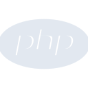
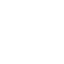

# php

[← Back to main README](../../README.md)





## 16 px

### black
```
https://georgegach.github.io/compatible-icons/simple-icons/php/16/black.png
```

### slate
```
https://georgegach.github.io/compatible-icons/simple-icons/php/16/slate.png
```

### white
```
https://georgegach.github.io/compatible-icons/simple-icons/php/16/white.png
```

## 64 px

### black
```
https://georgegach.github.io/compatible-icons/simple-icons/php/64/black.png
```

### slate
```
https://georgegach.github.io/compatible-icons/simple-icons/php/64/slate.png
```

### white
```
https://georgegach.github.io/compatible-icons/simple-icons/php/64/white.png
```

## 128 px

### black
```
https://georgegach.github.io/compatible-icons/simple-icons/php/128/black.png
```

### slate
```
https://georgegach.github.io/compatible-icons/simple-icons/php/128/slate.png
```

### white
```
https://georgegach.github.io/compatible-icons/simple-icons/php/128/white.png
```

## 512 px

### black
```
https://georgegach.github.io/compatible-icons/simple-icons/php/512/black.png
```

### slate
```
https://georgegach.github.io/compatible-icons/simple-icons/php/512/slate.png
```

### white
```
https://georgegach.github.io/compatible-icons/simple-icons/php/512/white.png
```

## 1024 px

### black
```
https://georgegach.github.io/compatible-icons/simple-icons/php/1024/black.png
```

### slate
```
https://georgegach.github.io/compatible-icons/simple-icons/php/1024/slate.png
```

### white
```
https://georgegach.github.io/compatible-icons/simple-icons/php/1024/white.png
```

## 16 px in base64

### black
```
data:image/png;base64,iVBORw0KGgoAAAANSUhEUgAAABAAAAAQCAYAAAAf8/9hAAAABmJLR0QA/wD/AP+gvaeTAAAA8klEQVQ4jdXSzUoDQRAE4M81Iv6Bgn+Y5CR4FkTwsUR8SQVBdA0e1IPREBRDEHRNFNfDdjDI+ABpGJiunqpuqoeJj6kE1sABdrERWBfnOMFDSmgGx2ihgyHKP2cYtRaOUBuRm8jxkSDcJoRKFMFpwNVYoYsvXOMNp3jFXdS+cYPHeJ9nIxV84h7T0b2Ppbg/B6nAbOTQzMZ8eEEWneAdCzHJGgaB9bAZb8oM7UgKzMWYO1jGKhaxgvnwadvvdtpQx2V06P1jWj/GHjfxAluj8Wuq1eSqVQ0SIoPwIcdhcJIfqY597GE9sCecqbbSSXAmOX4ApUdcbrsMJyEAAAAASUVORK5CYII=
```

### slate
```
data:image/png;base64,iVBORw0KGgoAAAANSUhEUgAAABAAAAAQCAYAAAAf8/9hAAAABmJLR0QA/wD/AP+gvaeTAAABbUlEQVQ4jdWSTU5TcRTFf+e+AgE/UqQfJrQO1DBhYmJMXALrYAG4F+OQfdAtaDRxagwx8bUGSos1hA/7Xv/HwZMEWjbAGd7k/M7JvRfuvTQ/6PfHHZazt8ArJ9oJkwVHtr6qmH3sdDb6C4DP9lJrePYOe9ekuhQN7KW5qAJ7hGNCpP1uq/5eUqnBYNydZbUD4CV45abBdi70/I7iVyYdZmXaiTKLHni7MusYeybxDVMIjQ1nNj8Qx4CRDhGnQtupFr0QdG5U/ImUYaaSJkKPBFPBiRMD4JKUVnA6ATB0w9etrDEQmCNjbF8YPxCcI5oh/RW6SOIU9LTKlENE/p9wibyKnIy2hOrGDcNDpHXjNeSrDL0A2hXAufLRaNOzWo+kLfA5Yn1+ZYY/ggJoXC9R8ndHsSMA27V8ONmTYzeRnkBsCC/fhmgqGAG/A/Y3248/SCoXHqlqlL3BvBZqVWYPEV+I8tOzZvPX4lnvtf4BeJivtoBp8fIAAAAASUVORK5CYII=
```

### white
```
data:image/png;base64,iVBORw0KGgoAAAANSUhEUgAAABAAAAAQCAYAAAAf8/9hAAAABmJLR0QA/wD/AP+gvaeTAAABC0lEQVQ4jdWSTUtCYRCFn3szoi8o6IvUVdA6iKCfFdGfTAiibtKiWmSKJIkEptfCp81cEL39gGb1zjnvGZhzBv59JfOAWgPOgRNgP+AucAtcJ0nytjBFXVav1KbaUScu1iS4pnqpVgpxXc3UcYnguWSQ6ig0NdSHGaKr/qiP6lBtqJ/qS3BT9Ultx/8sBWqxyTfwCiwBE2AAbMa7B7SBEbASPUA9nbHiA0jDMIAvYB0YArtAHlgfOCjsS4FWNCNgFZgCx8AWsANsANvAGjAGjmbSaaFW1Xs1V/t/mDZQe3Mm3qmHRRKViCaLqPKSIXmYl6kXRYxlh1QFzoBTYC/gd+AGaCRJ0lk4pP9dv0CQRZmH+TC2AAAAAElFTkSuQmCC
```

