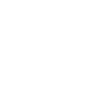

# phpstorm

[← Back to main README](../../README.md)

<table><tr>
  <td></td>
  <td></td>
  <td></td>
</tr></table>

## 16 px

### black
```
https://georgegach.github.io/compatible-icons/simple-icons/compat/phpstorm/16/black.png
```

### slate
```
https://georgegach.github.io/compatible-icons/simple-icons/compat/phpstorm/16/slate.png
```

### white
```
https://georgegach.github.io/compatible-icons/simple-icons/compat/phpstorm/16/white.png
```

## 64 px

### black
```
https://georgegach.github.io/compatible-icons/simple-icons/compat/phpstorm/64/black.png
```

### slate
```
https://georgegach.github.io/compatible-icons/simple-icons/compat/phpstorm/64/slate.png
```

### white
```
https://georgegach.github.io/compatible-icons/simple-icons/compat/phpstorm/64/white.png
```

## 128 px

### black
```
https://georgegach.github.io/compatible-icons/simple-icons/compat/phpstorm/128/black.png
```

### slate
```
https://georgegach.github.io/compatible-icons/simple-icons/compat/phpstorm/128/slate.png
```

### white
```
https://georgegach.github.io/compatible-icons/simple-icons/compat/phpstorm/128/white.png
```

## 512 px

### black
```
https://georgegach.github.io/compatible-icons/simple-icons/compat/phpstorm/512/black.png
```

### slate
```
https://georgegach.github.io/compatible-icons/simple-icons/compat/phpstorm/512/slate.png
```

### white
```
https://georgegach.github.io/compatible-icons/simple-icons/compat/phpstorm/512/white.png
```

## 1024 px

### black
```
https://georgegach.github.io/compatible-icons/simple-icons/compat/phpstorm/1024/black.png
```

### slate
```
https://georgegach.github.io/compatible-icons/simple-icons/compat/phpstorm/1024/slate.png
```

### white
```
https://georgegach.github.io/compatible-icons/simple-icons/compat/phpstorm/1024/white.png
```

## 16 px in base64

### black
```
data:image/png;base64,iVBORw0KGgoAAAANSUhEUgAAABAAAAAQCAYAAAAf8/9hAAAABmJLR0QA/wD/AP+gvaeTAAAA5klEQVQ4jc3SMUvCYRDH8Y9hNASGNDRkbdLW0mKbNDTYFi71Buz19EJqaWyJCMIhwcloKDCnGnJJo6EGT/nz569IDXXw8Bz3HN/73d2Tw5df2MKceVOL5ON+xGn4a6hhCwNc4QwbOEYZi2l6Cyd4xgP2cI82GuhGvBP5k5NPgJaxHn4dr1gJ6BCrKE7rr4VD3OESO9FWHzc4QhVNfKZUTAA1XOAaTxEf4APvEdsORZktVHCQUtfDOfZDTQFLyYRckF7wZjThpPUD0jRaeRWbWYAf27wf6R8Dxlvo4jbjfRelWYC/H+I3pPE93dXPqAAAAAAASUVORK5CYII=
```

### slate
```
data:image/png;base64,iVBORw0KGgoAAAANSUhEUgAAABAAAAAQCAYAAAAf8/9hAAAABmJLR0QA/wD/AP+gvaeTAAABLElEQVQ4jc2SvS6EYRCFnzPfikJCRCHBUokbUNCpFCQKUbkB9yCicwMalUtAR6XQCYVLkPiLoLDVfmJ3jsIG6yeExlSTvDPPe2bm6Oz63vwh4idFEuaLbyqtilObdYBI9zuYAY0h6pgDwbblKmiR8ChJRxtAuEZmqSJWKKjnI0tFBxuZfsDsuWANXEpq+k3zqwKAotJl5+BzzgJwJ9yT8gVEiaLPdu+XO8imTiVOBPsym7YHCFUlLTcaWlXmPOZY0PhcgbLEukpnT4S2DCNOSinGi8jNhJuInEtrV2jwAyDICaNZSS8Ll7jE3lFo2ulaqtItZ2fbhVo+uAXugdF3I9aQL4M4akLIngKGPwP8On5kpP8NeHaiOSc4fP9omMQMfQuwqGKqv1Hw5xGeAMqOgdEfyhTFAAAAAElFTkSuQmCC
```

### white
```
data:image/png;base64,iVBORw0KGgoAAAANSUhEUgAAABAAAAAQCAYAAAAf8/9hAAAABmJLR0QA/wD/AP+gvaeTAAAA+UlEQVQ4jc2Su0qDQRBGT0SxEBSxSOGlEzsbm6RLZRE7sdEX8CXS+gJp8hZJI9jYiATkL+IjRDCpYuHfGIPISZERlhglaKFfs8Nczu7MTkGVX2hhzrwvL1mMswvUwy4CVWAPGAI3QBPYBs6AXWBpGpADr0Atis6BBjACroCLiL+nxSkAYAXYDPsEeALWgF4UbwDrn5ub6F49VjvqtXqgdtVcbaunakXN1DcTpYCqeqneqg/hH6oj9SV8+2ovBaQtlICjqQf2gRZwGHNaBZbThELswQB4jgmnygOSMfnyCrAzC/BjzbtI/xjw8QuPwN2MeBnY+g7w90McA0llpSNnBoENAAAAAElFTkSuQmCC
```

