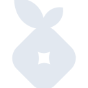
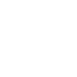

# pihole

[← Back to main README](../../README.md)





## 16 px

### black
```
https://georgegach.github.io/compatible-icons/simple-icons/pihole/16/black.png
```

### slate
```
https://georgegach.github.io/compatible-icons/simple-icons/pihole/16/slate.png
```

### white
```
https://georgegach.github.io/compatible-icons/simple-icons/pihole/16/white.png
```

## 64 px

### black
```
https://georgegach.github.io/compatible-icons/simple-icons/pihole/64/black.png
```

### slate
```
https://georgegach.github.io/compatible-icons/simple-icons/pihole/64/slate.png
```

### white
```
https://georgegach.github.io/compatible-icons/simple-icons/pihole/64/white.png
```

## 128 px

### black
```
https://georgegach.github.io/compatible-icons/simple-icons/pihole/128/black.png
```

### slate
```
https://georgegach.github.io/compatible-icons/simple-icons/pihole/128/slate.png
```

### white
```
https://georgegach.github.io/compatible-icons/simple-icons/pihole/128/white.png
```

## 512 px

### black
```
https://georgegach.github.io/compatible-icons/simple-icons/pihole/512/black.png
```

### slate
```
https://georgegach.github.io/compatible-icons/simple-icons/pihole/512/slate.png
```

### white
```
https://georgegach.github.io/compatible-icons/simple-icons/pihole/512/white.png
```

## 1024 px

### black
```
https://georgegach.github.io/compatible-icons/simple-icons/pihole/1024/black.png
```

### slate
```
https://georgegach.github.io/compatible-icons/simple-icons/pihole/1024/slate.png
```

### white
```
https://georgegach.github.io/compatible-icons/simple-icons/pihole/1024/white.png
```

## 16 px in base64

### black
```
data:image/png;base64,iVBORw0KGgoAAAANSUhEUgAAABAAAAAQCAYAAAAf8/9hAAAABmJLR0QA/wD/AP+gvaeTAAABFUlEQVQ4jZXSvUoDQRTF8V/ERguJBEuDtnaiZd7CJ7Cw1Vex8BEsrCwtfAEhCOJnE0mhYhRBiSKo+ViLnSXDujHJhWFgd87/nnNnGNQWfvCMM6yYsFbxii76uMMSprCJY2z8ByjhBgm+0cMR9vERoNujXNTQCpBPtEOkBE1UxolSwwXeg/ANl1gbR5xVGfXg5gknmJ9EfC6dQRJWH1fjQMrBfizOAD1plKGQmajzl3SAGSCbRz80mC0C7KITiVo4xAEeo+8d7BUB6jnb95gLsR5y/04z0XQEaGBd+qCEfSfYLUXnEtwWOagESD53gheD19nAQhEAqoHe9fcmss7VYeKsFsPBvLiJ5VHi2Ml1iNGW3n9h51+WvmkUdf+jQAAAAABJRU5ErkJggg==
```

### slate
```
data:image/png;base64,iVBORw0KGgoAAAANSUhEUgAAABAAAAAQCAYAAAAf8/9hAAAABmJLR0QA/wD/AP+gvaeTAAAB6UlEQVQ4jYWSPU+TYRSGr/t5Xz6VpkA0AdEyuCAmLg4Go4kmTA4OhslFB139GSbu+g8cnFxMNA4mEAcHBxMJMVEptKQWPyiUhlgoz+1gy1dBz3Sec577OndOjmjGYnn1nuCxUSXgUnRyOzfUN8d/IrQSB7+3qUkMWrogNV7lv1VGbYfC9+rdwvLa6+Ly+q2DgLSV5E5kPxSX18rY/ZhNpFNJ0JPCcnUl4JvRHJMaL450IMkO4T5QRnSCf9vxMnjScFxiQY3k6ZEAgNzJzFuHMGXz0WhbKCPolJhNE6ZGRjK//gloQWK3rwb4BJRt6ja1rQ3mD1uiDhbylUo2rTNtdH53gAxxznVdyeWylSMd5CuVbFJnZr8YwGCN0eWZxcXV/kMBxWKxJ60zDRoHbRlX98hriCDCuLqZLpVKve0OujIPgXN/a+4S2gA/xzyTVGuiJBjbVM+jlmznDoieMNp9i0Y9jXfSEEKoe1bNddmkIehSG8DoM/jizmKNOjbDg0TqtSTsFtlEf9md04ylpepgTOM74GyzsW7oa377iclITg3zHU4mhob6fuwDAJRKK2caIbyRNGpbtN/J1zTG68PDA4X2JQLDwwOFZHv7Woxx4WDPdj7C5F5xm4P9TvRS0uloHHAhib5xUAzwB9ds2FUHtrebAAAAAElFTkSuQmCC
```

### white
```
data:image/png;base64,iVBORw0KGgoAAAANSUhEUgAAABAAAAAQCAYAAAAf8/9hAAAABmJLR0QA/wD/AP+gvaeTAAABGklEQVQ4jZXTO0oDURjF8S9iYwpRgqVBWzvR0l24Agtb3YqFS7CwsrRwA0IQxPhoElKoGEVQjAi+kp9F7uAwjI+cbu6d87/nfHcmIgnreMcdjrEQowiLeMAnBrjEHMawhgOs/gao4MJQb+hjHzt4TtCNv1KsoJsgL3hKlaCD2n+qrKCJXjI+4hRLo8xjCo2U5haHmB7FfJJmkGmAsz8hydwsmDNAP1Uph2Aid/JrGmCmXg7URLUMsIWPnKmLPeziJrf+ge0yQKMQ+wqTqdZ1Ye8o843nGK2IWI6ISnquRMRmRFRzaxERIqJdlqCGVklvuPf9dbYw89Mg62gb/g/Fm5D26qXmHGQ2vVhUB/O/mgtJzlONJ8P7Lz35CxzYApe3pgz8AAAAAElFTkSuQmCC
```

