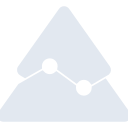
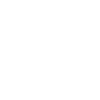

# pinescript

[← Back to main README](../../README.md)

<table><tr>
  <td></td>
  <td></td>
  <td></td>
</tr></table>

## 16 px

### black
```
https://georgegach.github.io/compatible-icons/simple-icons/compat/pinescript/16/black.png
```

### slate
```
https://georgegach.github.io/compatible-icons/simple-icons/compat/pinescript/16/slate.png
```

### white
```
https://georgegach.github.io/compatible-icons/simple-icons/compat/pinescript/16/white.png
```

## 64 px

### black
```
https://georgegach.github.io/compatible-icons/simple-icons/compat/pinescript/64/black.png
```

### slate
```
https://georgegach.github.io/compatible-icons/simple-icons/compat/pinescript/64/slate.png
```

### white
```
https://georgegach.github.io/compatible-icons/simple-icons/compat/pinescript/64/white.png
```

## 128 px

### black
```
https://georgegach.github.io/compatible-icons/simple-icons/compat/pinescript/128/black.png
```

### slate
```
https://georgegach.github.io/compatible-icons/simple-icons/compat/pinescript/128/slate.png
```

### white
```
https://georgegach.github.io/compatible-icons/simple-icons/compat/pinescript/128/white.png
```

## 512 px

### black
```
https://georgegach.github.io/compatible-icons/simple-icons/compat/pinescript/512/black.png
```

### slate
```
https://georgegach.github.io/compatible-icons/simple-icons/compat/pinescript/512/slate.png
```

### white
```
https://georgegach.github.io/compatible-icons/simple-icons/compat/pinescript/512/white.png
```

## 1024 px

### black
```
https://georgegach.github.io/compatible-icons/simple-icons/compat/pinescript/1024/black.png
```

### slate
```
https://georgegach.github.io/compatible-icons/simple-icons/compat/pinescript/1024/slate.png
```

### white
```
https://georgegach.github.io/compatible-icons/simple-icons/compat/pinescript/1024/white.png
```

## 16 px in base64

### black
```
data:image/png;base64,iVBORw0KGgoAAAANSUhEUgAAABAAAAAQCAYAAAAf8/9hAAAABmJLR0QA/wD/AP+gvaeTAAAA7ElEQVQ4jZ3RPS8EURTG8d8QClm+AFEq6Gh9D1FqlFrR0+mUaq1Gq9JtJF6KjVCO2I0ExWYar6twZjORmVnmSZ7i3Jz/c889l3q1wo3Uwg1uMdMk4Bjv+MTJf+F1PGEQfsHGX+FZpAU4d4r5UfAY2iVw7nOM1wXsIovmr5KADHtV8DJ6AZ5iC92SkB5WygIuAk6xigRXFZNc5lDxPR+YC3ANm5jEIybwHPUDDmIfQyU4iubft91jH1M4xB3OghlqG/0SOHfbz/deR93HTg4vxlhV8ACv0fNWOOtiCToj4Dp3klhOYyVYwHRDPvsGO1ttZy1JOwEAAAAASUVORK5CYII=
```

### slate
```
data:image/png;base64,iVBORw0KGgoAAAANSUhEUgAAABAAAAAQCAYAAAAf8/9hAAAABmJLR0QA/wD/AP+gvaeTAAABk0lEQVQ4jZ2QPU8UURiFz3lnmARBFBJls7JUKAINwcTECBQmlvZaon+AylAa/gKxklgYKeEPEGoKAh3bUO3sxt0dlo8BoyvM3mMBkayzTAKnvPd9nnvuC2QkiqLeKIp6s2YsC/7jgq1mEmzvHRz03VjQdME3ACMwjATntnIjQVg7fAdgVoAPwEi+DKOTuU6z/P+g3Gg8QuJvCii0XQhlX246nx8Ir20gyZB0raXgi6cKiXmrkrxrBeV6vChq4pJQykGNlavxYkfBj/3jKYAfINwhsCG4eUjV9obogcf3pf3jZylBK8GyoEFIFWfu0/Dg/SWSEYD2JlLOHJbTX6B9JrEj4y9z3kqlHhcldkMsQjiiVIHYFFGS45c2gSTKuVcSChRGBQ0LeArqCaB7Zvjq6feo5L6beAbDW0n8Jwhr8Ud5eEPgYYftDzlxphUE/TQ8F/SY0GRYjxcAgKXq6TjNrUPKp+CrnBFqiPYAUtflMqqS/5ph7WgX4HgGnBEVfYA5CIe34smcb569aJ27u7fhfWc//wIrRbzEFGli+wAAAABJRU5ErkJggg==
```

### white
```
data:image/png;base64,iVBORw0KGgoAAAANSUhEUgAAABAAAAAQCAYAAAAf8/9hAAAABmJLR0QA/wD/AP+gvaeTAAAA+UlEQVQ4jZ3ROy9EURSG4e9QEfwBiVJBR+uPKP0BrejptCq1VqNV6UTiUiB0xi0Sl0Qm4hIehTMx4czBfM3O3lnvu1b2SmqCAQzU1fwGH+EYQ90I1vCKN6z/F57Gja/cYeav8DAafqaBkd/gHmxVwK1so7dOsIBmWfxeIWhisRM8gasS3MAsLiskV5isEuyUcANTKLDXYZLdFtfT5lhOspPkMclqksMkfeV5n+Q8yVOS0yQr37sXWMV1RbczLKEfKzjBJop2wRwean5/y+d698v7A+Zb8BguamB4Lmte2t4uMV7gIMlYx93W57DAbZdwkqTAaJLBLvnmBzcPulApdW4OAAAAAElFTkSuQmCC
```

