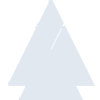

# pino

[← Back to main README](../../README.md)





## 16 px

### black
```
https://georgegach.github.io/compatible-icons/simple-icons/pino/16/black.png
```

### slate
```
https://georgegach.github.io/compatible-icons/simple-icons/pino/16/slate.png
```

### white
```
https://georgegach.github.io/compatible-icons/simple-icons/pino/16/white.png
```

## 64 px

### black
```
https://georgegach.github.io/compatible-icons/simple-icons/pino/64/black.png
```

### slate
```
https://georgegach.github.io/compatible-icons/simple-icons/pino/64/slate.png
```

### white
```
https://georgegach.github.io/compatible-icons/simple-icons/pino/64/white.png
```

## 128 px

### black
```
https://georgegach.github.io/compatible-icons/simple-icons/pino/128/black.png
```

### slate
```
https://georgegach.github.io/compatible-icons/simple-icons/pino/128/slate.png
```

### white
```
https://georgegach.github.io/compatible-icons/simple-icons/pino/128/white.png
```

## 512 px

### black
```
https://georgegach.github.io/compatible-icons/simple-icons/pino/512/black.png
```

### slate
```
https://georgegach.github.io/compatible-icons/simple-icons/pino/512/slate.png
```

### white
```
https://georgegach.github.io/compatible-icons/simple-icons/pino/512/white.png
```

## 1024 px

### black
```
https://georgegach.github.io/compatible-icons/simple-icons/pino/1024/black.png
```

### slate
```
https://georgegach.github.io/compatible-icons/simple-icons/pino/1024/slate.png
```

### white
```
https://georgegach.github.io/compatible-icons/simple-icons/pino/1024/white.png
```

## 16 px in base64

### black
```
data:image/png;base64,iVBORw0KGgoAAAANSUhEUgAAABAAAAAQCAYAAAAf8/9hAAAABmJLR0QA/wD/AP+gvaeTAAAA40lEQVQ4jZ3RvUoDQRTF8V9AbKxFS20sfAO1sfAVrFL5btqJKFqIGC2sbW2EFIGAH4WiUdDCsdhZnCy7s1kvDAyXe/5z5lzytYvTlplsXeMBa/8RbyPEc9ZVPI+bBDDGUhfAHt4TwAgHXQBXeMIr3nAeXazOIt6Kr35hgnt8xN7JLIBBYv1ZsYk0i5WceDMZDvg2nUXAcQ5wWRkOeFRkkbqozWKjRly6mFR6R3WAiwZA8LeRxiyaXs+5OIS5COjjNt7X0au462FBsdohPrEce1O10+LkB/t1/y/rrgUQ8ILFUvALp8xuTNc+sFIAAAAASUVORK5CYII=
```

### slate
```
data:image/png;base64,iVBORw0KGgoAAAANSUhEUgAAABAAAAAQCAYAAAAf8/9hAAAABmJLR0QA/wD/AP+gvaeTAAABZklEQVQ4jZWQPU5bURCFv3NtKKAACgSiIWlSpAoSCEEUyQlQUacCNpBdJGkDQllENkDJGiih5EdYeu8pivAPshUpvieFedgPbAO3ujNz5pszAyNeNfnz+TqtH43ShFHFqNKXiFeqvxtvXgy4Tm4qQEUw1/nXOXgR4PTU44bveSyxdJ7dzj0bMDFb20F618uoU/ZgFwMBIWoPaBvqxk3MGaJymdZePwm4yhrvBR+BKeGyUIb4gL0Q8OGTgOD47e47LqsNrgIT3U3C8kVy82oo4DJrrBs+5XGUp4SW7wX2QskUXBQApd707kA0htQyrvdEYaX/FveAatZYM2w8XCkSZwTlfhdB7D8CRMevD5sBZI2BWqB6X3Y1v0XIpwNbgwAAlqdxLLoI+gF31iLeQZx0a34rggouIkJMgv4C58gt4fk0TScLwqustilzPMwJwrZ/Lc7P7D66QfcQ/BzaDGAktJ0kzdk89R9H7Y3QgrFFiwAAAABJRU5ErkJggg==
```

### white
```
data:image/png;base64,iVBORw0KGgoAAAANSUhEUgAAABAAAAAQCAYAAAAf8/9hAAAABmJLR0QA/wD/AP+gvaeTAAAA5UlEQVQ4jZ3RvS5EURiF4TWJaKYWytEo3AEahVtQqdwbnQihEPFTqLUaiUIi8VMQhmQUHs2ZOM6MPTNWtbOz1/utvb6kIKzjoPSmKJzjHgv/Ma/60eGk5mlc1AB3mJ0EsIm3GuAW25MAzvCIF7ziqEoxP455pZraQxfXeK/u9scBnNaiP1WbqHfRKZmX/dZnowvYKwFODOqh6qKeYrALLA0x91N0G3e7wwDHfwD42Ug9RWec6aUUO0kyVTE2klxW58UkrUbAVpJ2kl6SmyQfSebQbn5jbUSSL2yVtnA1AgDPmOl7vgFqEenecTSckQAAAABJRU5ErkJggg==
```

