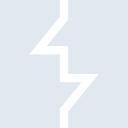
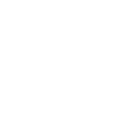

# portswigger

[← Back to main README](../../README.md)

<table><tr>
  <td></td>
  <td></td>
  <td></td>
</tr></table>

## 16 px

### black
```
https://georgegach.github.io/compatible-icons/simple-icons/compat/portswigger/16/black.png
```

### slate
```
https://georgegach.github.io/compatible-icons/simple-icons/compat/portswigger/16/slate.png
```

### white
```
https://georgegach.github.io/compatible-icons/simple-icons/compat/portswigger/16/white.png
```

## 64 px

### black
```
https://georgegach.github.io/compatible-icons/simple-icons/compat/portswigger/64/black.png
```

### slate
```
https://georgegach.github.io/compatible-icons/simple-icons/compat/portswigger/64/slate.png
```

### white
```
https://georgegach.github.io/compatible-icons/simple-icons/compat/portswigger/64/white.png
```

## 128 px

### black
```
https://georgegach.github.io/compatible-icons/simple-icons/compat/portswigger/128/black.png
```

### slate
```
https://georgegach.github.io/compatible-icons/simple-icons/compat/portswigger/128/slate.png
```

### white
```
https://georgegach.github.io/compatible-icons/simple-icons/compat/portswigger/128/white.png
```

## 512 px

### black
```
https://georgegach.github.io/compatible-icons/simple-icons/compat/portswigger/512/black.png
```

### slate
```
https://georgegach.github.io/compatible-icons/simple-icons/compat/portswigger/512/slate.png
```

### white
```
https://georgegach.github.io/compatible-icons/simple-icons/compat/portswigger/512/white.png
```

## 1024 px

### black
```
https://georgegach.github.io/compatible-icons/simple-icons/compat/portswigger/1024/black.png
```

### slate
```
https://georgegach.github.io/compatible-icons/simple-icons/compat/portswigger/1024/slate.png
```

### white
```
https://georgegach.github.io/compatible-icons/simple-icons/compat/portswigger/1024/white.png
```

## 16 px in base64

### black
```
data:image/png;base64,iVBORw0KGgoAAAANSUhEUgAAABAAAAAQCAYAAAAf8/9hAAAABmJLR0QA/wD/AP+gvaeTAAAA20lEQVQ4jaXTvUqDMRTG8Z9V8GvrVHBwdpRuju7egGPp3MHr0E4FBVc36eSiuHkBjg6u2pYWoeBQOtjWJUJ5m+RVPPCQk5Pn/EMOZA0L6WiH9SxlqGSafxU5wAA32C+DLCL6QAOnGCU8P1opTHCJQ/RLmlcAMzxhGw94wdtfAD0cox5Uw0UOsFGYxxZuQ76O67IBFgHVwr4SbppivlTfSQFi0cF9yHdxtQwgP6B3PKOLTTziS2aIMfVxhHN8Rs6zzWO0cIJhwpMF3OEgPCXqKftMr2hiL2X492/8BuRefMpJltcAAAAAAElFTkSuQmCC
```

### slate
```
data:image/png;base64,iVBORw0KGgoAAAANSUhEUgAAABAAAAAQCAYAAAAf8/9hAAAABmJLR0QA/wD/AP+gvaeTAAABH0lEQVQ4jZWSO0tDQRSEvzk3PlCDoGgTwdpfYCf4KwQhnaVVwM5WsLKyEGzt0lgoCGktBXsbQfDRCIkIBvTu2FjkdW/ilMvsd+bsrJ7e2qZI0gkAdqPIEoWXJ1QJwK+Z0oWS1/8NELwnOEzJG4S2ygCVEWdfNs2pjPs8ZdfYKxMDJJLRnb4/Grmql+A2JkesFQHU34JfEqor0QFIlcpz5vygrIWBFTQbpolAQab855xQ2QZDb7DEn98GQkGyEV1w6hk0VwQYUo5PQ7oBIXse4gw8IcBppxLaJvHY/Vzcna62r0R/K2MSqIYVEdqfWegcCW0asl5H6Vc2bgPHBMsWdUN10FOaIIjbPEXLyluC1dGesgTiIZT2MLXiIeM0xvEL9cpoL/zXEa4AAAAASUVORK5CYII=
```

### white
```
data:image/png;base64,iVBORw0KGgoAAAANSUhEUgAAABAAAAAQCAYAAAAf8/9hAAAABmJLR0QA/wD/AP+gvaeTAAAA6klEQVQ4jaWTrU5DMRhADxvJYASzhYRkAj2NQ0zwHjieAM0DTAwUYsnsHEEREpY5HmA4BJY/tYTMDDE4mIqt9PYSOEnT2/a7p1+/tGuqFHMe+pOigErm51+RE7wBQ2DvL4IpcAq0gU5OsJ6YmwOXwD1wA+zkBLjKp3qnbqoj9UF9MkMseFEP1f3QdtWznCA+wkZIH6AKDLLpJ2rQiMYVQOAD+FqarxcJUlwAt+F7C+gvC+IaxDyrE/VKraljdZErYopX9UDtqbN4sewqvwNdoAkcAds/Ikp2v1bb4ShJyjJ4BI6BVlHAv1/jN95RSkmMxUL9AAAAAElFTkSuQmCC
```

