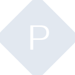
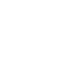

# precommit

[← Back to main README](../../README.md)

<table><tr>
  <td></td>
  <td></td>
  <td></td>
</tr></table>

## 16 px

### black
```
https://georgegach.github.io/compatible-icons/simple-icons/compat/precommit/16/black.png
```

### slate
```
https://georgegach.github.io/compatible-icons/simple-icons/compat/precommit/16/slate.png
```

### white
```
https://georgegach.github.io/compatible-icons/simple-icons/compat/precommit/16/white.png
```

## 64 px

### black
```
https://georgegach.github.io/compatible-icons/simple-icons/compat/precommit/64/black.png
```

### slate
```
https://georgegach.github.io/compatible-icons/simple-icons/compat/precommit/64/slate.png
```

### white
```
https://georgegach.github.io/compatible-icons/simple-icons/compat/precommit/64/white.png
```

## 128 px

### black
```
https://georgegach.github.io/compatible-icons/simple-icons/compat/precommit/128/black.png
```

### slate
```
https://georgegach.github.io/compatible-icons/simple-icons/compat/precommit/128/slate.png
```

### white
```
https://georgegach.github.io/compatible-icons/simple-icons/compat/precommit/128/white.png
```

## 512 px

### black
```
https://georgegach.github.io/compatible-icons/simple-icons/compat/precommit/512/black.png
```

### slate
```
https://georgegach.github.io/compatible-icons/simple-icons/compat/precommit/512/slate.png
```

### white
```
https://georgegach.github.io/compatible-icons/simple-icons/compat/precommit/512/white.png
```

## 1024 px

### black
```
https://georgegach.github.io/compatible-icons/simple-icons/compat/precommit/1024/black.png
```

### slate
```
https://georgegach.github.io/compatible-icons/simple-icons/compat/precommit/1024/slate.png
```

### white
```
https://georgegach.github.io/compatible-icons/simple-icons/compat/precommit/1024/white.png
```

## 16 px in base64

### black
```
data:image/png;base64,iVBORw0KGgoAAAANSUhEUgAAABAAAAAQCAYAAAAf8/9hAAAABmJLR0QA/wD/AP+gvaeTAAAA6UlEQVQ4jZXTMUoDURDG8d+a1SaNeAJLDyB4ihSm90QeY0VBCwvtBG1SeA3BUlDQJZKgsZmQt8vzJRkYdpnd/zfzZt6QtwoNPsKbiG1kFS7QYhbeRmytSApPA57He4urkkgOXoQvRb5wkxMpwX2RTiWVVcNOsYMBdvGEN9TYwzEO8INf3OJMwLnM53jFJ57xEPFZUklTYxQZJc/UpviOKtJ/BhjVuW4mNsE+hjjKfF/UuMM4zt+v4gSHPWhu1Yd7/p/AI150J5Gev3OxNhljCl/a8i6k8HUOLomszVwS2XqZUpHlOr8rrPMf2W5xmG72muEAAAAASUVORK5CYII=
```

### slate
```
data:image/png;base64,iVBORw0KGgoAAAANSUhEUgAAABAAAAAQCAYAAAAf8/9hAAAABmJLR0QA/wD/AP+gvaeTAAABm0lEQVQ4jY2TMW4TYRCFvze7ToNkWxQ2xRaU9CBxASokF3YBQsg+EafAEiUWShAlDVfgAiRFEiERQgGSs/MonJV3N0bib//5Zt7MvBEHnm2dXVy9TZgBBBxX0/FKkvux5UH48nqdZo40AEh7cXZ5LdvLfpI4BDtzLiKQCSER4cz56fnPd7bVZtSGv11crYF5EGFcAINdkG5sbhSuST5VD0YvGiXRriwzl7swgHEpUTpVGD9vK1FbNkQQFNgDm8/A9whKpCMnTxD3SWrIVMSmmgyXOj3/sU6zUAveDS7fhOIVZqTQV8Mv7GdIW5LaZIZ4X1qaAQPCkHvZjXhJv+38gzlCAntAAaSKxLPSdnuWvZXqCzAmuIf1qP8v5DLgOO0FdQQBTQsAEk+Bh1j7GtKW+nYO4iSq6XgVERvIJKmRtrvs8Vg9nzT9Q2ZEbKrpeKW+gdgZqLPGDiyn0IdqOnwtyf9lpD2cKeljNRm9bIzUmV5fiSMLSVDrTuWG6fQoydVkuFTExmRi4QSTKWnTh+8o6Ci5PWdJln3yr3P+CwEdC5MhUWLzAAAAAElFTkSuQmCC
```

### white
```
data:image/png;base64,iVBORw0KGgoAAAANSUhEUgAAABAAAAAQCAYAAAAf8/9hAAAABmJLR0QA/wD/AP+gvaeTAAAA9klEQVQ4jZWTMUoEQRBF37ijiYl4AkMPIHiKDTT3RB5jREEDA80ETTbwGoKhoKDDyi76TGqw7Z3pcQuaLpp+v6qruqDH1Ept1LdYjVr13R2Cz9RWXcRq46wsksHzgJfht+rFoMgA3Fkn8qFerYiMwLnIn0yqcBrgCNgAJsAm8AC8ADWwBRwAu8AX8A1cAydEhfsin6rP6rv6qN7F+SLJpKmBaUQk2VObA5+RRXpnAkzrYltgBuwA28B+X+1r4AY4jvfnWRwCexm0TOpwW+rAvfqUdSJ9/+/H+mcbU/h83b+Qwpcr8IhIOfKIyHrDlIl04/xqYZx/ADfu/xjFUpI3AAAAAElFTkSuQmCC
```

