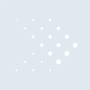

# presto

[← Back to main README](../../README.md)





## 16 px

### black
```
https://georgegach.github.io/compatible-icons/simple-icons/presto/16/black.png
```

### slate
```
https://georgegach.github.io/compatible-icons/simple-icons/presto/16/slate.png
```

### white
```
https://georgegach.github.io/compatible-icons/simple-icons/presto/16/white.png
```

## 64 px

### black
```
https://georgegach.github.io/compatible-icons/simple-icons/presto/64/black.png
```

### slate
```
https://georgegach.github.io/compatible-icons/simple-icons/presto/64/slate.png
```

### white
```
https://georgegach.github.io/compatible-icons/simple-icons/presto/64/white.png
```

## 128 px

### black
```
https://georgegach.github.io/compatible-icons/simple-icons/presto/128/black.png
```

### slate
```
https://georgegach.github.io/compatible-icons/simple-icons/presto/128/slate.png
```

### white
```
https://georgegach.github.io/compatible-icons/simple-icons/presto/128/white.png
```

## 512 px

### black
```
https://georgegach.github.io/compatible-icons/simple-icons/presto/512/black.png
```

### slate
```
https://georgegach.github.io/compatible-icons/simple-icons/presto/512/slate.png
```

### white
```
https://georgegach.github.io/compatible-icons/simple-icons/presto/512/white.png
```

## 1024 px

### black
```
https://georgegach.github.io/compatible-icons/simple-icons/presto/1024/black.png
```

### slate
```
https://georgegach.github.io/compatible-icons/simple-icons/presto/1024/slate.png
```

### white
```
https://georgegach.github.io/compatible-icons/simple-icons/presto/1024/white.png
```

## 16 px in base64

### black
```
data:image/png;base64,iVBORw0KGgoAAAANSUhEUgAAABAAAAAQCAYAAAAf8/9hAAAABmJLR0QA/wD/AP+gvaeTAAAAz0lEQVQ4jc3TzU5CMRAF4E8wbnwDef+n8CHAlfEHIz/RwM6IYC7hXhd3Cg1UYmDjJJOcaTsn53RamKE5MWcXAU6OzjnN+wTvWjswwVvgEcbHSHJPNabYYB3NFZYYKtzDvoW00QmyOnBar4L8VwUpXyMbPOElcD/q/GyRYI0VnvGNTzzgCx+4izMHFlJchvw04iakp7rKcFHBWHuZDQZ4DHyL+2MWau0Ic7wI2YOwssh7/vKQru0mchX1NvKnPNGOrFfAXdyU2P/HX5if0T//AX+/eim80/q9AAAAAElFTkSuQmCC
```

### slate
```
data:image/png;base64,iVBORw0KGgoAAAANSUhEUgAAABAAAAAQCAYAAAAf8/9hAAAABmJLR0QA/wD/AP+gvaeTAAABGklEQVQ4jaWTTUuCQRhFzx2lRbUWSoMoCWoXtOjH9yOqZVSgbx/qqnXZnBZmFmiE3dUwD/fOuTNMBqOXcaDDGhImZV0zQKBT1jXP9S0gz8D4M7kRnwDUQWC4KqC9WLoTUHyUdEtSrQxTsotMgXvg4BcCIIgIFE0toQJFcAbDK/K+ggCUQtJTBiVQYR+5FVqBQ+IlsA3pLw34wkq6whS4g+wF35CbwJHJNOE65kRsL30FsQ3WzNARJLyTGADzKrqSINAYi6YfvCJsIsfCBdALnq2qIPJo2LPGwAOhP7s4r2LOSeZgs7o/Tw7zYb7y2BJqQjVsgFvfPQsCbSwUSC/SWCyYHtAkaSmnWVZ3OHpxyf6f9f+/IEzWNQuTD2n+h1tuS50PAAAAAElFTkSuQmCC
```

### white
```
data:image/png;base64,iVBORw0KGgoAAAANSUhEUgAAABAAAAAQCAYAAAAf8/9hAAAABmJLR0QA/wD/AP+gvaeTAAAA0ElEQVQ4jc3TzUpDMRDF8d9tiwvrxo2gFsQvEN9/6UPoXtBaqvQ+Qq0dF04wXLxV2o2BkJOBc/IfkjQRscCR7UbbRERsaQaDXczdgDcsUs/wmnqKl76AbguRxmOsK73KAy42EZSAyPo656CqL/GxiaCMaa5neMQQ57jHAa5+C1jlnGOC92xnkvVn3GLUdwujxC/hkehlvyy6j2Dmq/dTPGAf17hLipu+FqLCLvowT3/CJRqMi+EvD2ns+0b2anOXoMbu6iFOfkr/H3+h3cHffgLQhlkOiP8W4AAAAABJRU5ErkJggg==
```

