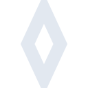

# privatedivision

[← Back to main README](../../README.md)

<table><tr>
  <td></td>
  <td></td>
  <td></td>
</tr></table>

## 16 px

### black
```
https://georgegach.github.io/compatible-icons/simple-icons/compat/privatedivision/16/black.png
```

### slate
```
https://georgegach.github.io/compatible-icons/simple-icons/compat/privatedivision/16/slate.png
```

### white
```
https://georgegach.github.io/compatible-icons/simple-icons/compat/privatedivision/16/white.png
```

## 64 px

### black
```
https://georgegach.github.io/compatible-icons/simple-icons/compat/privatedivision/64/black.png
```

### slate
```
https://georgegach.github.io/compatible-icons/simple-icons/compat/privatedivision/64/slate.png
```

### white
```
https://georgegach.github.io/compatible-icons/simple-icons/compat/privatedivision/64/white.png
```

## 128 px

### black
```
https://georgegach.github.io/compatible-icons/simple-icons/compat/privatedivision/128/black.png
```

### slate
```
https://georgegach.github.io/compatible-icons/simple-icons/compat/privatedivision/128/slate.png
```

### white
```
https://georgegach.github.io/compatible-icons/simple-icons/compat/privatedivision/128/white.png
```

## 512 px

### black
```
https://georgegach.github.io/compatible-icons/simple-icons/compat/privatedivision/512/black.png
```

### slate
```
https://georgegach.github.io/compatible-icons/simple-icons/compat/privatedivision/512/slate.png
```

### white
```
https://georgegach.github.io/compatible-icons/simple-icons/compat/privatedivision/512/white.png
```

## 1024 px

### black
```
https://georgegach.github.io/compatible-icons/simple-icons/compat/privatedivision/1024/black.png
```

### slate
```
https://georgegach.github.io/compatible-icons/simple-icons/compat/privatedivision/1024/slate.png
```

### white
```
https://georgegach.github.io/compatible-icons/simple-icons/compat/privatedivision/1024/white.png
```

## 16 px in base64

### black
```
data:image/png;base64,iVBORw0KGgoAAAANSUhEUgAAABAAAAAQCAYAAAAf8/9hAAAABmJLR0QA/wD/AP+gvaeTAAAAwElEQVQ4jaXTMW4CQQwF0Ef6gLQ1CheIwhXI3cIltiWCG8AJQg0HIAoRFFtAmyKBpYglQFpgd/nS11jW+Nsee7iOWbAWXrHBNuzKmCIPTqsGPyPDTzALX2lMIvMimGNcdPGhwNfGC/4wxCjsLjplsr9jjyVaeMRXVDG4FZzgOwTSE3+KXYgmt1rI42yUKbcIA+ctNFVogf9HXOEXb+iHvcZT2SrGjmP8dGWMl3D3InG+yh9Vg6Hn+Jl6dQRgHryIA+ftOsNAu7c+AAAAAElFTkSuQmCC
```

### slate
```
data:image/png;base64,iVBORw0KGgoAAAANSUhEUgAAABAAAAAQCAYAAAAf8/9hAAAABmJLR0QA/wD/AP+gvaeTAAABYklEQVQ4jZWQPW4TYRRFz/1mIkJDxCBHibFD4TaCHURykz1kIYkEtETibx2wBiizghjRQShmjDOK5LEtmkSMv0thEEXksXPL946O7nvQkKKcnhfl9LyJCcsWw8tJ36ZraW94OenfWWDp1CKz/XAund5JkJfVfoQe5hpzDfTystpfv4HDO8G2xCgERoJtlLxdSzAcjjuWn0qqQ/AHm4+IGvPsx2jyZKVgnobXQdp19Ogm9fv7ye83Nj/B7Y0QXjUKimKWCQ5sUOBTL8tmrVbrF/AZiOCDophljQ2EvPiDtRRaJuh2tyrwmQS2Di+qauvbePwAOFywOlsw/5PealDH53Ej6Suofa8Ox7FGTniMNUri/GVjA4BO59EQ9MV2anNE8BEmRR6021m+UrC4f35iuIqRtq1dwxWOJyt/8C97O9lX4AKxidgM0ve/s/UEAMF+IVNJTIjx1u1rJS+ng7ycDpqYPyHvm1pg2XIrAAAAAElFTkSuQmCC
```

### white
```
data:image/png;base64,iVBORw0KGgoAAAANSUhEUgAAABAAAAAQCAYAAAAf8/9hAAAABmJLR0QA/wD/AP+gvaeTAAAAzUlEQVQ4jaXTQU5CQQzG8epeTVgTvQDRK8Dd5BJsIXIDPIGs4QAaMbpggVsXgD83TXgxMLwHkzTTTPr926adiMLBDLNSTEncwwrf6J0CmNqdaVNxB0v8pC3RaQJ4zsyvaTDZF3u5R9yOiPuI2ETEU0SM03/AXZ3sI/xigRtc4T2rGB4Tt/CRgEHlfYBtQlvFFiJC3hdHyz1QxfBfC9e1W0hAG59Y4xH99L9wW7eKSWWMb6UxHgKct0gJqa7ySyNxArqVz9RtDEjIHPNSzB+T1yPohheaKAAAAABJRU5ErkJggg==
```

