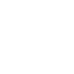

# publons

[← Back to main README](../../README.md)

<table><tr>
  <td></td>
  <td></td>
  <td></td>
</tr></table>

## 16 px

### black
```
https://georgegach.github.io/compatible-icons/simple-icons/compat/publons/16/black.png
```

### slate
```
https://georgegach.github.io/compatible-icons/simple-icons/compat/publons/16/slate.png
```

### white
```
https://georgegach.github.io/compatible-icons/simple-icons/compat/publons/16/white.png
```

## 64 px

### black
```
https://georgegach.github.io/compatible-icons/simple-icons/compat/publons/64/black.png
```

### slate
```
https://georgegach.github.io/compatible-icons/simple-icons/compat/publons/64/slate.png
```

### white
```
https://georgegach.github.io/compatible-icons/simple-icons/compat/publons/64/white.png
```

## 128 px

### black
```
https://georgegach.github.io/compatible-icons/simple-icons/compat/publons/128/black.png
```

### slate
```
https://georgegach.github.io/compatible-icons/simple-icons/compat/publons/128/slate.png
```

### white
```
https://georgegach.github.io/compatible-icons/simple-icons/compat/publons/128/white.png
```

## 512 px

### black
```
https://georgegach.github.io/compatible-icons/simple-icons/compat/publons/512/black.png
```

### slate
```
https://georgegach.github.io/compatible-icons/simple-icons/compat/publons/512/slate.png
```

### white
```
https://georgegach.github.io/compatible-icons/simple-icons/compat/publons/512/white.png
```

## 1024 px

### black
```
https://georgegach.github.io/compatible-icons/simple-icons/compat/publons/1024/black.png
```

### slate
```
https://georgegach.github.io/compatible-icons/simple-icons/compat/publons/1024/slate.png
```

### white
```
https://georgegach.github.io/compatible-icons/simple-icons/compat/publons/1024/white.png
```

## 16 px in base64

### black
```
data:image/png;base64,iVBORw0KGgoAAAANSUhEUgAAABAAAAAQCAYAAAAf8/9hAAAABmJLR0QA/wD/AP+gvaeTAAAAsUlEQVQ4jcXTPQrCQBAF4E/xNyAIIgj2nsXG1s6beSNvINqJpSI2Gn9ikRQhmkVR8MGwsMy8efNmt4LEF6h+U/wTglrJ/REHdLDDDUO031FwxQpTXNDCHIsyFcmL2GCcdU+wxARxMTfkQX68CD0vNhYiiHHPjTVDI9SliD3q2GIgNTQos4h+dkZoZvGE0Ag36Ra6gZxSgpr0HVRCxbKEorNnnLDGSGrck3khgo/w/8/0AKMZJonvxu6LAAAAAElFTkSuQmCC
```

### slate
```
data:image/png;base64,iVBORw0KGgoAAAANSUhEUgAAABAAAAAQCAYAAAAf8/9hAAAABmJLR0QA/wD/AP+gvaeTAAAA3klEQVQ4ja2RMUpDYRCEv9k882IgKIhi8BYexs7K69jaeSOvYGUhqdRgZV7ejpUgyf8nhueWy+zHzKxeFh9mwMSQ438BNKWl4VNmSTDDvCH14CvM8V4HktYhPUfEDUmHNbH0CDz9KYLtBvvC8gnBCHmuzDs77hHdXgCABZn6HW+q6M+wtj5WLVHKlZMEEKzdcwseb+qKJQKQeid8BHrN9KXQrCSrAgTnGJCnEi3QlnTVCA56UIc5rbqsAkwTZmlbu44rAH1ZTFJ+kBiDVrsAhQ7cyrTA9Y+dAx0cNoMB34z9ThkXJsbnAAAAAElFTkSuQmCC
```

### white
```
data:image/png;base64,iVBORw0KGgoAAAANSUhEUgAAABAAAAAQCAYAAAAf8/9hAAAABmJLR0QA/wD/AP+gvaeTAAAAuElEQVQ4jcXTS2oCQRSF4a9jG7UhJCCK4twlZebI7biE7Chb0GmGijjx1baD7oD0o0wwkANFFUXd/946VTfKsizzgJ4eCf4TQNywv8MWL1gjxQS9n1RwxhLvOKGLD3zWZaoDxBjiFS2MMceiAN4F3IK+laCPyouFAEdcivUZMzyHspS1QRtfGMkNDZZZ1qCYE3SKUVHoCqnctLfAmUZALP8HUSgYoppeOGCPFaZy4yrmhQC/0v830xUBOCOAo89aNwAAAABJRU5ErkJggg==
```

