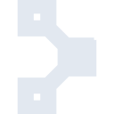
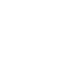

# puppet

[← Back to main README](../../README.md)

<table><tr>
  <td></td>
  <td></td>
  <td></td>
</tr></table>

## 16 px

### black
```
https://georgegach.github.io/compatible-icons/simple-icons/compat/puppet/16/black.png
```

### slate
```
https://georgegach.github.io/compatible-icons/simple-icons/compat/puppet/16/slate.png
```

### white
```
https://georgegach.github.io/compatible-icons/simple-icons/compat/puppet/16/white.png
```

## 64 px

### black
```
https://georgegach.github.io/compatible-icons/simple-icons/compat/puppet/64/black.png
```

### slate
```
https://georgegach.github.io/compatible-icons/simple-icons/compat/puppet/64/slate.png
```

### white
```
https://georgegach.github.io/compatible-icons/simple-icons/compat/puppet/64/white.png
```

## 128 px

### black
```
https://georgegach.github.io/compatible-icons/simple-icons/compat/puppet/128/black.png
```

### slate
```
https://georgegach.github.io/compatible-icons/simple-icons/compat/puppet/128/slate.png
```

### white
```
https://georgegach.github.io/compatible-icons/simple-icons/compat/puppet/128/white.png
```

## 512 px

### black
```
https://georgegach.github.io/compatible-icons/simple-icons/compat/puppet/512/black.png
```

### slate
```
https://georgegach.github.io/compatible-icons/simple-icons/compat/puppet/512/slate.png
```

### white
```
https://georgegach.github.io/compatible-icons/simple-icons/compat/puppet/512/white.png
```

## 1024 px

### black
```
https://georgegach.github.io/compatible-icons/simple-icons/compat/puppet/1024/black.png
```

### slate
```
https://georgegach.github.io/compatible-icons/simple-icons/compat/puppet/1024/slate.png
```

### white
```
https://georgegach.github.io/compatible-icons/simple-icons/compat/puppet/1024/white.png
```

## 16 px in base64

### black
```
data:image/png;base64,iVBORw0KGgoAAAANSUhEUgAAABAAAAAQCAYAAAAf8/9hAAAABmJLR0QA/wD/AP+gvaeTAAAA20lEQVQ4jZ3SP0pDQRDH8U8konYPjRYiXuVdI97CMjfQ0tYmteApPIJFDmAIKiagYBFFUIvdkEX37Yo/WJgdZr47f5a1xvj6cWYq2sj4FriL9vI/gHtc1BJLgGOMor2F/b8CPjDHm9D/C45wU4L0EnsXTXJvcYYDYZhPSc45rkuVrTTEo9/bGedayOkKr6WAGqCqGuAEe6WAfmJ3DbERPtYi+nu4zcEuhUk/xPOMT0ww6KogbWFT2Pd2fKUR1tcmrxcBK02FPcN7KbkLcIjTUlKqfsY3sO55pwb4BpqALDKEM+OZAAAAAElFTkSuQmCC
```

### slate
```
data:image/png;base64,iVBORw0KGgoAAAANSUhEUgAAABAAAAAQCAYAAAAf8/9hAAAABmJLR0QA/wD/AP+gvaeTAAABK0lEQVQ4jZ2QO07DQBiEv3HMqwELwiuKw1GoKSkpuQElN4AyJ6BGyik4AhUdEiYQBFEAUfCSPRQ4JIhkEzHV7L87n/4dUSrrPJ4g7TMscdNYT+oEFI2YdW2uSv8aCo8ESNwiNScFAxuoIXwIQMFcp/OyOhVA0qfQg+ENycCTRP1D+VkIor65vn5eLmad9M+xou288JHwmqGNuAdwgYDjrc2kBRD3A2m61AN6Q/DL7K73aipNcIpJvzcF7B2gNaaDgRoby6fIL1N18F8FAdldbw9YCb356WBciZhE+MqiC98lRorO/wCY8VFk7VrkAHlRzIOWEBeVPNqu1Ra7wS/YnjFeFcxjC0iw23GuseFfgIGcGR2Xt++h8EiATQ37IBQaVjxiVpWoln5hEuAL4uJyG/dg6ngAAAAASUVORK5CYII=
```

### white
```
data:image/png;base64,iVBORw0KGgoAAAANSUhEUgAAABAAAAAQCAYAAAAf8/9hAAAABmJLR0QA/wD/AP+gvaeTAAAA6klEQVQ4jZ2STWoCQRCFvwoG426IP4sgXsVrmFu4zA106daNa8FT5AhZeABlUNGBCFkkIeBzYQ8MTFsz5EFDUV3vq+ofCJK0UFkpFXqI5DJgE+Lv/wB2wKzK6AEGwFuIm5K6dQF/wAn4AQScgT7w7kEsDyQ9A0lhbwhMgB6QAseCZ2pmK2+yHDqSdIi8ziJ2hPJ4Zkvgy6txAXXkAiS9Am2vplEovneJCbePlYW8AR+xbnNJR0n7sD4lXSStJXXqHOER6AJPoUvC7fmGZpZFvCVAri0wDfGvZ74HeAHGnqmoRiTXCQugVQW4ArNTefC8vE6LAAAAAElFTkSuQmCC
```

