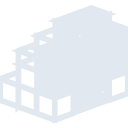
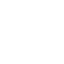

# pypi

[← Back to main README](../../README.md)





## 16 px

### black
```
https://georgegach.github.io/compatible-icons/simple-icons/pypi/16/black.png
```

### slate
```
https://georgegach.github.io/compatible-icons/simple-icons/pypi/16/slate.png
```

### white
```
https://georgegach.github.io/compatible-icons/simple-icons/pypi/16/white.png
```

## 64 px

### black
```
https://georgegach.github.io/compatible-icons/simple-icons/pypi/64/black.png
```

### slate
```
https://georgegach.github.io/compatible-icons/simple-icons/pypi/64/slate.png
```

### white
```
https://georgegach.github.io/compatible-icons/simple-icons/pypi/64/white.png
```

## 128 px

### black
```
https://georgegach.github.io/compatible-icons/simple-icons/pypi/128/black.png
```

### slate
```
https://georgegach.github.io/compatible-icons/simple-icons/pypi/128/slate.png
```

### white
```
https://georgegach.github.io/compatible-icons/simple-icons/pypi/128/white.png
```

## 512 px

### black
```
https://georgegach.github.io/compatible-icons/simple-icons/pypi/512/black.png
```

### slate
```
https://georgegach.github.io/compatible-icons/simple-icons/pypi/512/slate.png
```

### white
```
https://georgegach.github.io/compatible-icons/simple-icons/pypi/512/white.png
```

## 1024 px

### black
```
https://georgegach.github.io/compatible-icons/simple-icons/pypi/1024/black.png
```

### slate
```
https://georgegach.github.io/compatible-icons/simple-icons/pypi/1024/slate.png
```

### white
```
https://georgegach.github.io/compatible-icons/simple-icons/pypi/1024/white.png
```

## 16 px in base64

### black
```
data:image/png;base64,iVBORw0KGgoAAAANSUhEUgAAABAAAAAQCAYAAAAf8/9hAAAABmJLR0QA/wD/AP+gvaeTAAABY0lEQVQ4jZXSvU5VURAF4O8cOCI0aKGdjUYF7Iyx0QRjiMZSeQALfQTDIxCeAgutTOw02tig1vz0JjYS5Udjwu/leq/FWSeckBhwN3tmstdas2Y2Jz9n8QAj/4FRYRofsY5tbOI9LhwHnglgF138wX7yn7j1L2CBSXxGD3shOAhBP/EO1soj4GEs4k0UCwyhxFruvdRhdLAFvojHOI9lXItSP4Bziavcw7EDxsL8Bb/S8j46ibcC6rQs7KLTWNjCt/jqYyD1KnHTchFwY63bEJwJcDN5r2XtAKdaA6xa8ykL9U5HsIFHWMJVNPPph3AoZFU6XcVGGbZehnYv+enUBgMo4n8gJHAZL0q8xUP8wB1cSlxmgN9blrr4rd7ABO7DJzzF6zz6gCtYwKz6U6073MJ2BOZxm3rvz9T//TlW0vIcbuB6VL/iHe6mOxyupzkTeIKbGI0yvMLLqJ/olJjC+HEP/wJ7SmlicmQcLAAAAABJRU5ErkJggg==
```

### slate
```
data:image/png;base64,iVBORw0KGgoAAAANSUhEUgAAABAAAAAQCAYAAAAf8/9hAAAABmJLR0QA/wD/AP+gvaeTAAACJUlEQVQ4jY2Tv49McRTFP+f75s3YEVm/M7GyEiJ+bL+JRhRCNBI0oqAQvUIUGp1m/wgFlUJFolRRIKgUCsZjZsf6MWMXa+a9exSGCPHjdvfkntxz7s2B/6x2u7+m6A4OdTqd5s+4/ka6b+fru4PDSTqL2Aluyiwb7mVRnZmaWlfU/rix++48vf5FSUlybklYpeWmzWxZy6eB4jcFtvVyvr8XpUvGe4ChoIZkB4FcB0pgBCyln8lFUUwUvf5DSzcsqrHFhiHheI2cbJYREsZm8oeFdq+/NcKnRNpo4rGCGYsRliXLShsMlpwLbDSRxGcBPOt82JmleAS8Aq9FWoVVIYRJ4GVg5Vh2DirBJVKWAPIYLQGvbH9CMiYDg51jZ+Bvt5IEGo37huwyAURNq/mGvh3/Nuyxt6QRUh30BWxwbqsCZJNU9Aa3AppyvJlurTlazPcfBexIUs02FlYQiMZ3CxKfbDqCNynClSICa+ZFr38gTCVYEeEAajI5IKMhJkOMbJhurd5ux5Uk4qaHOkJSz1XsU2Ib0JNIkkpgHilkg1QSDGxPtLuLu0nZwUTKTrjBMeGFLZvWXpB5kLK0F/murTnZx4ElRB0hRBO0IMpzluZqQ6ejdVUnI7TxRff9ZcOGzetXPX35enDHEdcrFElRF2obniSYm2pN3pYUv4Wp3V3crRSngVnhyTALAERca6Th1Var9fFP2fk1D6nd6+9/3lnc9a/Zrw6dKYh3rqIGAAAAAElFTkSuQmCC
```

### white
```
data:image/png;base64,iVBORw0KGgoAAAANSUhEUgAAABAAAAAQCAYAAAAf8/9hAAAABmJLR0QA/wD/AP+gvaeTAAABjUlEQVQ4jY2SPWtUURCGn3Ozm7gRiRGSzkbxM72NghZiSJnYa6G/wZ9g43/QQitBK4U0gqixNaksrCwUk00EwWw+drOPhe8NF0GyA5czM/e875l3ZmBEU6fVBXVyVAxqW72tvle76ra6pS6rp48CPwhgRx2oB+pe4p/q1f8Bi3pdXVGH6m4I+iEwfk/dqP4Bd4BPwCvgACjABFABGzl3kweYajXAZ4C7wCywBswBfcAAZuK3c3aAnRLwRWAV+AacAk40KqhfPR7CNjDIN1ZL+B1wL+xjybfj1yWXkNTSBjXByQC3Eg8brekD48BeQ8JhdUVdBiaBzVLKkroKXADq/hjCiYaEHvAd2KzCNgTm1FuJjyXXCqAA+5HTByilnAOeVsBrYBFYB24AZ+NXadSPhqQB8AvoqJeBedQP6n31RSbyRj2vvlMfZqm6WaD9bOe6+li91gKWgDvArPqEv/P+AnwEXub1ceAr8Bl4BLwtpQzrsRxayroHXAGmgG5+PQeelVK2GcXUSr2pXjrq7h+z0xVx1wdpDwAAAABJRU5ErkJggg==
```

