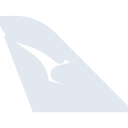

# qantas

[← Back to main README](../../README.md)

<table><tr>
  <td></td>
  <td></td>
  <td></td>
</tr></table>

## 16 px

### black
```
https://georgegach.github.io/compatible-icons/simple-icons/compat/qantas/16/black.png
```

### slate
```
https://georgegach.github.io/compatible-icons/simple-icons/compat/qantas/16/slate.png
```

### white
```
https://georgegach.github.io/compatible-icons/simple-icons/compat/qantas/16/white.png
```

## 64 px

### black
```
https://georgegach.github.io/compatible-icons/simple-icons/compat/qantas/64/black.png
```

### slate
```
https://georgegach.github.io/compatible-icons/simple-icons/compat/qantas/64/slate.png
```

### white
```
https://georgegach.github.io/compatible-icons/simple-icons/compat/qantas/64/white.png
```

## 128 px

### black
```
https://georgegach.github.io/compatible-icons/simple-icons/compat/qantas/128/black.png
```

### slate
```
https://georgegach.github.io/compatible-icons/simple-icons/compat/qantas/128/slate.png
```

### white
```
https://georgegach.github.io/compatible-icons/simple-icons/compat/qantas/128/white.png
```

## 512 px

### black
```
https://georgegach.github.io/compatible-icons/simple-icons/compat/qantas/512/black.png
```

### slate
```
https://georgegach.github.io/compatible-icons/simple-icons/compat/qantas/512/slate.png
```

### white
```
https://georgegach.github.io/compatible-icons/simple-icons/compat/qantas/512/white.png
```

## 1024 px

### black
```
https://georgegach.github.io/compatible-icons/simple-icons/compat/qantas/1024/black.png
```

### slate
```
https://georgegach.github.io/compatible-icons/simple-icons/compat/qantas/1024/slate.png
```

### white
```
https://georgegach.github.io/compatible-icons/simple-icons/compat/qantas/1024/white.png
```

## 16 px in base64

### black
```
data:image/png;base64,iVBORw0KGgoAAAANSUhEUgAAABAAAAAQCAYAAAAf8/9hAAAABmJLR0QA/wD/AP+gvaeTAAAA+ElEQVQ4jc3SzypFURTH8c+hW5LCwEiG3oEBE2NDRf48gCfwHF7jmipjL8DNSRmhW3J0SZRcco/B3ifHyT33msiqPdirvb79fr+9+A/1iDaukGIf078BpMhL5wPXWB1meDQOLaKBESSYxAo6OB0EmUcPJzhDVlKTYWcYJS0hiyMs4Djee3jA9iDALrqC/xRT2BOCbeEdW3WACSG4IsQm1nCBm9jLsFkHOfTl/RIHePX9h2ohy4LfHE84xzPuor0CcouNnwBJlJxXTgcvuK9A1gl7UK45YSeSUm9c2JG3ONwQMltCO6kAZoV96PaxOSbkUiie6fPuD+sTtVBOsy+eLm0AAAAASUVORK5CYII=
```

### slate
```
data:image/png;base64,iVBORw0KGgoAAAANSUhEUgAAABAAAAAQCAYAAAAf8/9hAAAABmJLR0QA/wD/AP+gvaeTAAABhUlEQVQ4jcXQP09TYRzF8e95bofigpb0ijHSuJioK2/BVcfGoMYX4MA7cJUBw+JAIAxOjiauxoUX4GAHE0PA3hpu+dNLIwkW7HMcWlRCESf9TU9Ofs8nvxz436NmvreH/FVW32hf8C72/LRWu1j8FZDlRcPo9nFgiAG3In5Sm6y8OQ8Itl5gd5C/AwiC0RQky+ubxeNzASV6i3TJqAE0ZLYGkNOSNPd5s3j0R+BaOv4J+CC4LumLpHvYq6CuoSq00GoXD88EBk1o0VFjMfpOJC73y9w1fiZoImfRYSVrdx6cCZTVeynFXCKAbpYOtYRZs+kZqkCIDvPZdndmJJCm6f6wA4BgMx2gjlQTugIOgjT2/Xyj3Zk5BQAoeA6pGBTIRIRbwkegbdDhME+Dk/lm3rn/89/xw7ZaW92PNjdO3GjvIl3AHCAqw7QNcXZqsvLq1wWSI7wG4glAmgDGLCfYB8P0MiQLzXy3rt93s52dqz4qvSe4N6pxosoEfxtchiBUR+790/kBaJil+v2jpD8AAAAASUVORK5CYII=
```

### white
```
data:image/png;base64,iVBORw0KGgoAAAANSUhEUgAAABAAAAAQCAYAAAAf8/9hAAAABmJLR0QA/wD/AP+gvaeTAAAA7klEQVQ4jcXRvS4EURgG4O90CoVGpXYPKnegFMRPtFyBTu1aaCUqhRvYiI1EhUas+JlYkd1sdh+Fs8mYzK6peKszk8yT874T8d9JKCKiGxHDiPiIiPOIOEwpvTUS0PYzQ9xjpSmwhxcMKlAHu02ARYzQwlX+sIzsNEEuUeAMS7jIzyO8Yvs3YB/93L+NORzgLuMDbE0DZvNw4xGPsYobPOR3HWxOQ05L3W9xgl7NsPUIlnNfeMc1unjK9cZ5xEYdkPKVq3nGp+9fXUbW65Cj3LcuRYbKyFqqAAsR0YqI/oSpZiKil88pIuYnjvpn+QLIQ5W43P1t+wAAAABJRU5ErkJggg==
```

