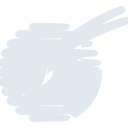
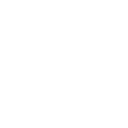

# qatarairways

[← Back to main README](../../README.md)

<table><tr>
  <td></td>
  <td></td>
  <td></td>
</tr></table>

## 16 px

### black
```
https://georgegach.github.io/compatible-icons/simple-icons/compat/qatarairways/16/black.png
```

### slate
```
https://georgegach.github.io/compatible-icons/simple-icons/compat/qatarairways/16/slate.png
```

### white
```
https://georgegach.github.io/compatible-icons/simple-icons/compat/qatarairways/16/white.png
```

## 64 px

### black
```
https://georgegach.github.io/compatible-icons/simple-icons/compat/qatarairways/64/black.png
```

### slate
```
https://georgegach.github.io/compatible-icons/simple-icons/compat/qatarairways/64/slate.png
```

### white
```
https://georgegach.github.io/compatible-icons/simple-icons/compat/qatarairways/64/white.png
```

## 128 px

### black
```
https://georgegach.github.io/compatible-icons/simple-icons/compat/qatarairways/128/black.png
```

### slate
```
https://georgegach.github.io/compatible-icons/simple-icons/compat/qatarairways/128/slate.png
```

### white
```
https://georgegach.github.io/compatible-icons/simple-icons/compat/qatarairways/128/white.png
```

## 512 px

### black
```
https://georgegach.github.io/compatible-icons/simple-icons/compat/qatarairways/512/black.png
```

### slate
```
https://georgegach.github.io/compatible-icons/simple-icons/compat/qatarairways/512/slate.png
```

### white
```
https://georgegach.github.io/compatible-icons/simple-icons/compat/qatarairways/512/white.png
```

## 1024 px

### black
```
https://georgegach.github.io/compatible-icons/simple-icons/compat/qatarairways/1024/black.png
```

### slate
```
https://georgegach.github.io/compatible-icons/simple-icons/compat/qatarairways/1024/slate.png
```

### white
```
https://georgegach.github.io/compatible-icons/simple-icons/compat/qatarairways/1024/white.png
```

## 16 px in base64

### black
```
data:image/png;base64,iVBORw0KGgoAAAANSUhEUgAAABAAAAAQCAYAAAAf8/9hAAAABmJLR0QA/wD/AP+gvaeTAAABPElEQVQ4jZ3STytFYRAG8J/rT4RENmRrJSULltZStjYWPoDyEXwBWx/AimQr2ZKdlCxsrJTQxb3Idbn+Lc6cHMctulPTvO+cZ2aeZ87bpHHrRluhgcJhbOES8/UAg2ivk+/HJmo4xjpOs4AxLOAdJexhBRNYRBWfEV+xg8m0eADFANTwgCuUI5f6LZbRm53chUoOmPUPPAbt0byuAtbQUUfzfTQoxb0NcxF/NBjP6Eqthk40oS9Y3OBJsswf9pCjfBe5bP4DFzjHUr5BGc/B4joKdrER5/doWgmWB3kJlYgt6AmqrZjJ4Kp4i/NZnsF2fHwJBuW4p3I+Y3I12EzlG3T7fiRZf5EsM5VQxKFksb9sRLK0N8mmnyS/7zwYvQb1oXxhc8QijnCC6WBwhn2sRvNZyUv808ZiUst/wF+TfnInfVDJtAAAAABJRU5ErkJggg==
```

### slate
```
data:image/png;base64,iVBORw0KGgoAAAANSUhEUgAAABAAAAAQCAYAAAAf8/9hAAAABmJLR0QA/wD/AP+gvaeTAAAB50lEQVQ4jZ2Rz0uUURiFn3Pnh0ZOpY1iQyIGLYOhqGWLNi3a1KLa+A+06W9oG7Ry0a6gbbRuFy2DCIJE20SUDorfZ46j+TnjzHdPi1RmBJE6y/ee83De94r/VJqmlU5nqBz+NbictC4vr22+2c2Lqy56VkcNS2lay39XN2Zm1O6fr6xsVbuF+DzAPZvFCItC9UNAI2nWY04d6QVii+j5CB8LhNfADeNniCFQBxGAdzJPBPAj3bkQ8t4XcFWiF+1dETKIw6CzhzXMhoLnYltz09PnmgBKkmSknZcSpFPHrG2JHdvfhWenJsfm+x9DJy+/OibcAoxpYhChnBMeLiy4PAAwXAW1jfb65l3BaUCIsYijzboiO5WJrDoAUOA8eFjsk0VTuB3N7oFJqGLFSyHwyHnv/tEGEdS26RglmFFLHyTe7sejzSYwGtEkMT4YAIAz7CC5KDiLtS67BNw5OL2C20APjBS+Da4Q9RlRgJAbtwgu2boJjCCaQLBVFSoHKIj4sh+gNE0rWa+USgwNfoL2IAZQQLQwOdLPqYkz1yX5sMH4+Pg25NcktoEcnIEz4wxYBbZBI5hW6Pbu9of/HnhfS2ut2+ArmKegrolfA3yC8N74VjFmj2u1WsZJaiTNeqPx66Lt4olm4A/zvudquMbDdQAAAABJRU5ErkJggg==
```

### white
```
data:image/png;base64,iVBORw0KGgoAAAANSUhEUgAAABAAAAAQCAYAAAAf8/9hAAAABmJLR0QA/wD/AP+gvaeTAAABXklEQVQ4jZ2SMUscYRCGnz3MqUkkGCxUbK2CIAFNmdIifQLBwh8QSGPvH8g/iI2VENLG9GlSipWNjYIYo+YuJ3fs3a37pLgJrB93IPfCst8O78w+M/NljCl1BqjXxkhcVr8CF8DmMMOiOjUkPqd+UfvqkbqvHlcNq+qWeqc21B/qJ3Vd/aDmDpSrPfW7+up/8oJ6FYa+2lJ/qU3v60bdUWerf36qdhytUr0N7JW0tRqwB0wPmddfQKAR33XgnVpPC7wEcqBXifeBJ0AGPAdK4BpoA3PpdFsJ8p+ItZI2ztUz9WNKUAZBF/gNzAI/gYPwlEAz4vPA27RAJ94TwLNAfQS8qfhyoIjzSdrCN7VQu+plrK6otGPsPY878rqanzm401fAJPfVC7Iag43cAafAWpZlphQvYmiF2o6nEUNrBsGJusQoqRvqdmDm6qH6WX2v7qqPRyYnhVbVJXXiIf5/2OOUZJGPfCMAAAAASUVORK5CYII=
```

